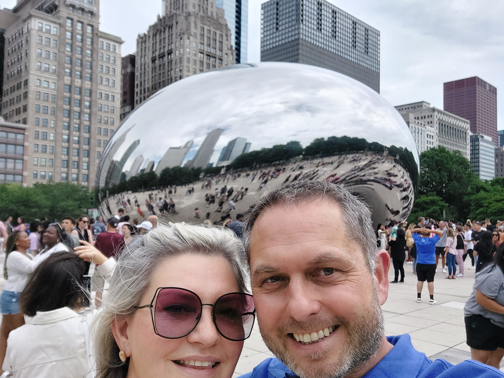
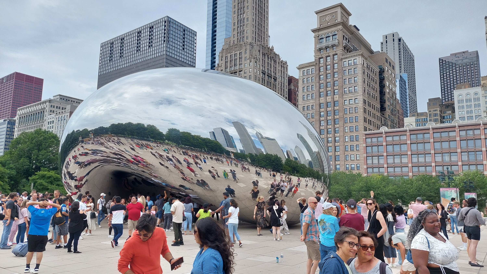
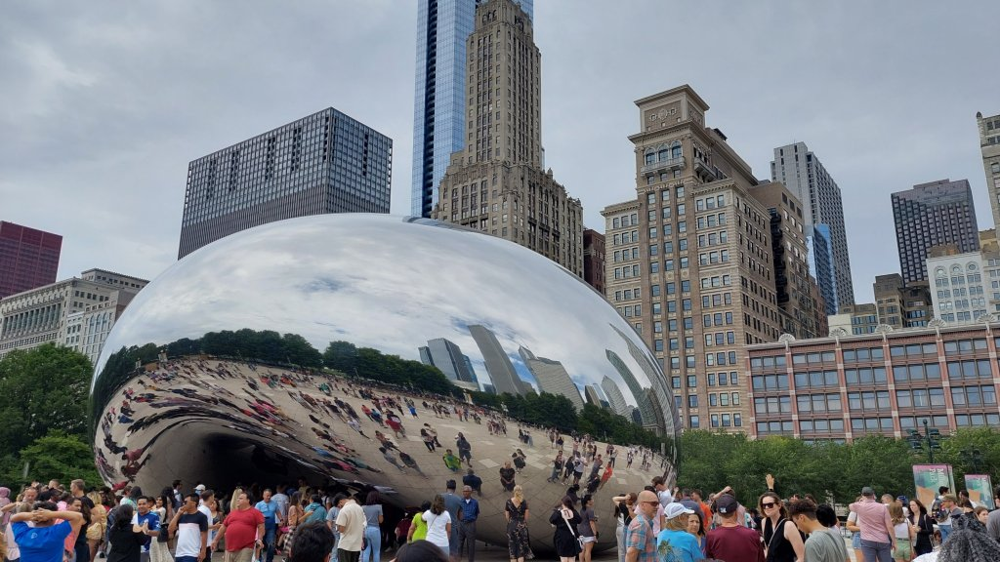
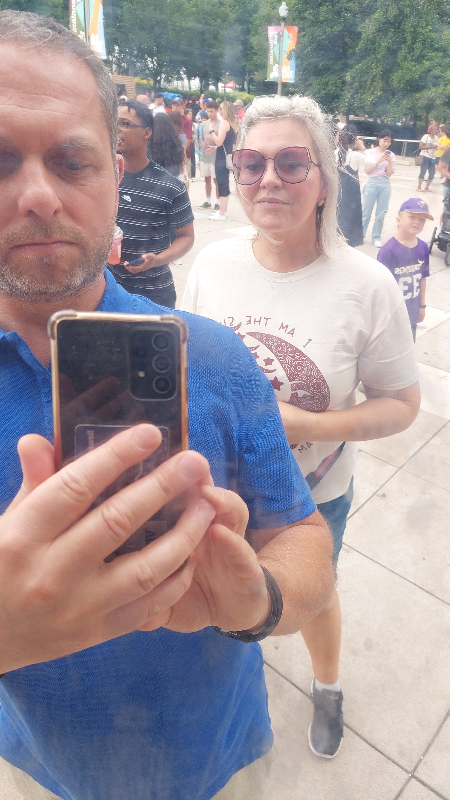
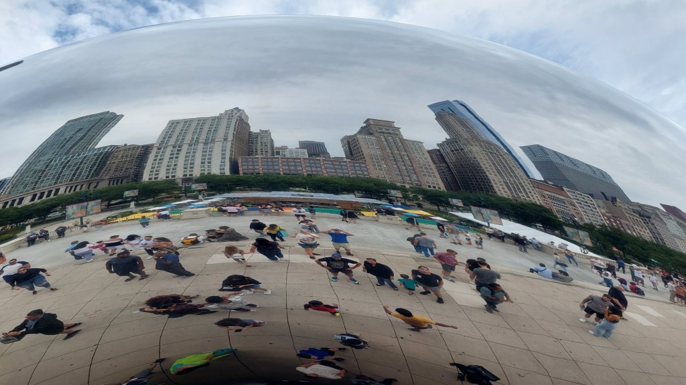
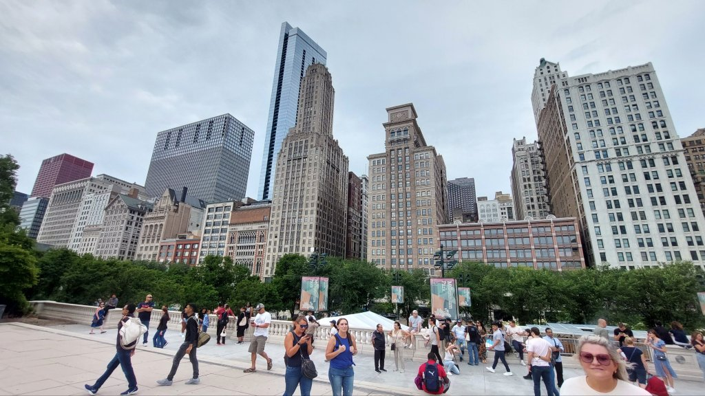
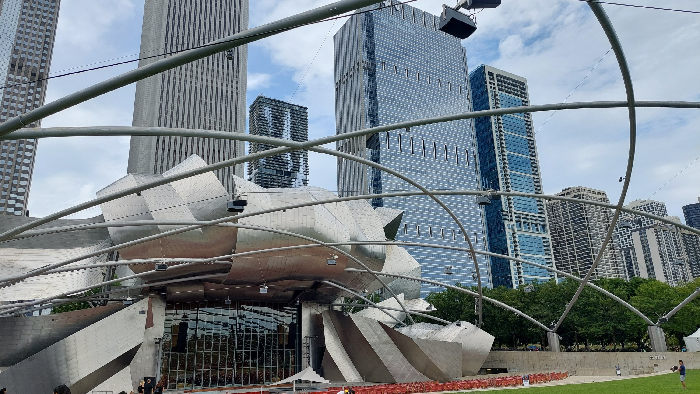
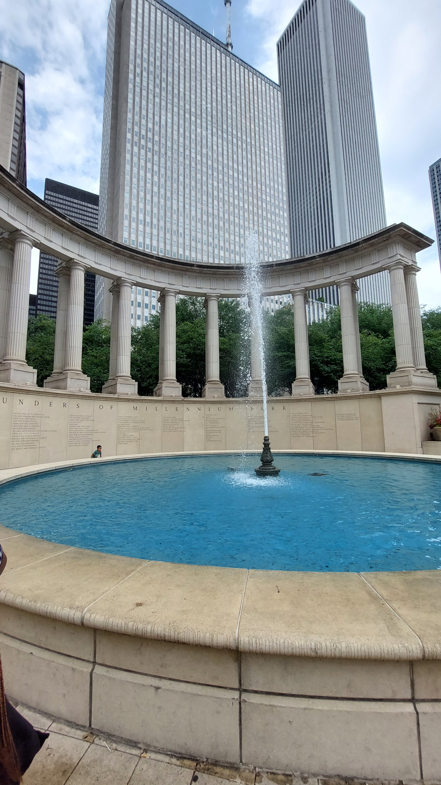
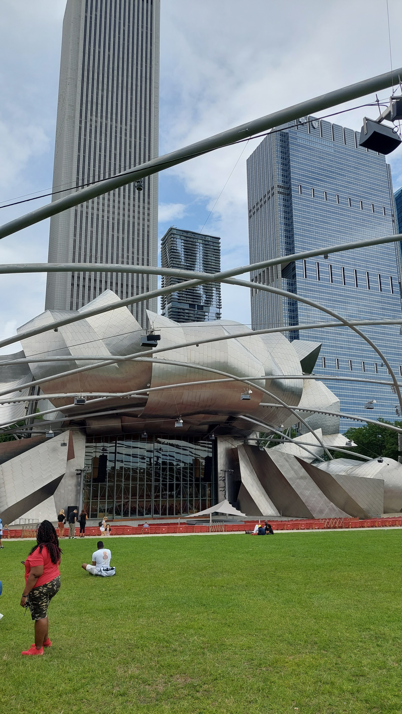

Millenium Park

Coffee then walk to Millenium Park to see Cloud Gate or the "The Bean", a sculpture by British architect Amish Kapoor

Walked to room for a siesta...I also had the runs, so lost half my body weight

