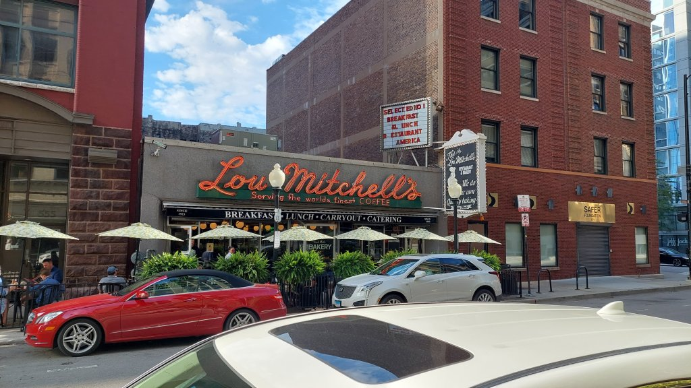
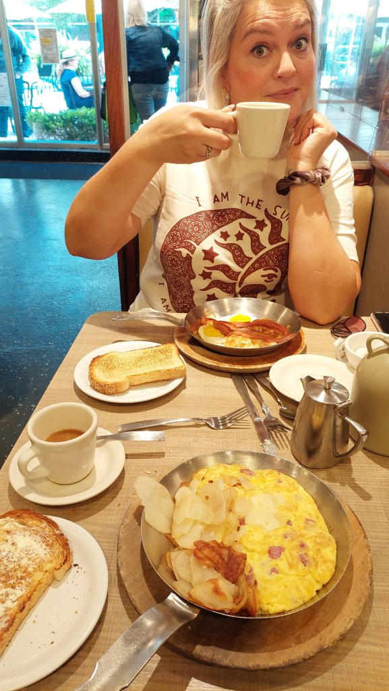
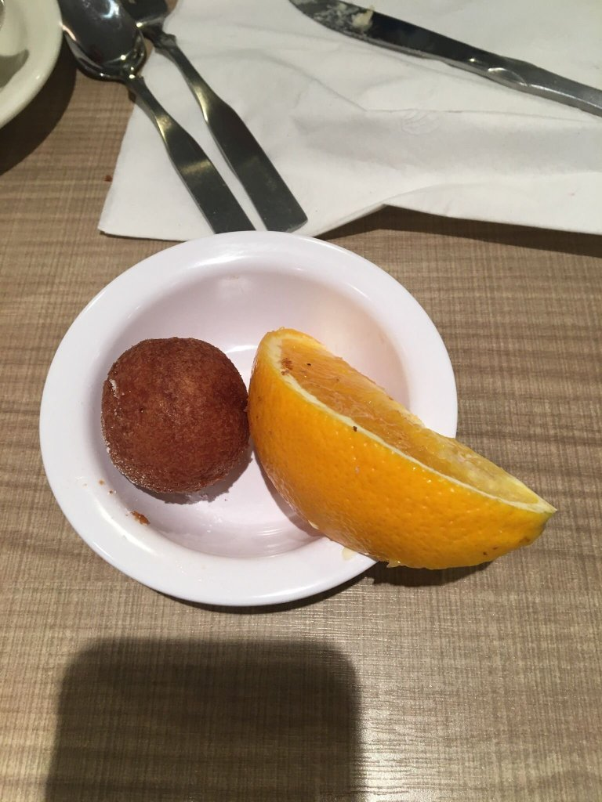
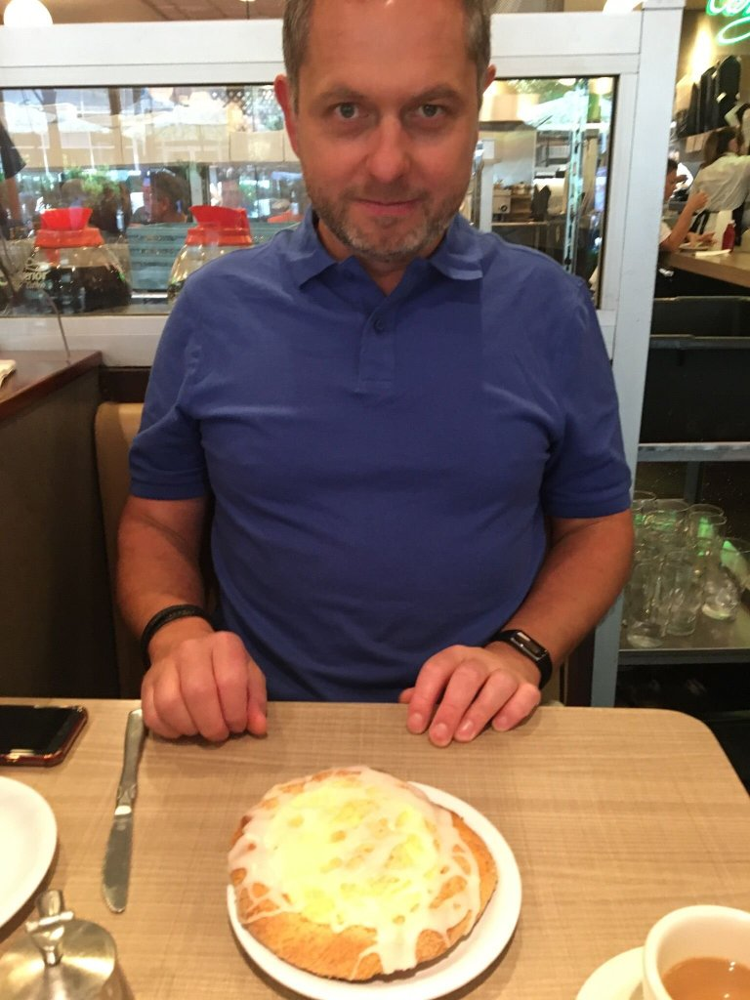

First full day, up at 6AM, body clock all over the place, walked 1.5 miles along Chicago river to Lou Mitchell's café...a world famous original staples of Route 66, fantastic experience. I had jumbo salami and cheese omelette, Mel had eggs sunny side up, I also had a cheese creme pastry, as you do...and unlimited coffee for both. 40 dollars.

<figure>

<figcaption>

Dough ball ( was ill later, put it down to this)

</figcaption>

</figure>

<figure>

<figcaption>

No need for this really

</figcaption>

</figure>

