Forgot about this day, oops!

Louisville was amazing! Great authentic place, econo Lodge downtown great location, rough and ready, stunk of smoke but fine. Headed to against the grain brewery tap for a few beers, great place, Mel had Grits, nice. We forgot to pay, then realised so I ran back.

Ended up at The Troll pub under the Bridge, amazing beers and place, and the people were so friendly. Ended up drinking Tennessee Whisky with my new friend from Fresno and Mel was drinking with some cowboys from Amarillo. Don't remember walking home. Morning after was the usual from Mel "I'm never doing it again". In the morning we visited Muhammad Ali's grave, very moving and poignant.

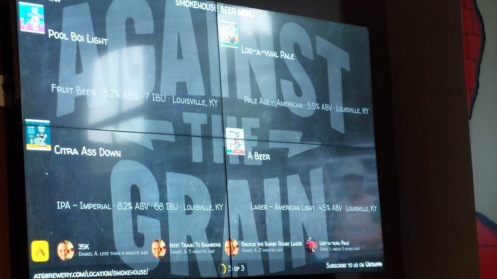

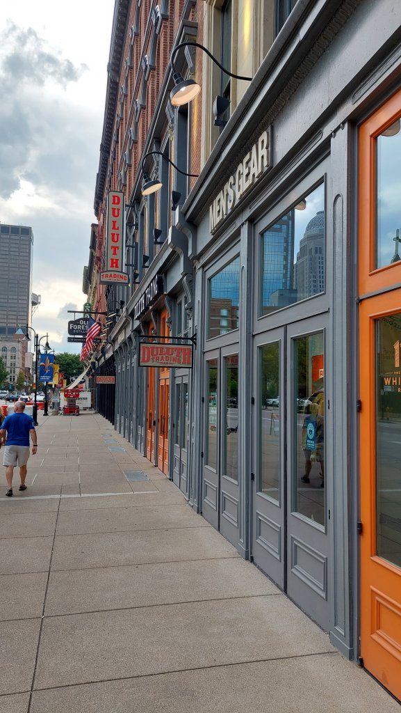

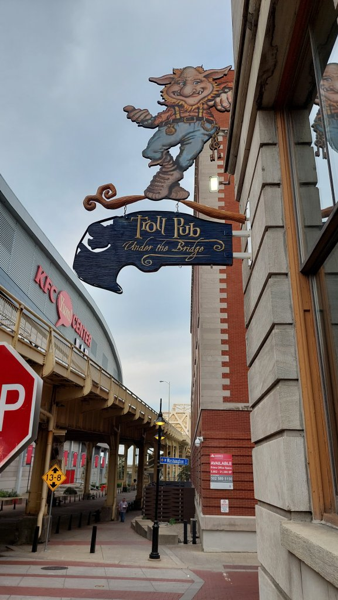

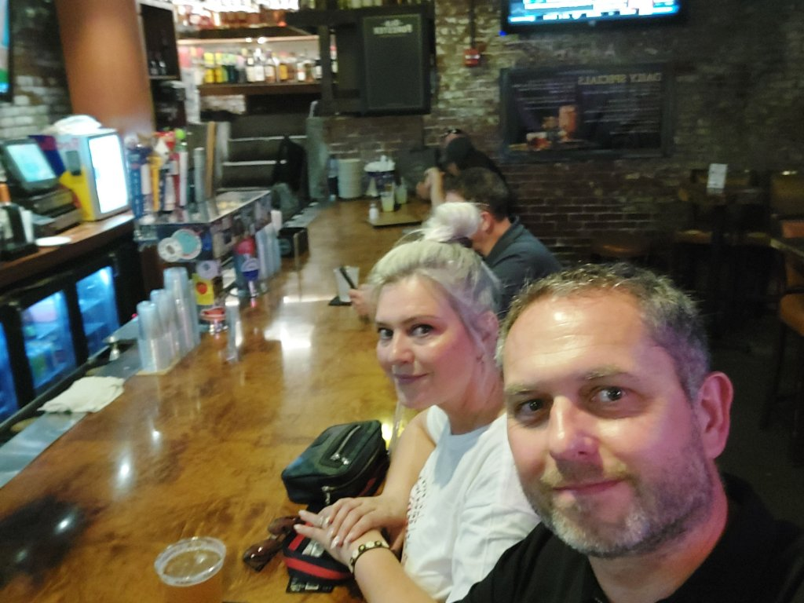

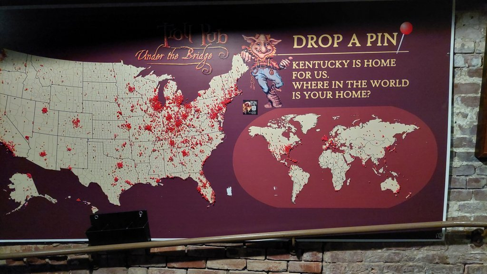

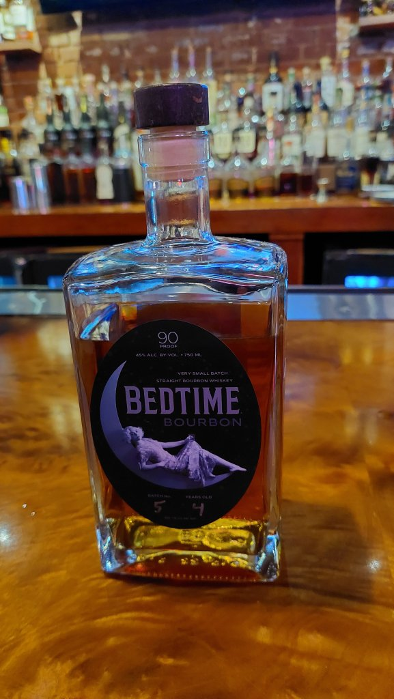

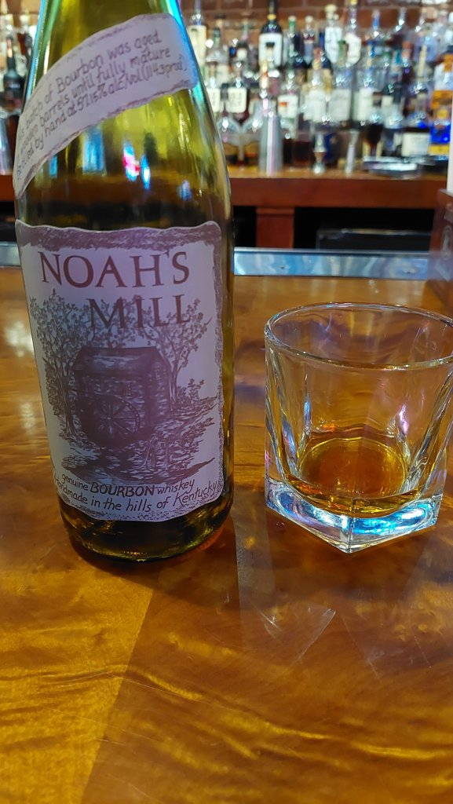

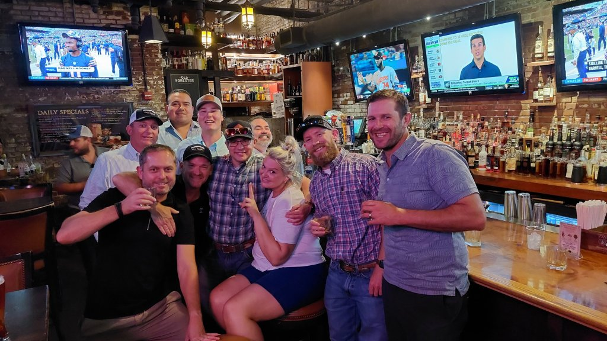

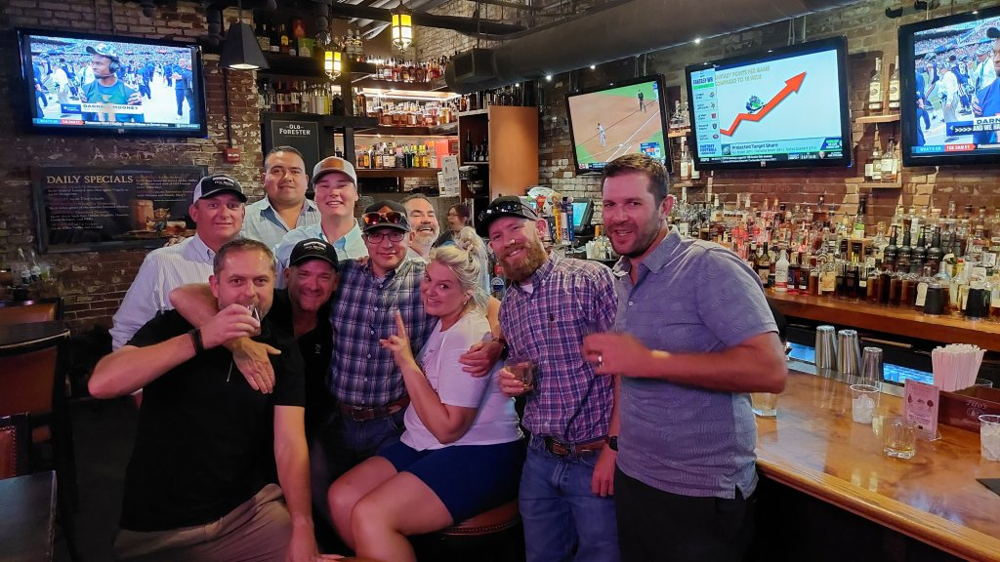

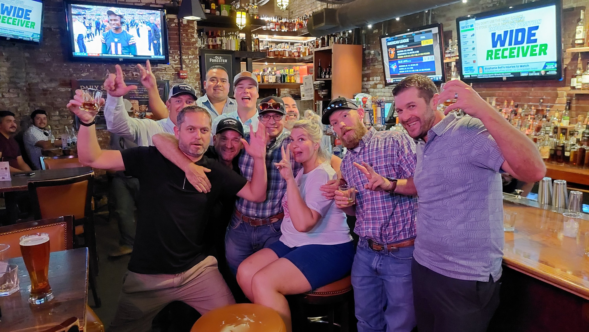

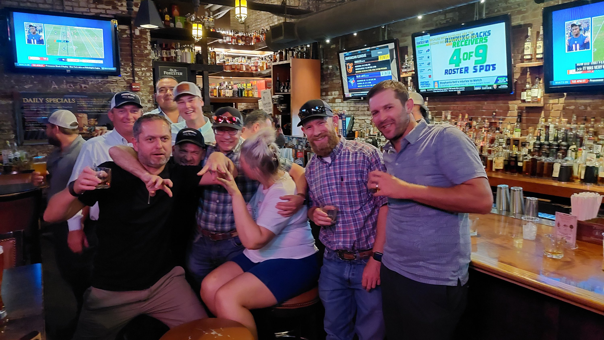

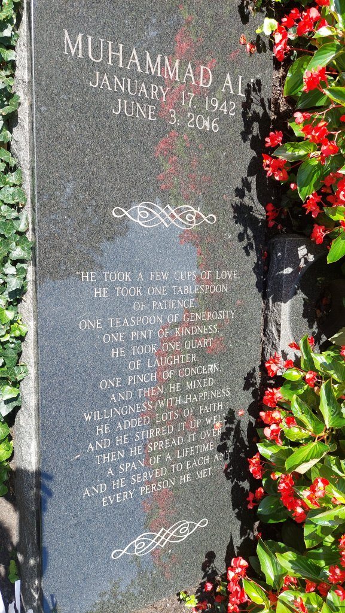

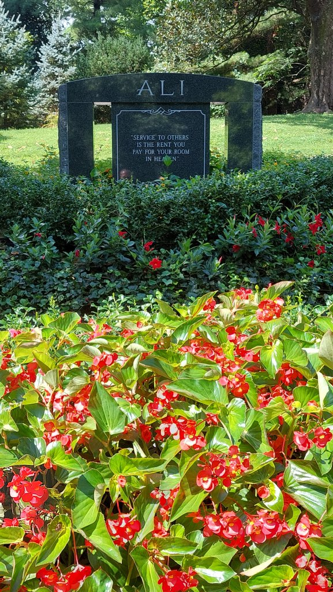

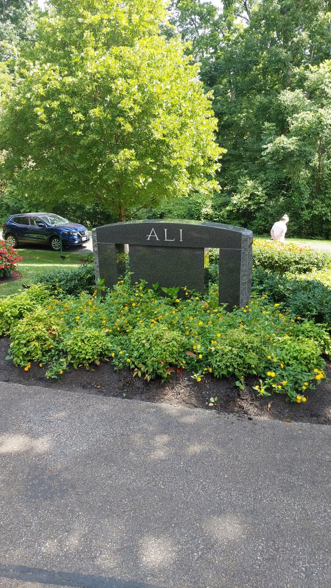

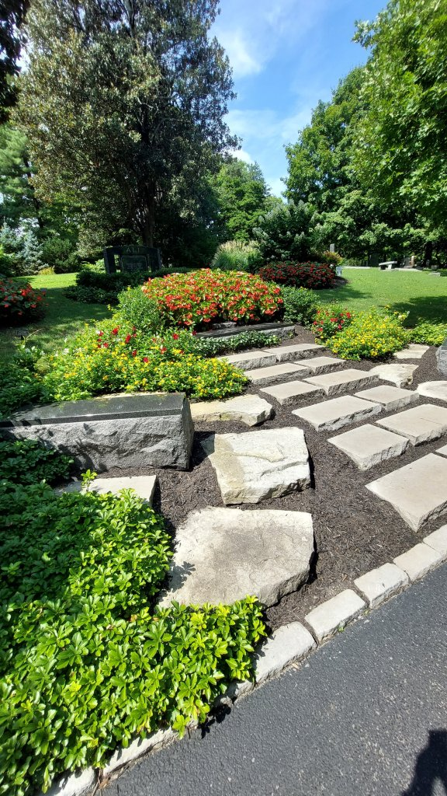

We also had a "Hot Brown" from the Brown Hotel.....a speciality of Lousville...delicious

