Picked up the hire car, a Nissan Rogue Sport - mini SUV thing...very nice, better than expected!

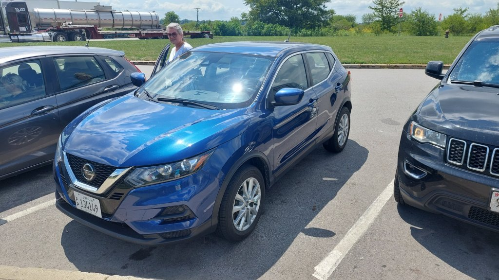

A bit hairy driving with all the mad lorry drivers, a baptism of fire driving through Chicago immediately at rush hour. Mel is a nightmare Passenger and is a bag of nerves...I have to zone out and concentrate.

Arrived at hotel Comfort Inn at downtown Nashville about 3:30pm....shower and head to Broadway...unbelievable place ! Live music literally from every bar, we started at the top and ended up at Roberts Western World where beers were an unbelievable ( for nashville ) 2 dollars 50, everywhere else is 7- 9. Mel had a recession special....a fried sandwich, bag of crisps, a beer and a moon pie for 6 dollars, cheaper than 'Spoons! I needed to try the Nashville Hot chicken so picked one up and we walked the mile back to the hotel...police everywhere as Michael Buble was in town performing so felt safe. Still have no phone for calls or texts and cannot get uber to work on other phone. May cause issues later.

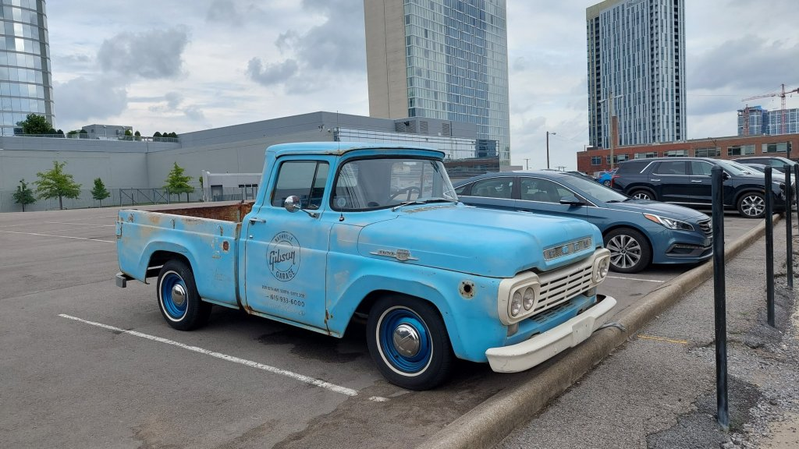

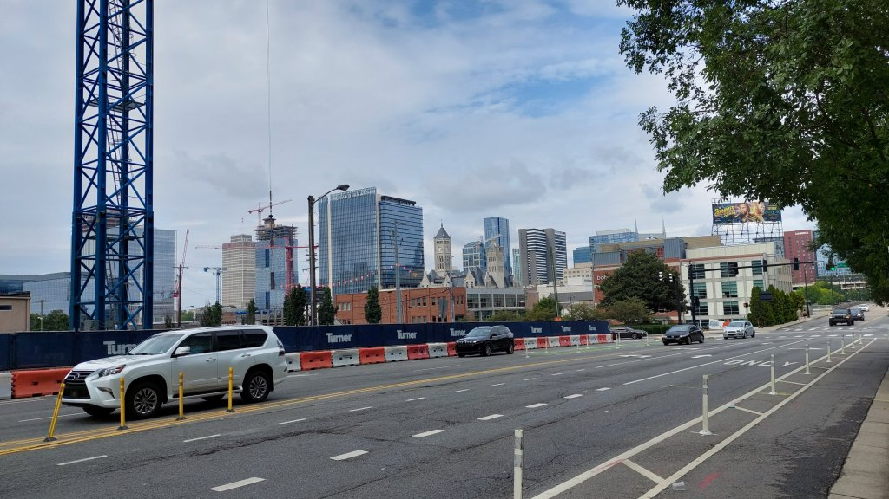

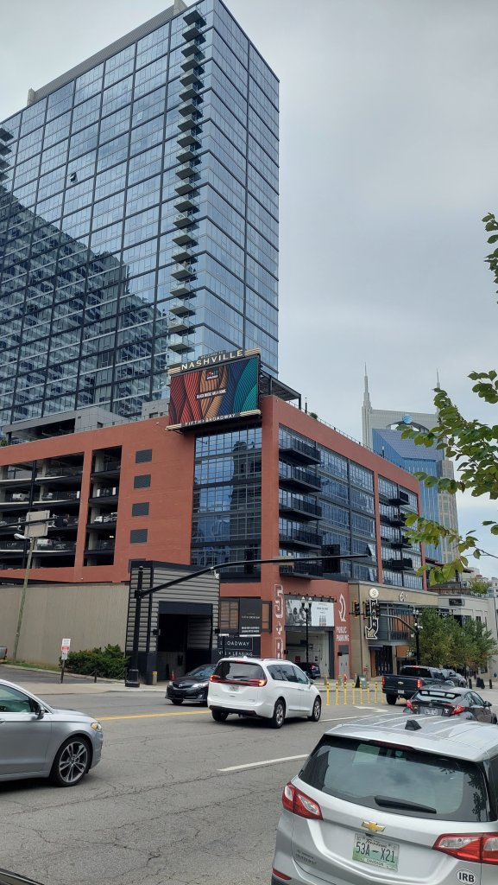

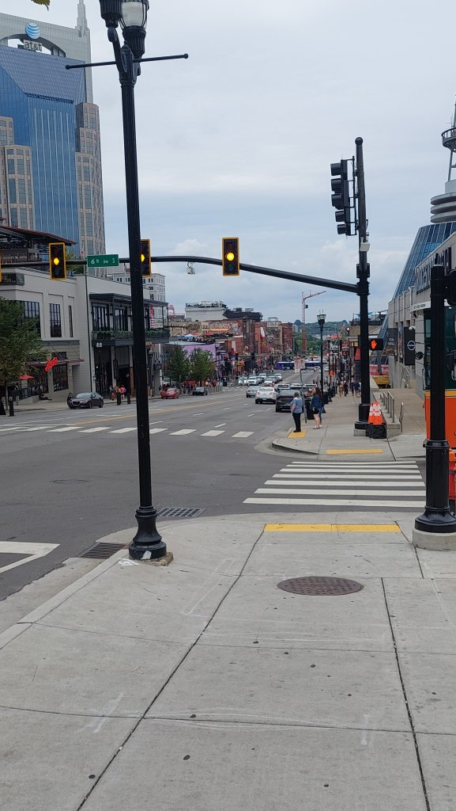

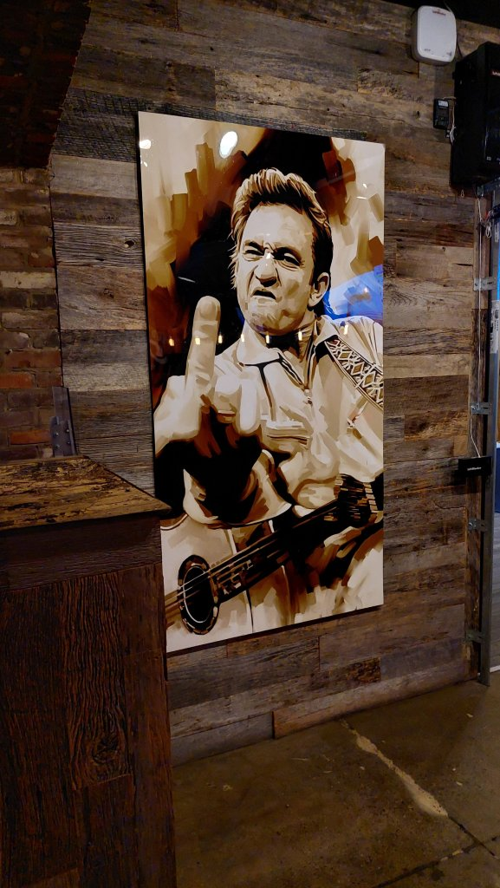

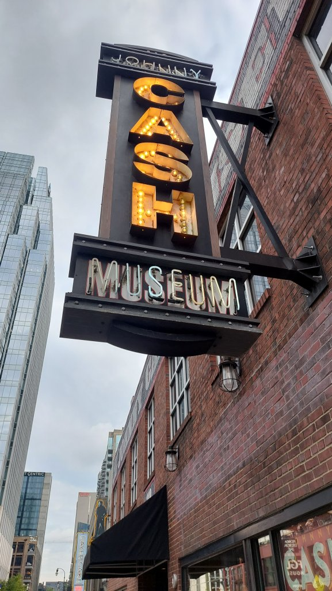

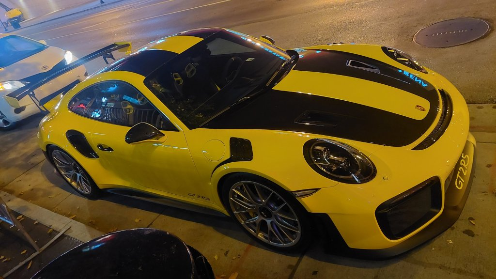

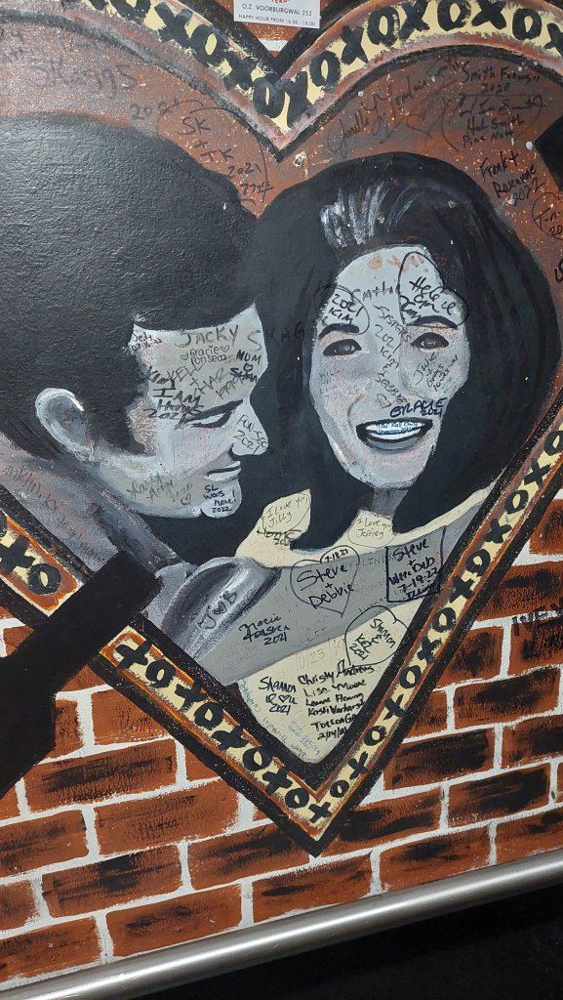

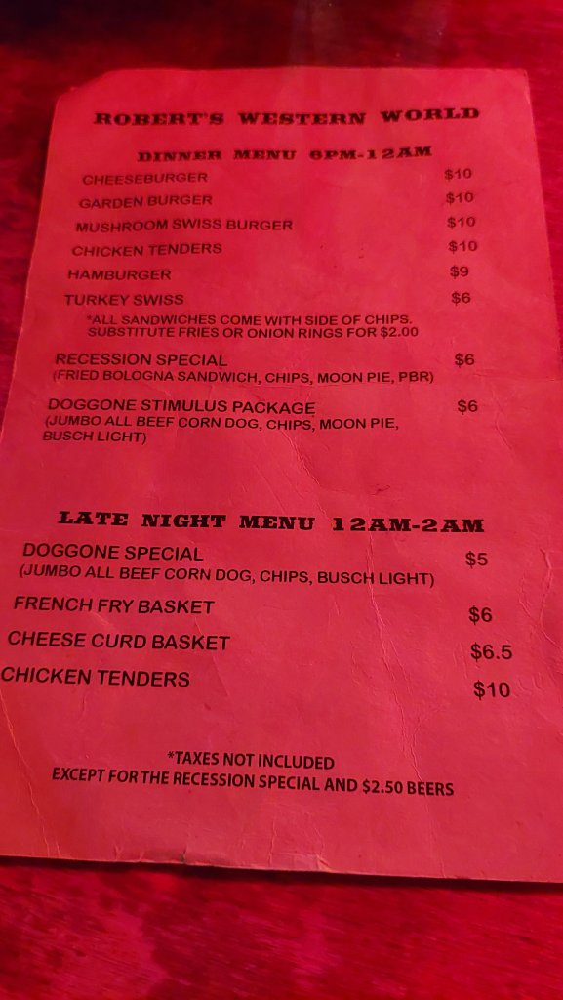

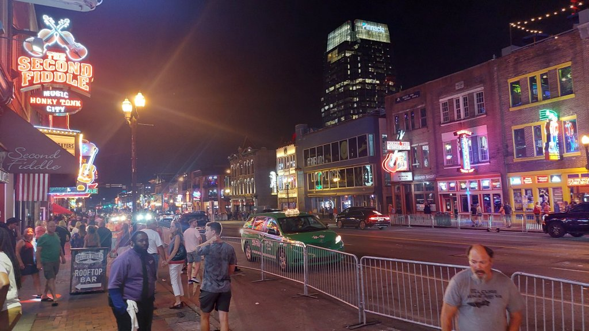

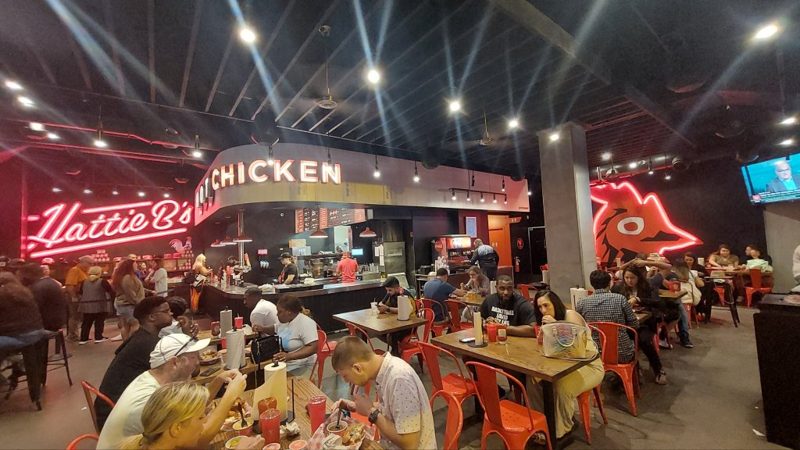

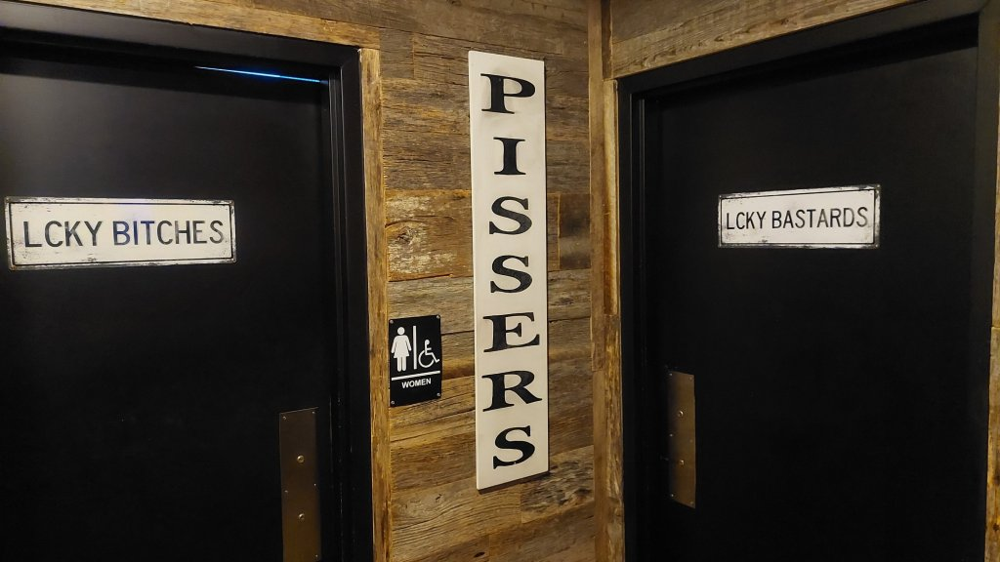

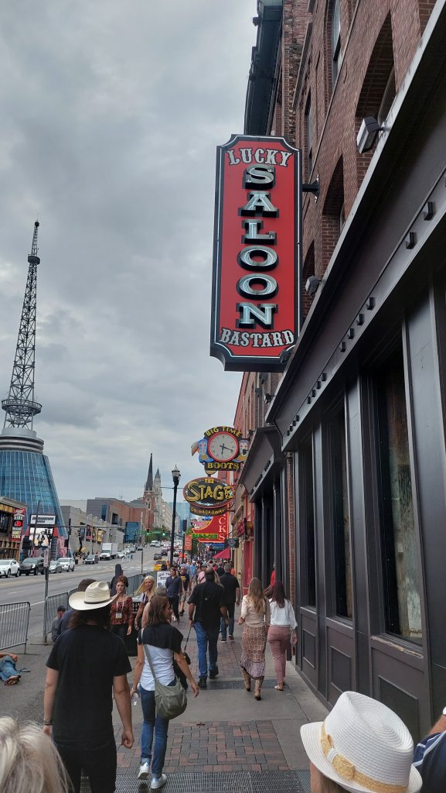

