Travelled to National Civil Rights Museum..amazing experience to see the struggle of racism throughout the US and also to visit the Lorraine Motel where Martin Luther King Jr was assassinated. A very powerful and moving experience.

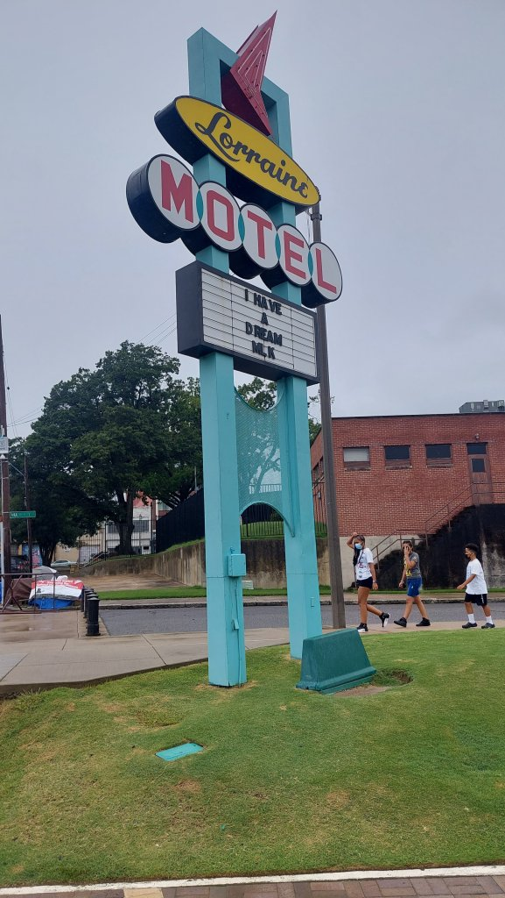

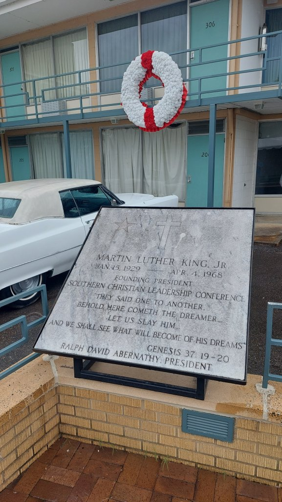

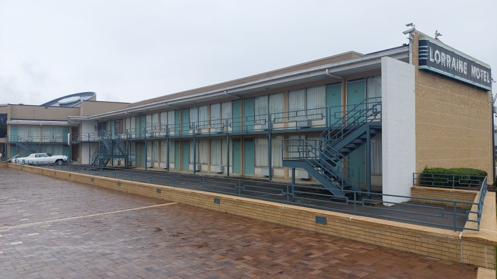

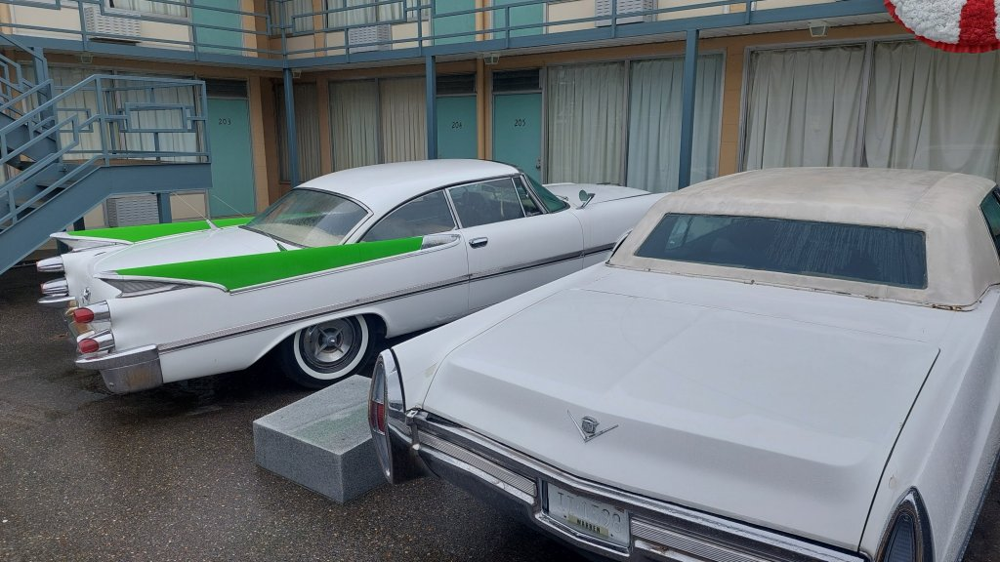

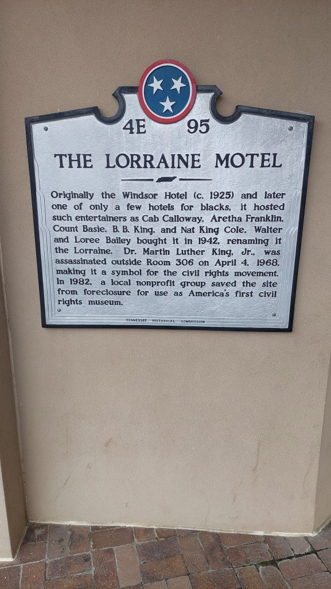

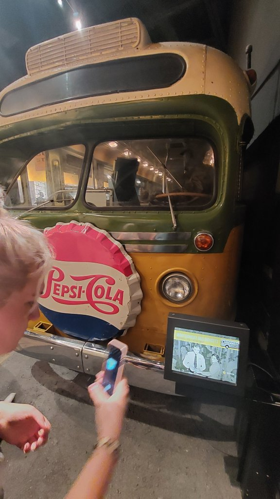

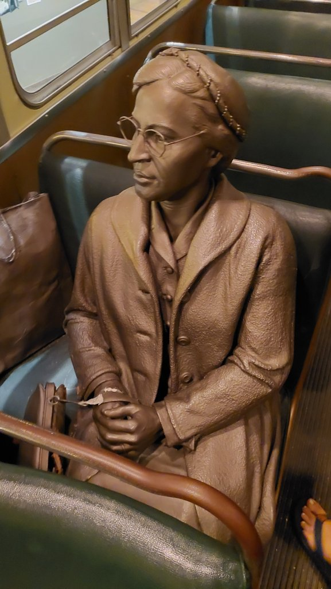

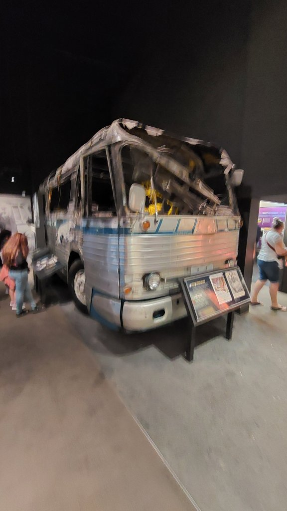

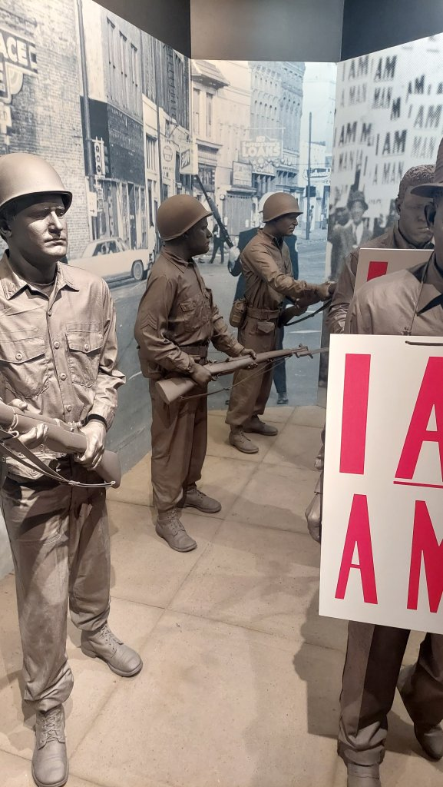

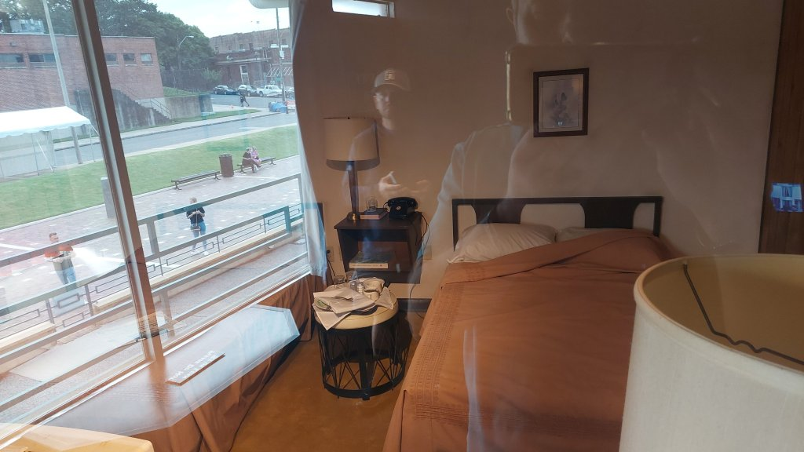

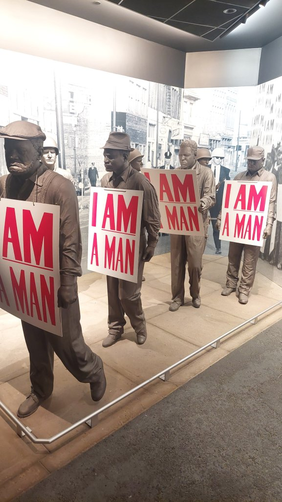

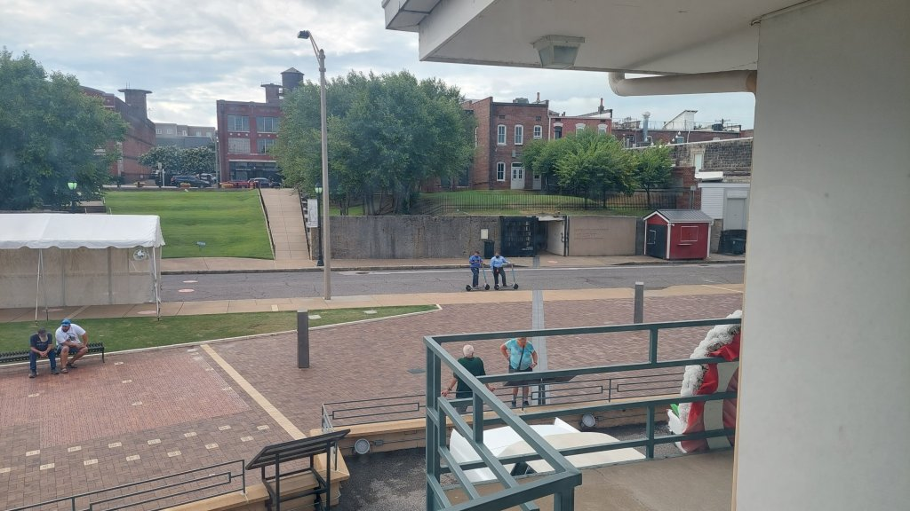

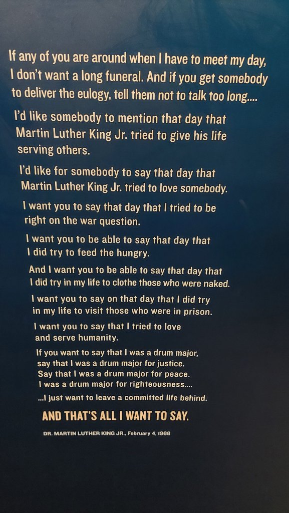

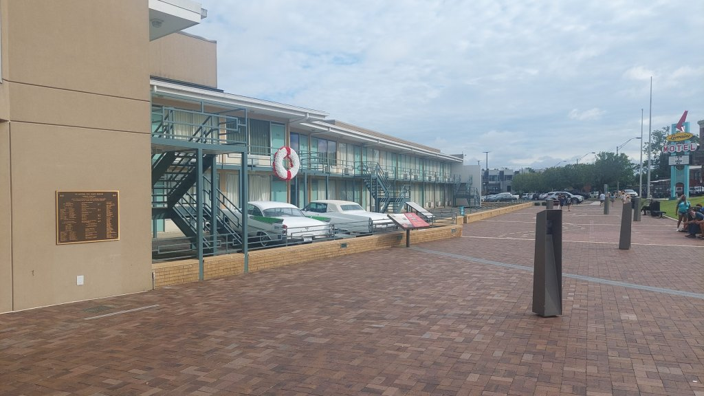

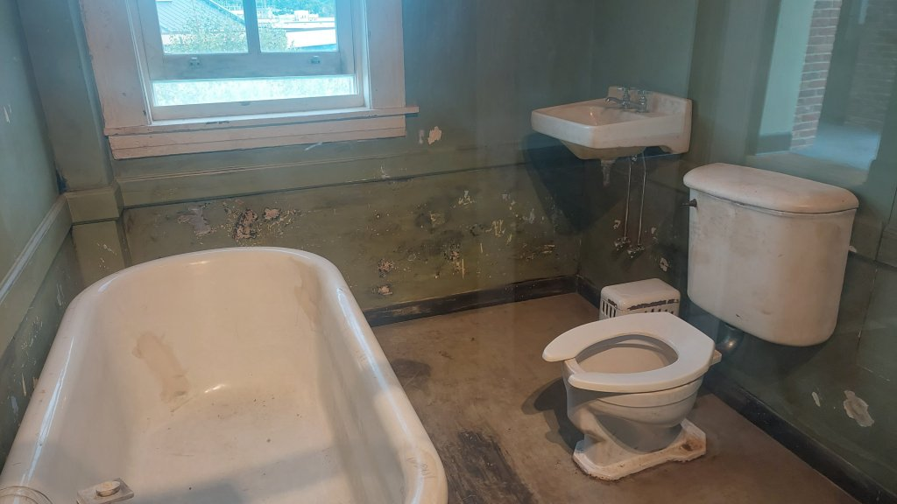

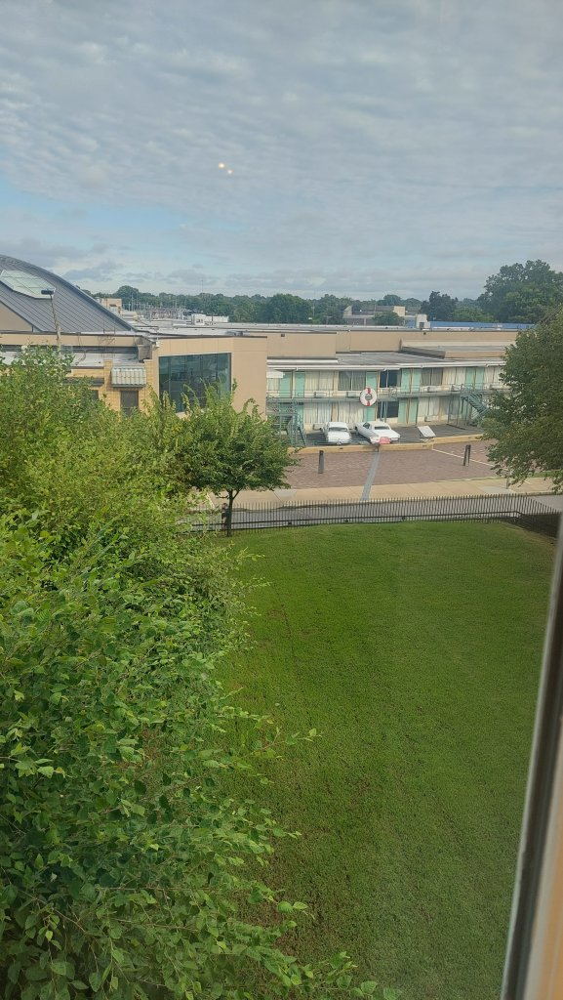

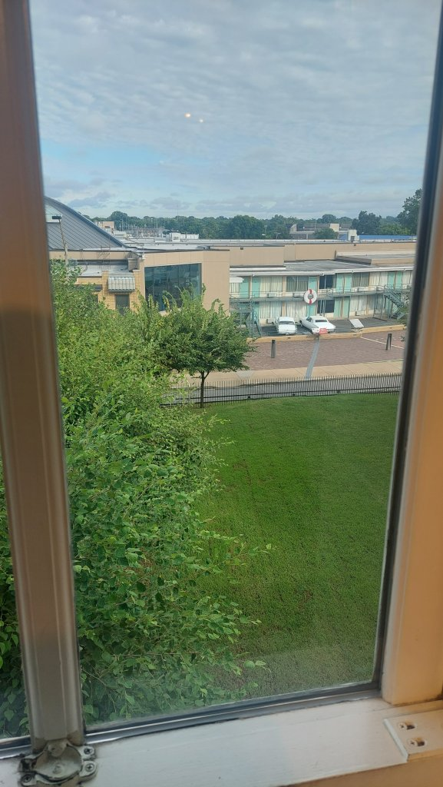

