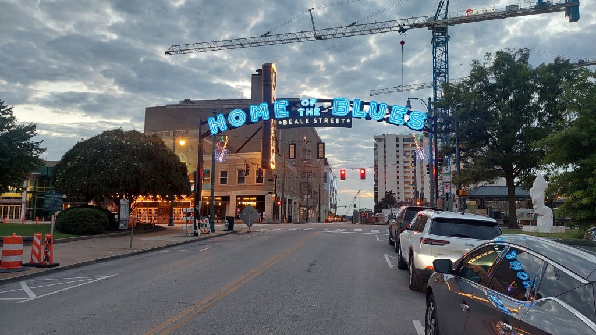
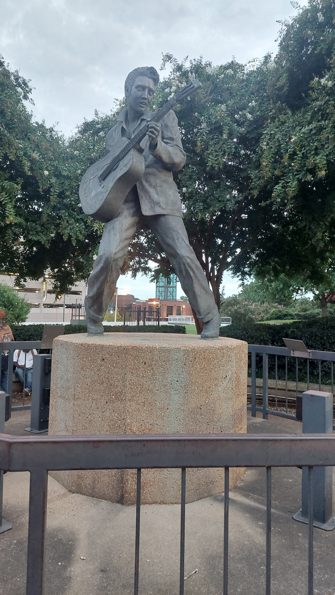
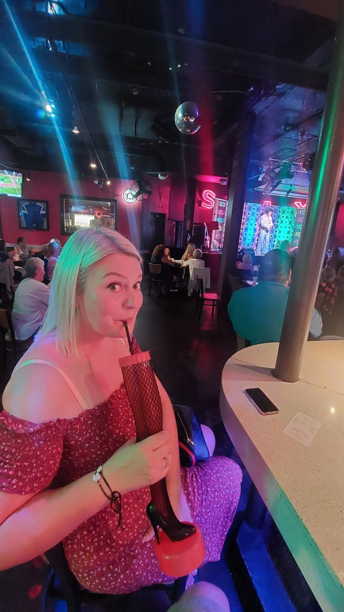
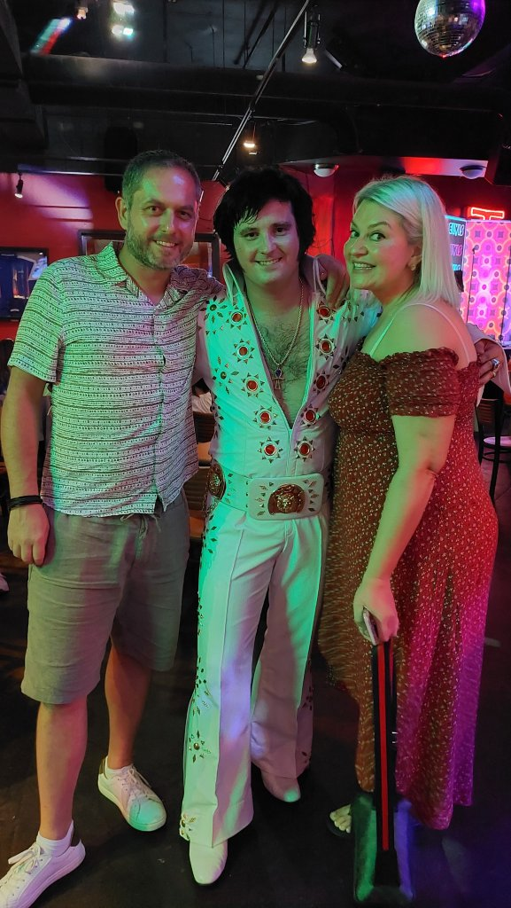
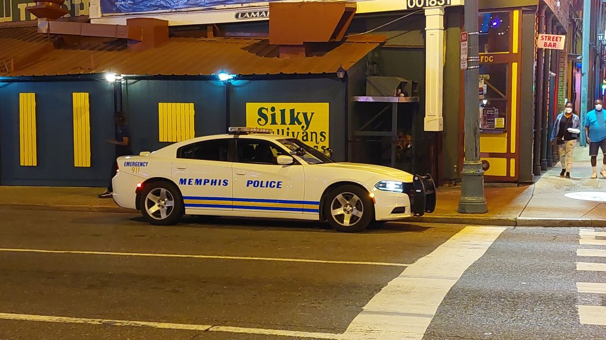
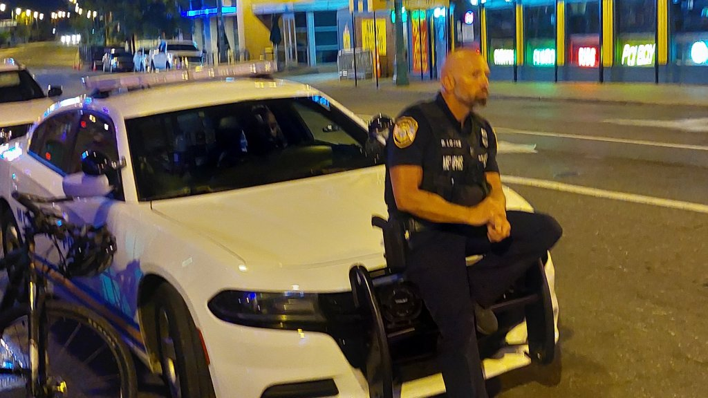
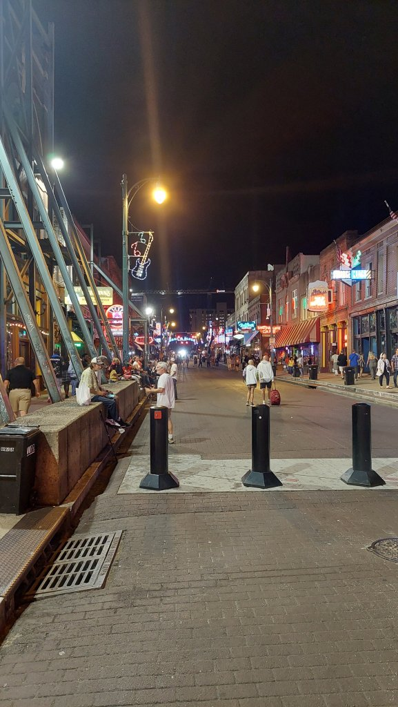

Headed to our Airbnb on North Watkins Road about 2 miles out of town, beautiful house with all mod cons needed for laundry etc.etc. which is mounting up. Quick shower and Uber to Flying Saucer Brewery, then to Beale Street for live music, watched an Elvis Night in Alfred's, then Silky O' Sullivans for dualling pianos and loaded fries and nachos then uber to collapse in bed.... an inebriated Mel chewing the ear off the poor driver stating how it is way more dangerous where we live, ahem!

