Uber to Beale Street - Ghost River brewery for IPA's and live music, great combo! Band were superb, ended up staying to 5 pints and Mel had 5 pints of Loblolly Punch beer tail, then fell into Coyote Ugly bar which was pretty wild, had a Bottle of Bud to conform to stereotype....I even peeled the labels. Then headed to B.B.Kings but no food and we were starving so we went to Miss Molly's soul city cafe, I had Gumbo Yaya and a bowl of chilli with some kind of things that you dip in it. Mel had SFC Tenders ranch with chips and coleslaw. A full on day, uber home.

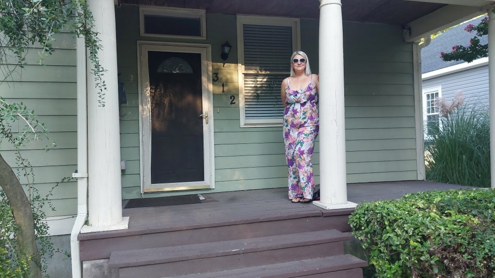

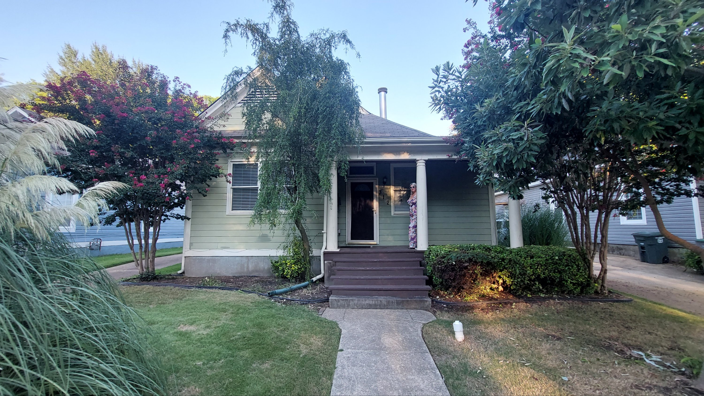

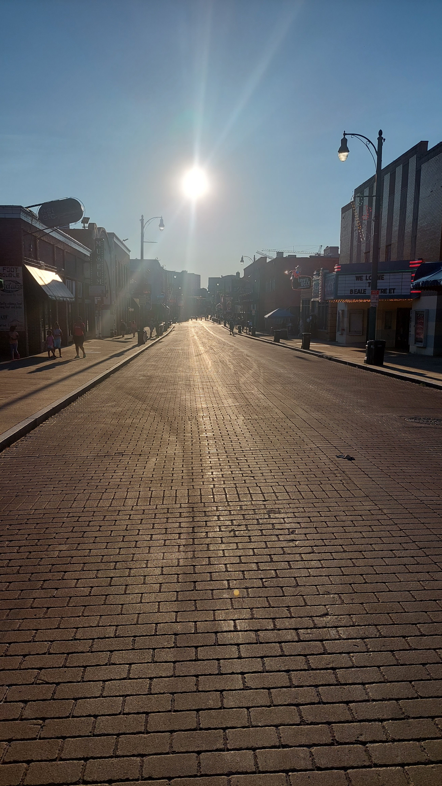

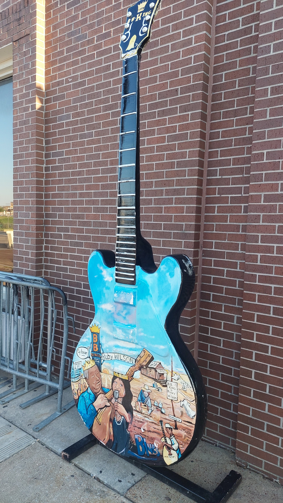

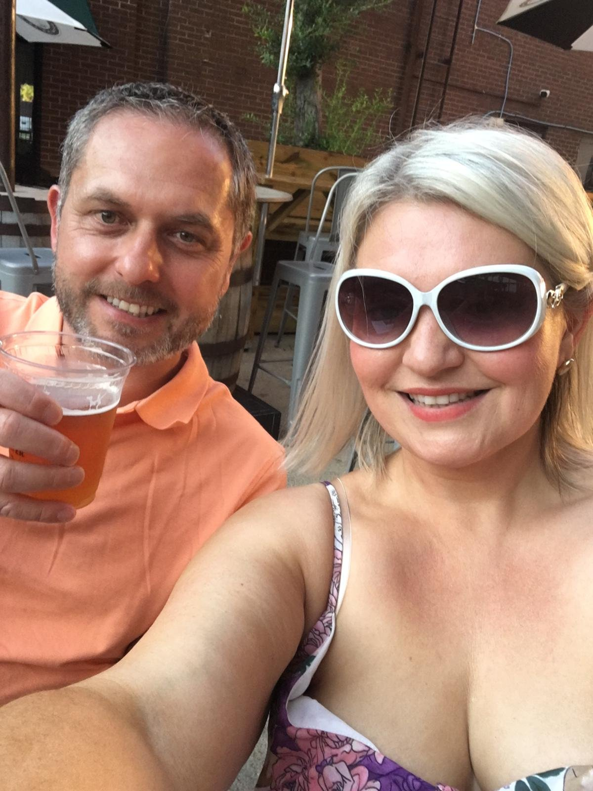

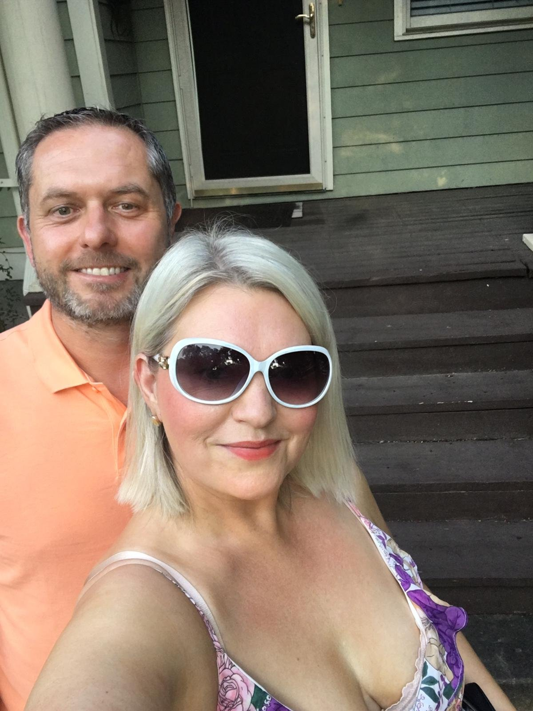

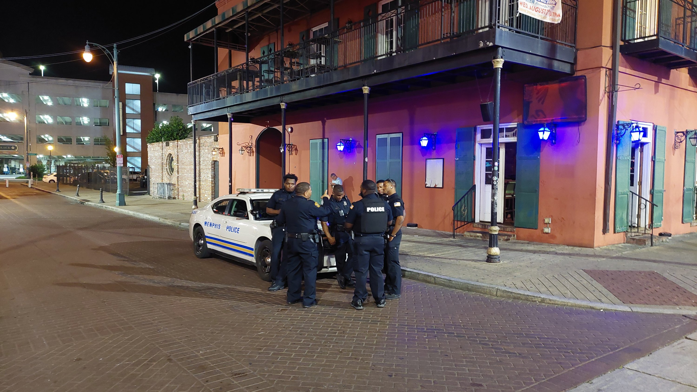

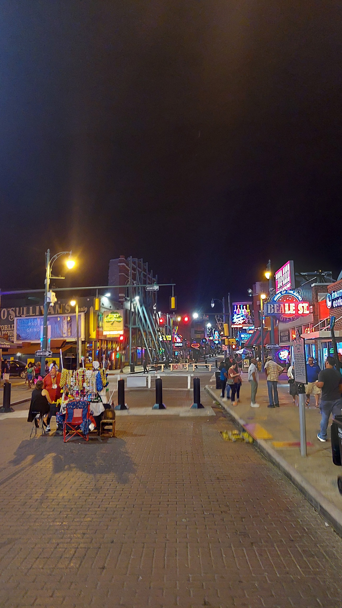

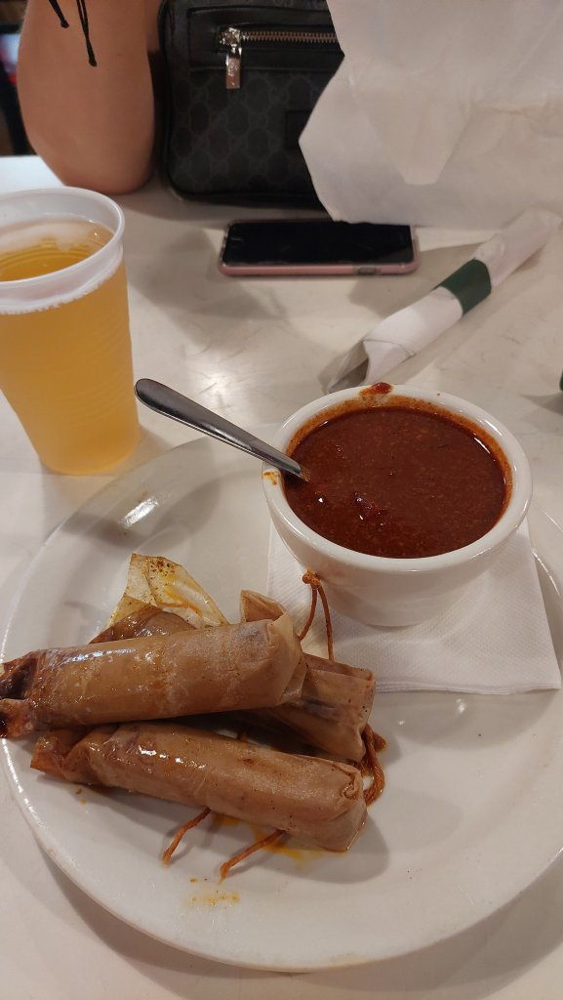

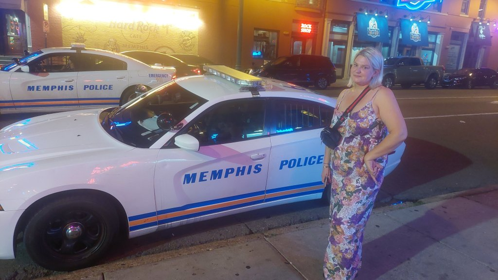

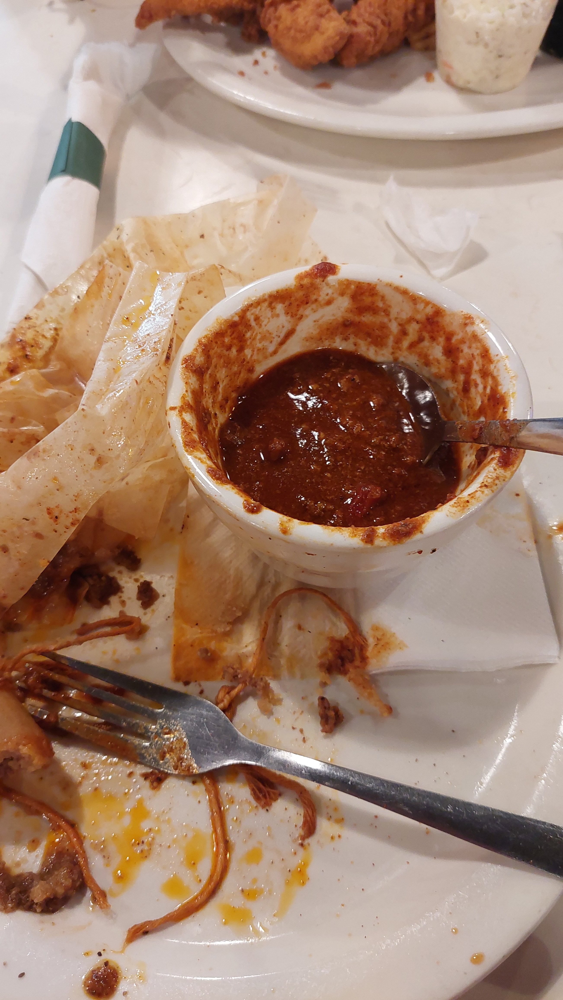

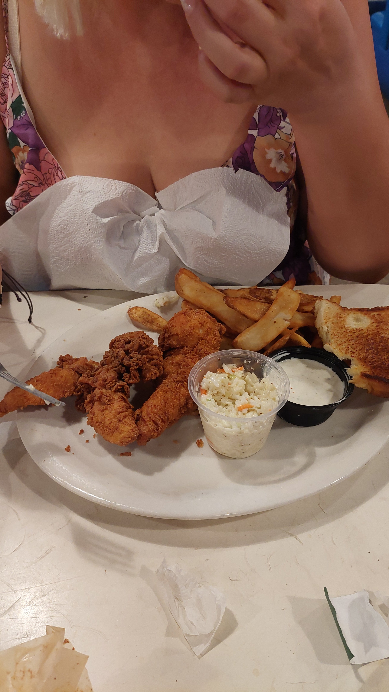

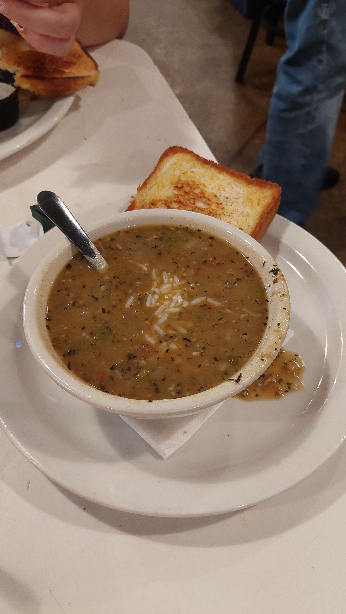

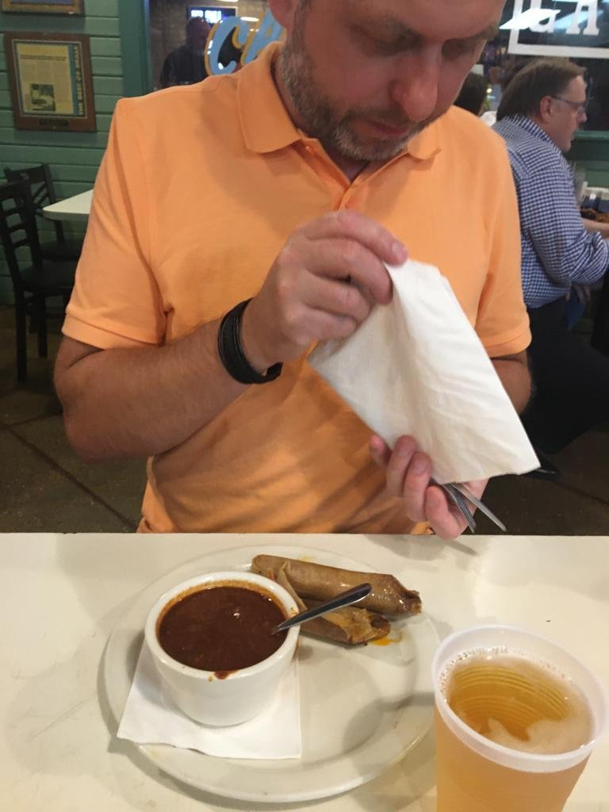

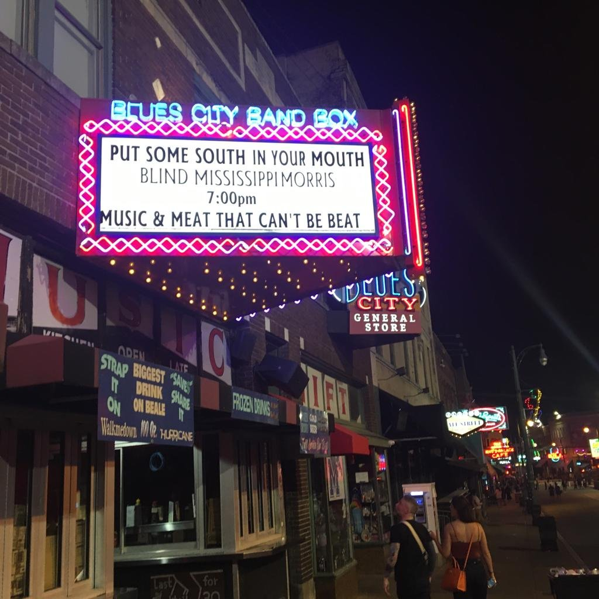

