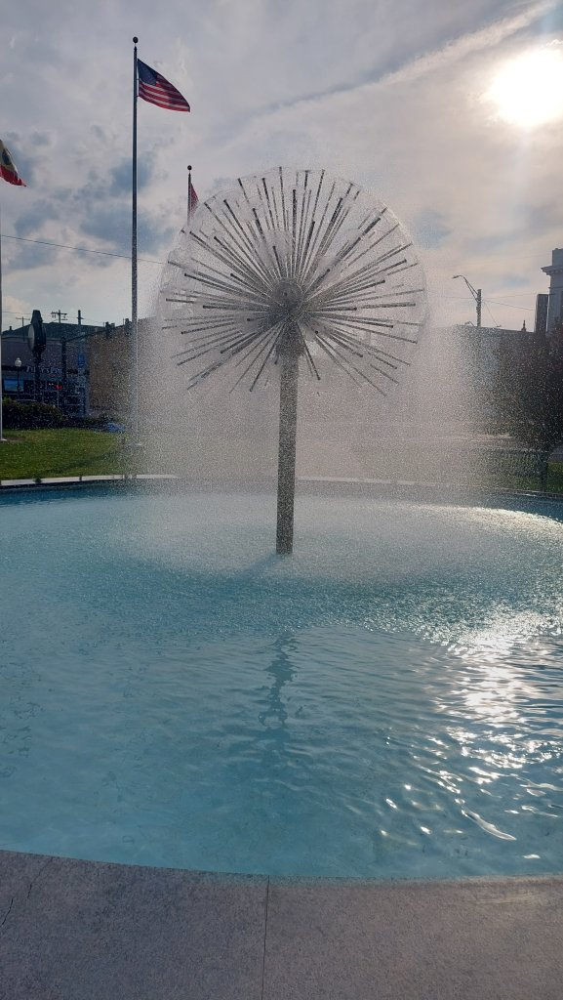
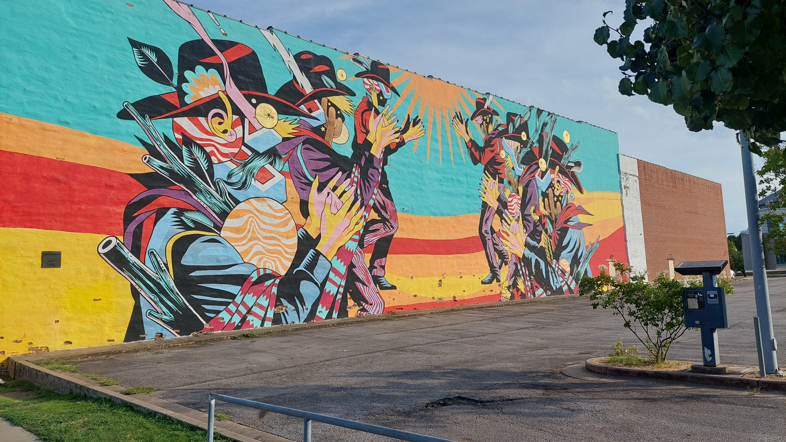
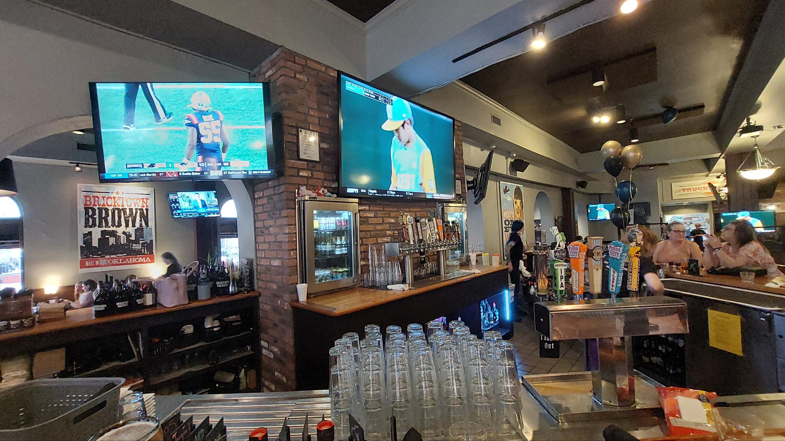
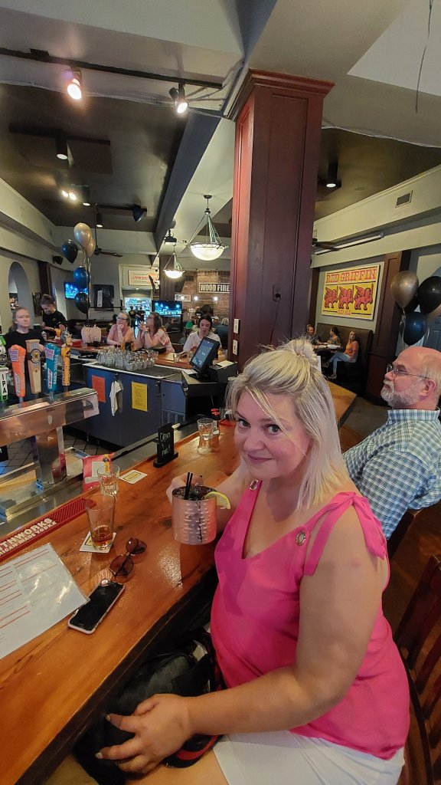
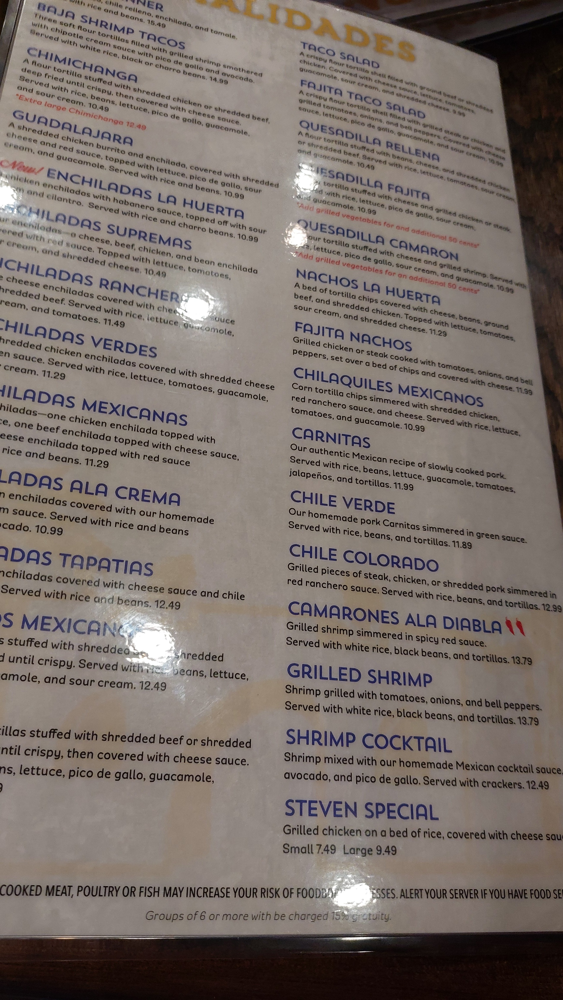
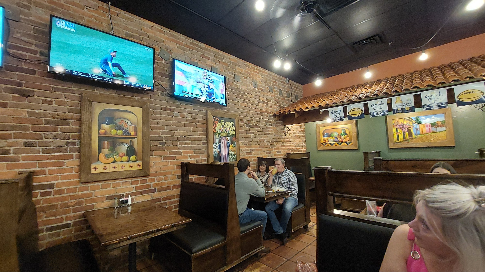
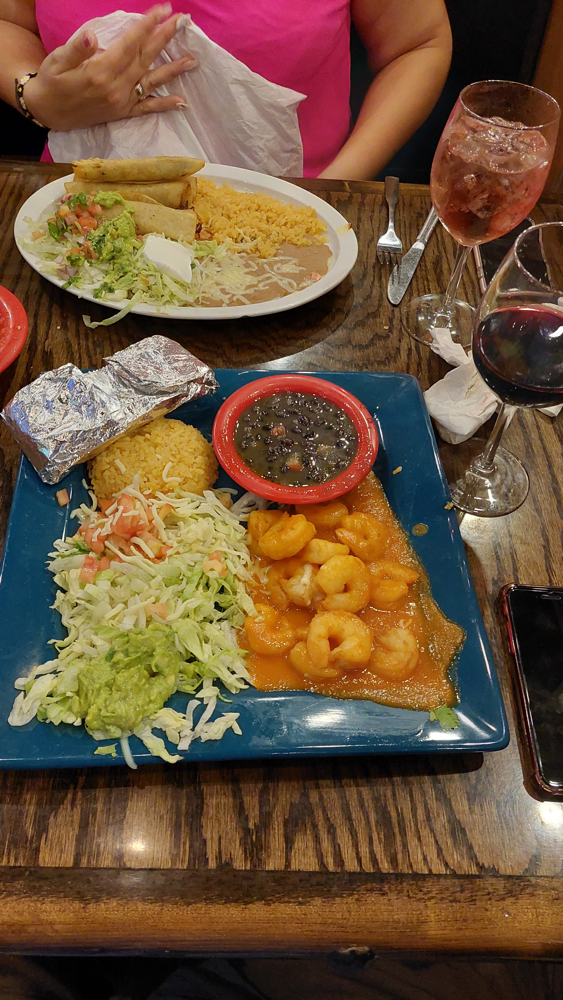

5 hr drive from Memphis to Fort Smith, a former garrison town historically important during the frontier era. Weather mid 90's but tolerable, hotel Red Roof Inn Downtown.

Checked in 4pm, showered and out for 5pm headed to Bricktown Brewery about 3/4 mile away, usual homeless issues as in every city we have been in. Had about 4 pints in here and headed for the La Huerta Mexican place next door, very nice meal - I had Camerones Ala Diablo - spicy king prawns, Mel had Chilequiles Mexicanos - mmmm and a couple of wines, but no wi-fi so couldn't book an Uber ( too sketchy to walk back in the dark ). Had to go back to Bricktown to get a beer and wi fi then Uber home. Total spend about 110 dollars plus room 70.

