Busy day ahead, Mel still laid up so struggle to get going so didn't leave the Airbnb until 11am. Weather warming up VERY slowly - still barely 21 degrees. First stop was fuel station to fill up, then head to Tucumcari for the most authentic route 66 diner - Watson's BBQ. We both had brisket salad with unlimited cold tea and lemonade, great place and great characters! We also hit the midpoint of Route 66 and the topography is definitely starting to become more dramatic throughout New Mexico

Next up was spot I was really looking forward to - The Blue Hole of Santa Rosa - a crystal clear natural artesian well that flushes itself clean every 6 hours so is as clear as clear can be and is a constant 61deg Fahrenheit eek. No one was in but I got changed and jumped in anyway! Mel had one job to video me jumping in but missed the entry. Absolutely beautiful feeling and much needed. Mel chickened out.

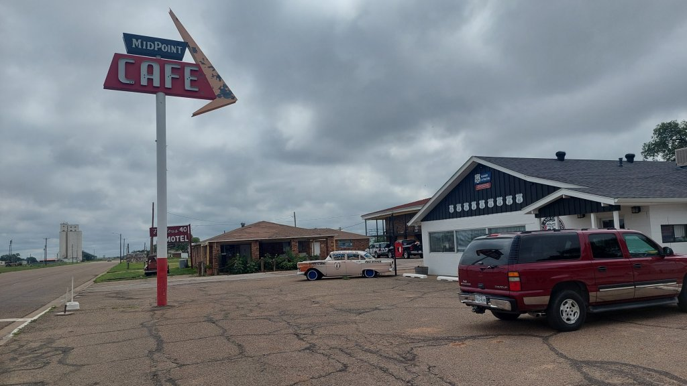

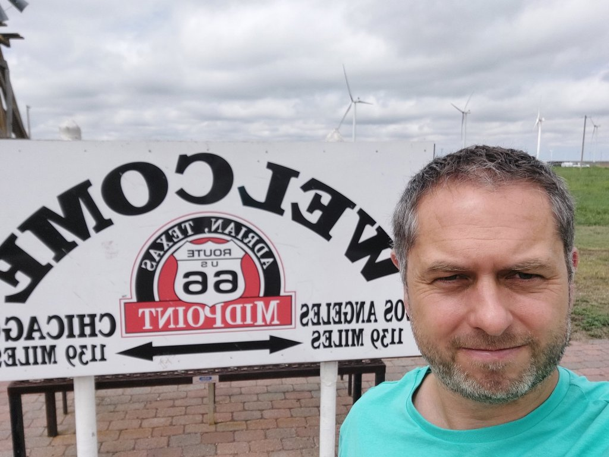

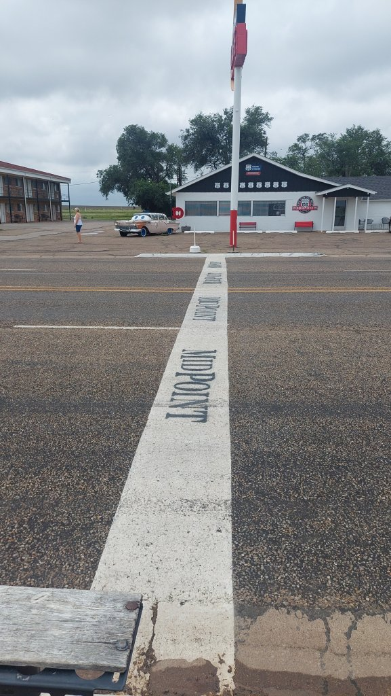

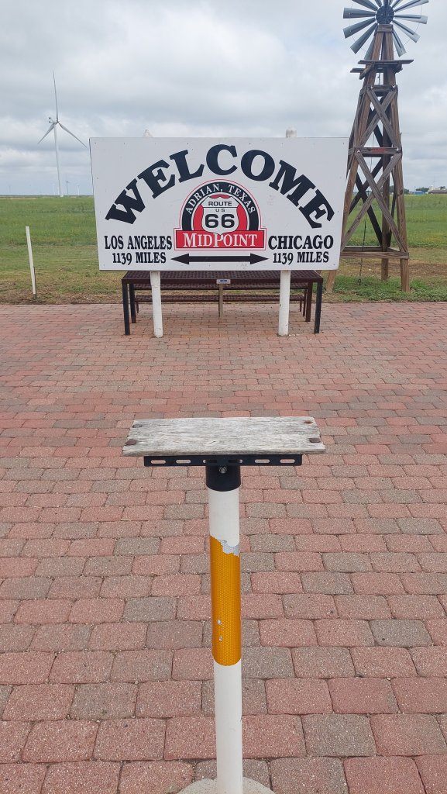

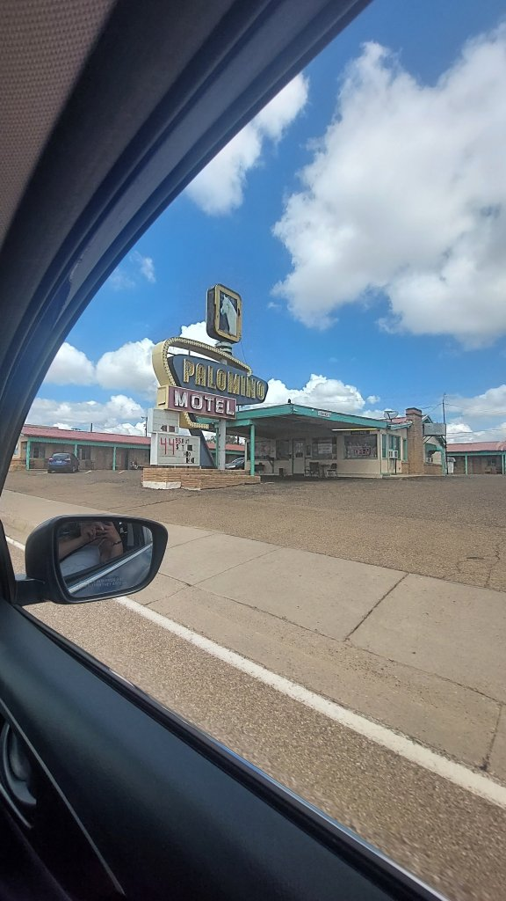

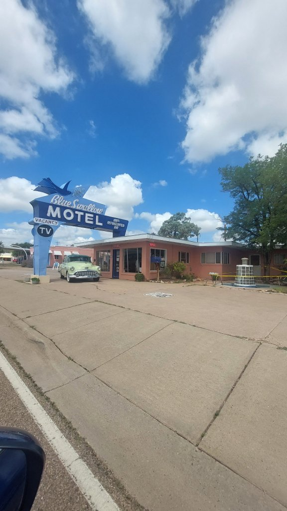

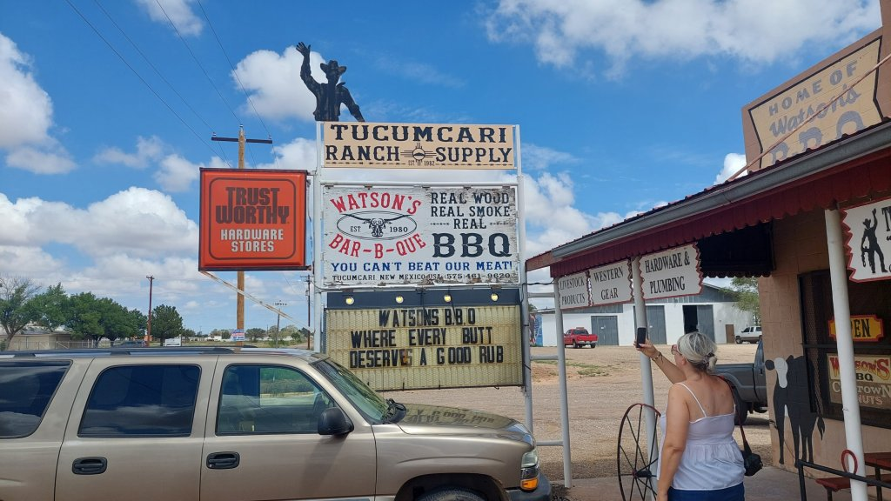

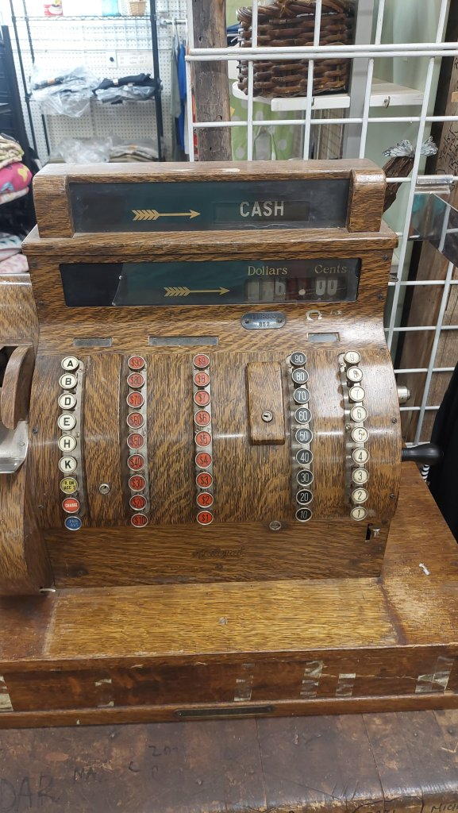

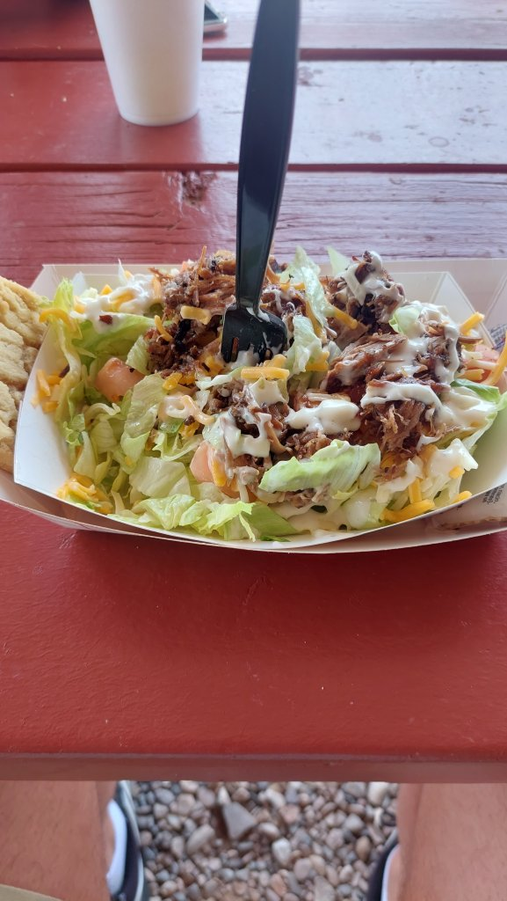

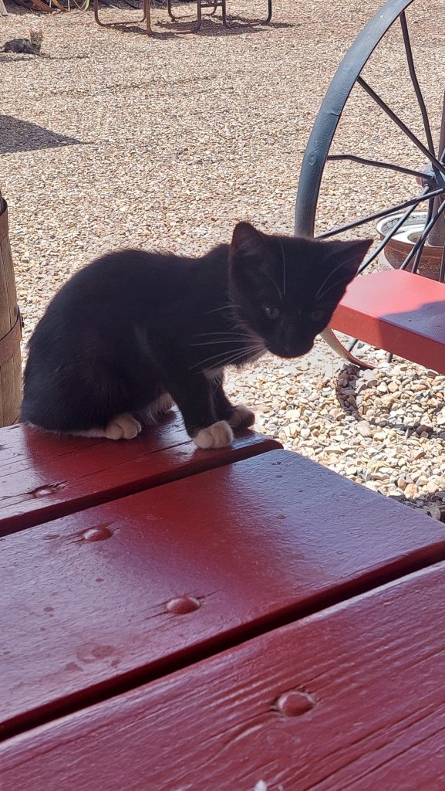

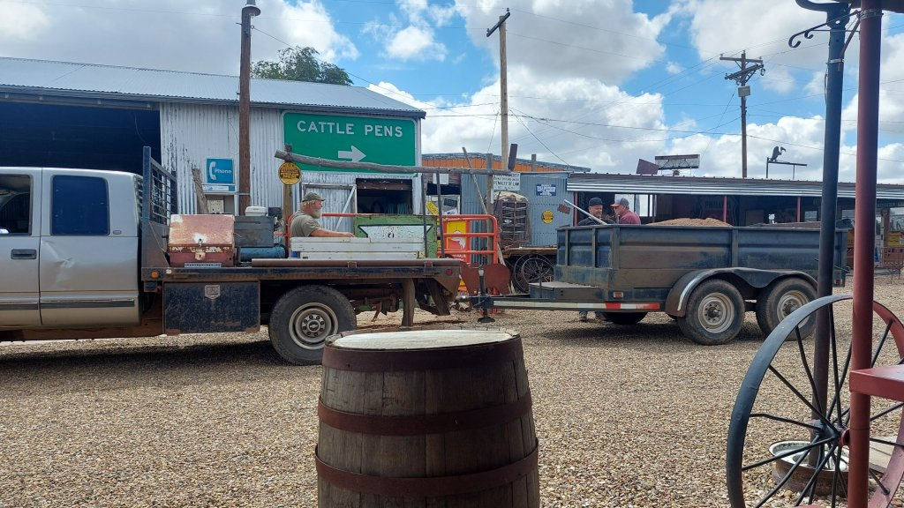

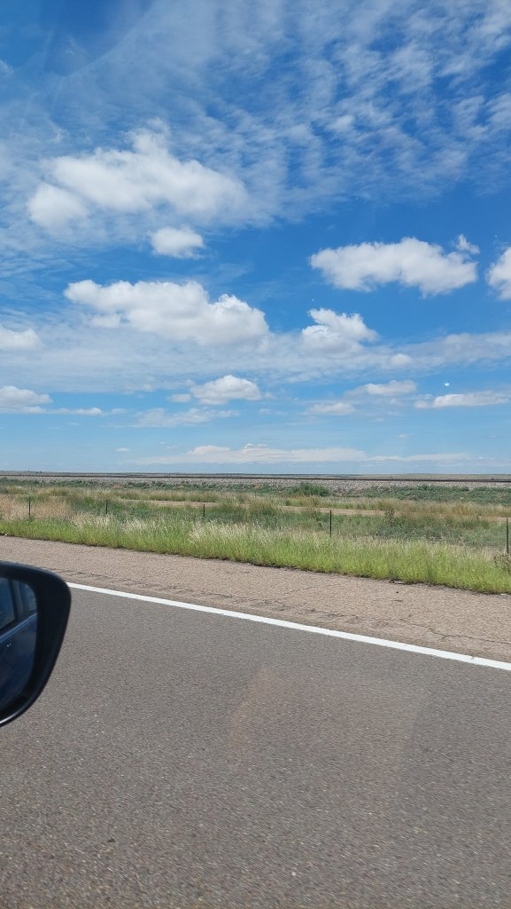
