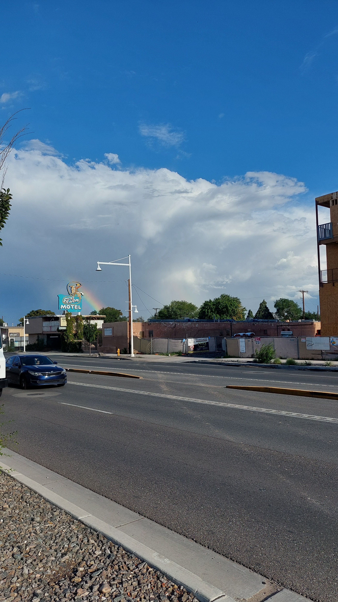
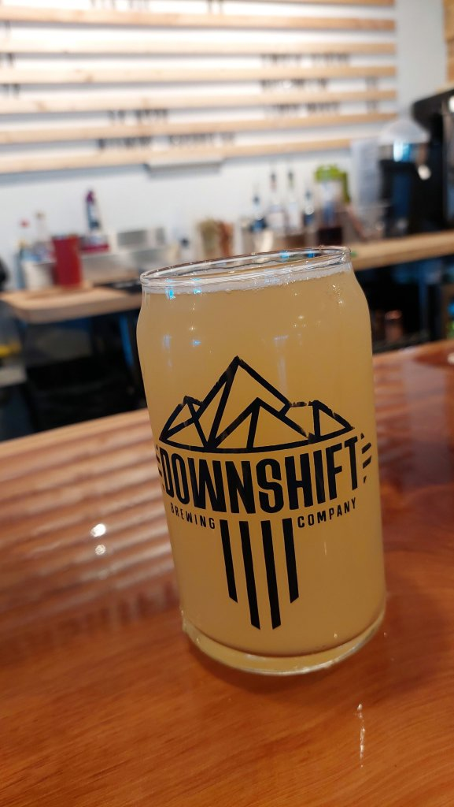

Next stop EconoLodge Albuquerque old town - arrived in rush hour traffic - possibly the maddest drivers yet and what was to turn out to be a very strange evening! Mel really not well so bed ridden so I decided to walk to local brewery tap and try to pick up a takeaway for later and bring it back to feed her - like a mother bird bringing food back to feed its starving chick's. Downshift Brewery was spot on,had 3 really pints, electrical storm and downpour made me stay in there longer than scheduled. Couldn't find a takeaway so Mel tried very hard to sort an Uber eats ( and failed ) , I managed it from my brewery table ;). I then walked home, uber stated it had been delivered and I got a bill and a big tip paid to the driver- when I arrived at the hotel room - no pizza! We were fuming and absolutely ravenous and 42 dollars lighter for the privilege. Went to reception to moan and ask for CCTV cameras - he was dead helpful but couldn't get anywhere then a huge guy covered in tatoos and a massive dog from a white Mustang walked in and couldn't believe it - long story short- this guy drove 3 miles to Papa John's and brought us the exact pizzas we wanted and brought them back to us! He then got on to Uber eats and sorted us a full refund ! What a guy! Mel was shitting herself thinking he was going to rob us and blow our brains out. Bizarre evening. Mel was on pins anyway and then about 2am I went for a wee and as I opened the bathroom door all hell was let loose! Full on alarms going off, lights flashing on and off....she thought that was the end!! Haha...we still don't know what it was.

