Started with breakfast in Winslow, I had avocado on toast with cashews? Some kind of nut anyway and Mel had eggs. She was then serenaded with "Sittin' on the Dock of the Bay".....that made her all emotional. Lovely people in Winslow.

We then headed for the meteor crater - the largest preserved meteor crater on Earth....50000 years ago an Iron Nickel meteorite 50 metres wide caused the crater which is just over a kilometre in diameter. Fascinating to see and a good guided tour.

We then headed to Sedona, flash flood warnings coming through on phones and a torrential downpour and electrical storm whilst driving through Flagstaff. Had a Wendy's for the first time, a triple baconator burger, was lovely but mahoosive. Weather cleared in time for the journey to Sedona, and wow , what a view going down the 89A. Scenery like I have never seen before.

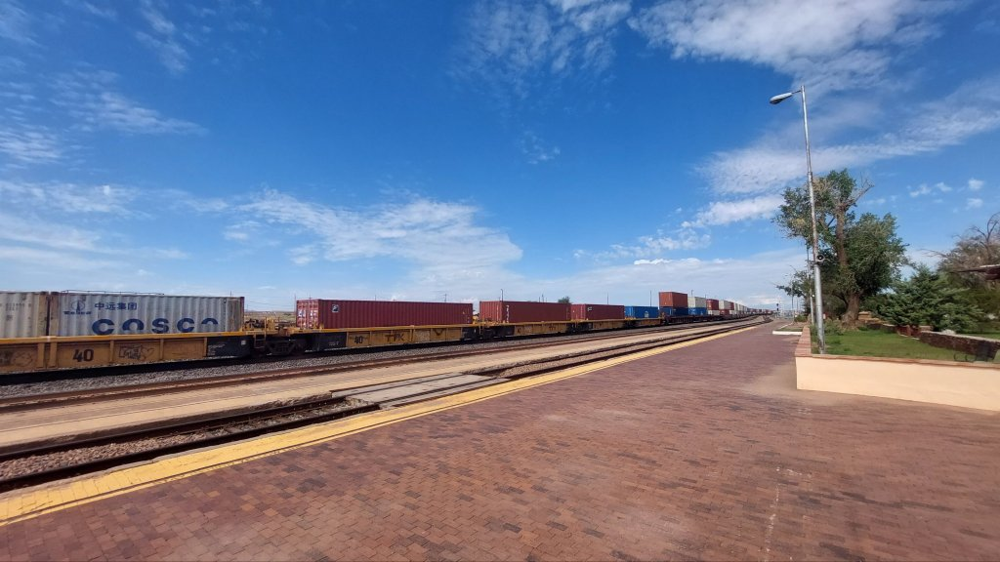

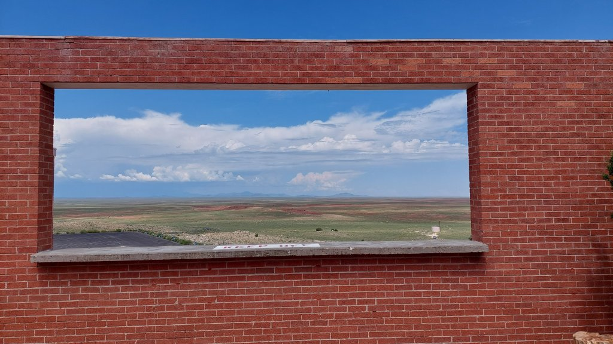

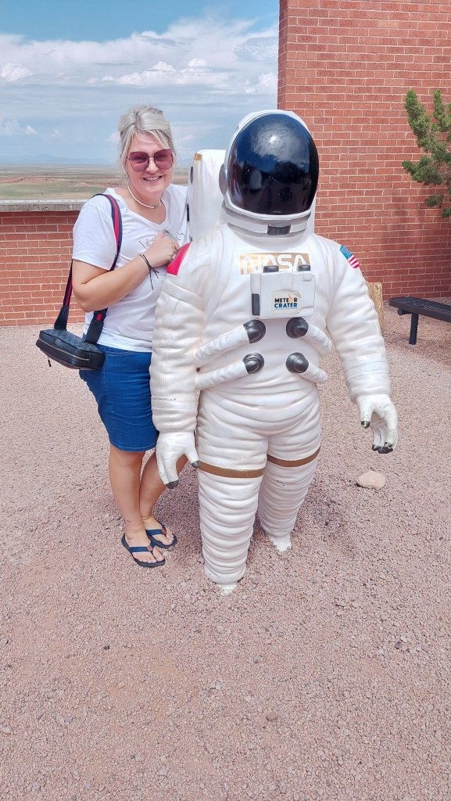

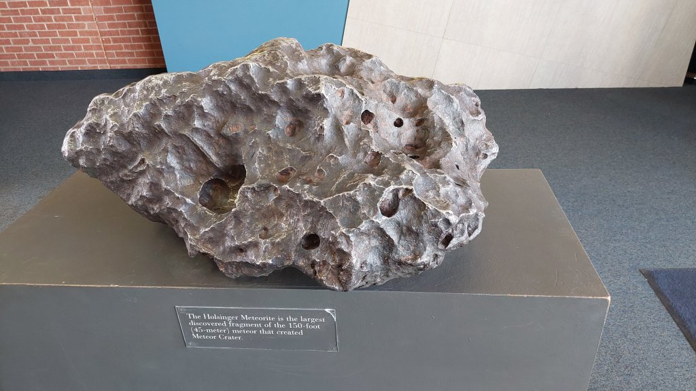

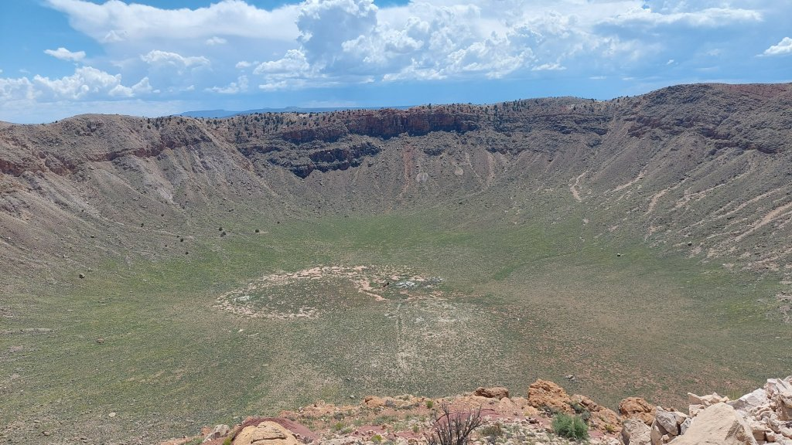

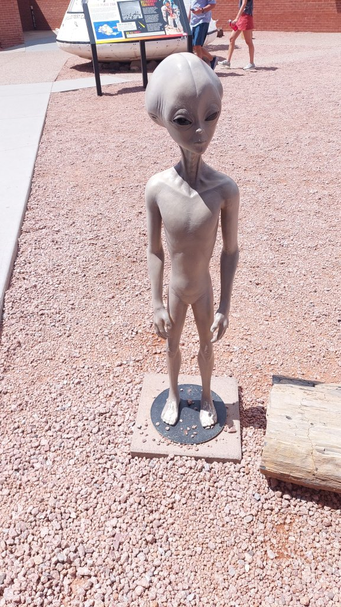

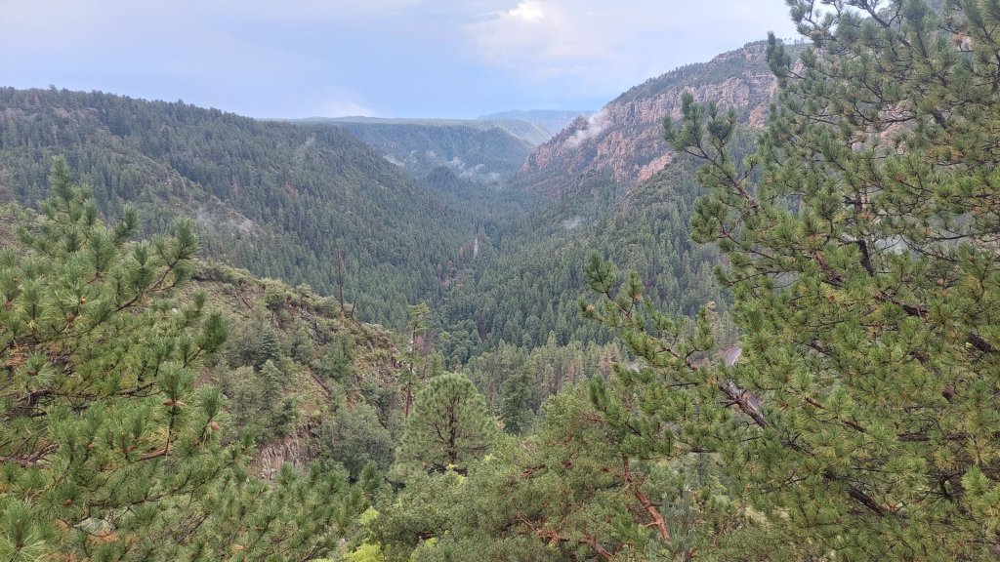

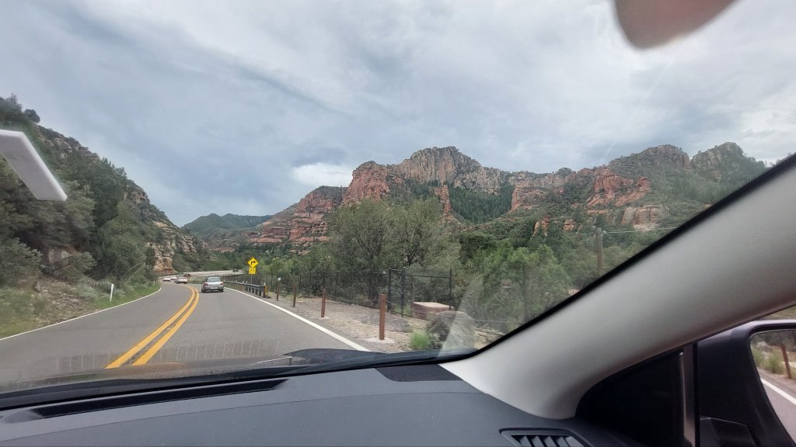

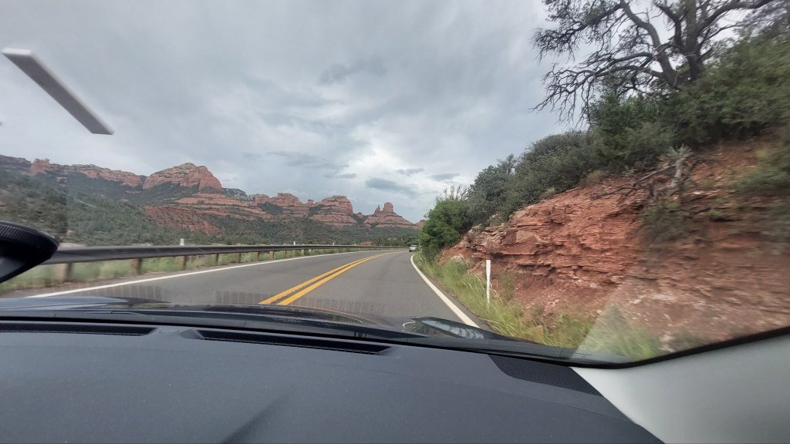

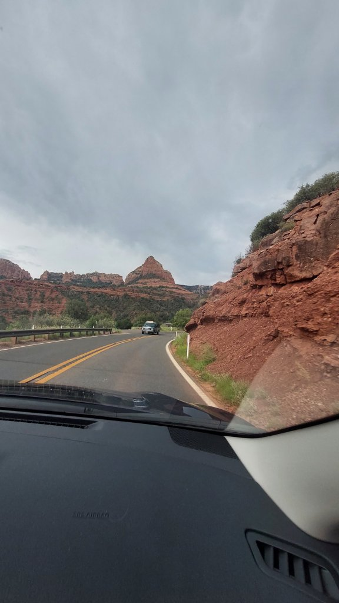

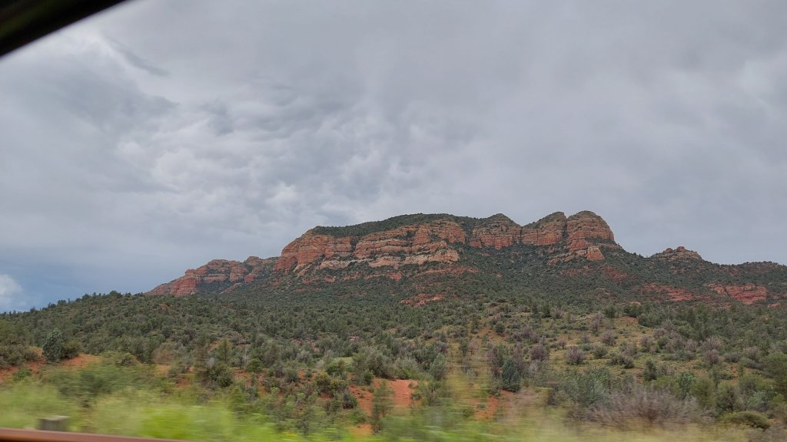

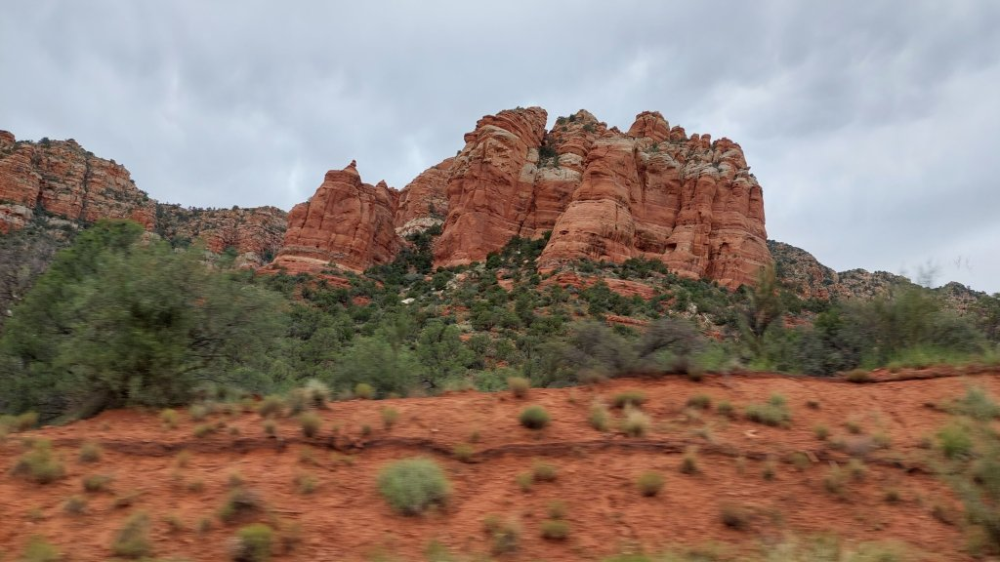

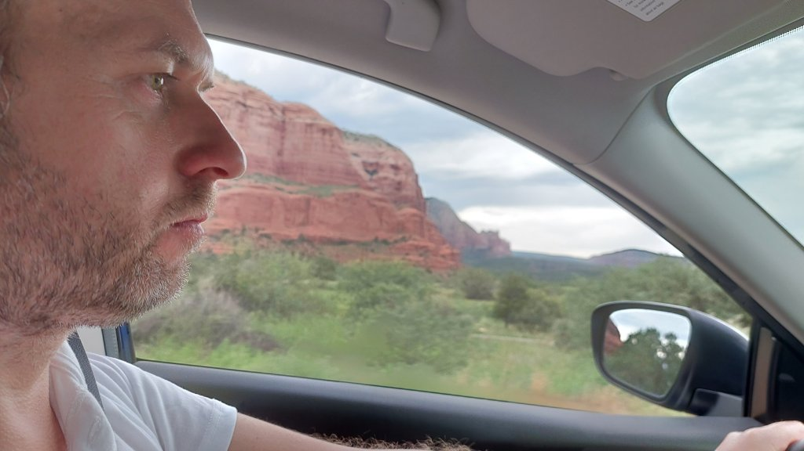

