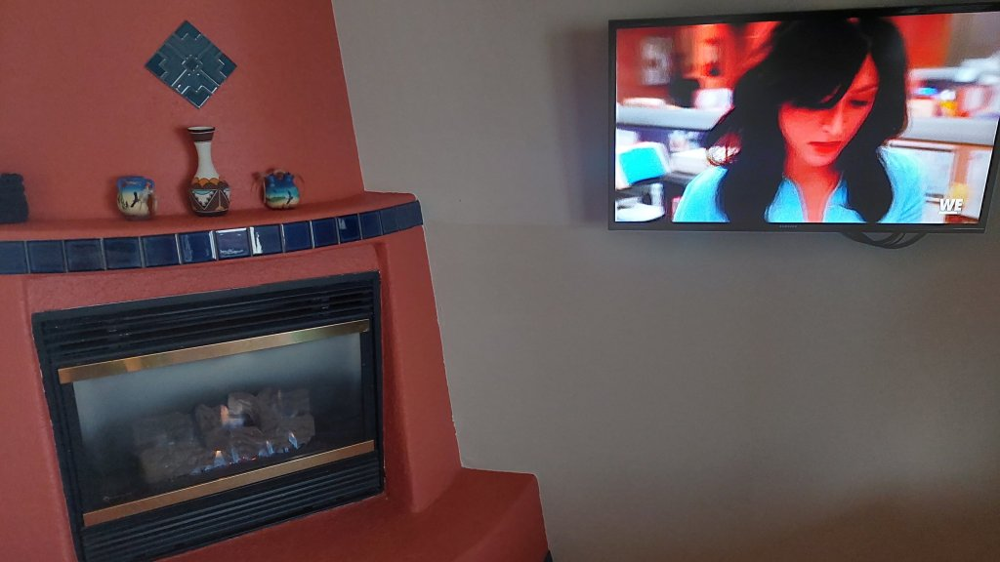
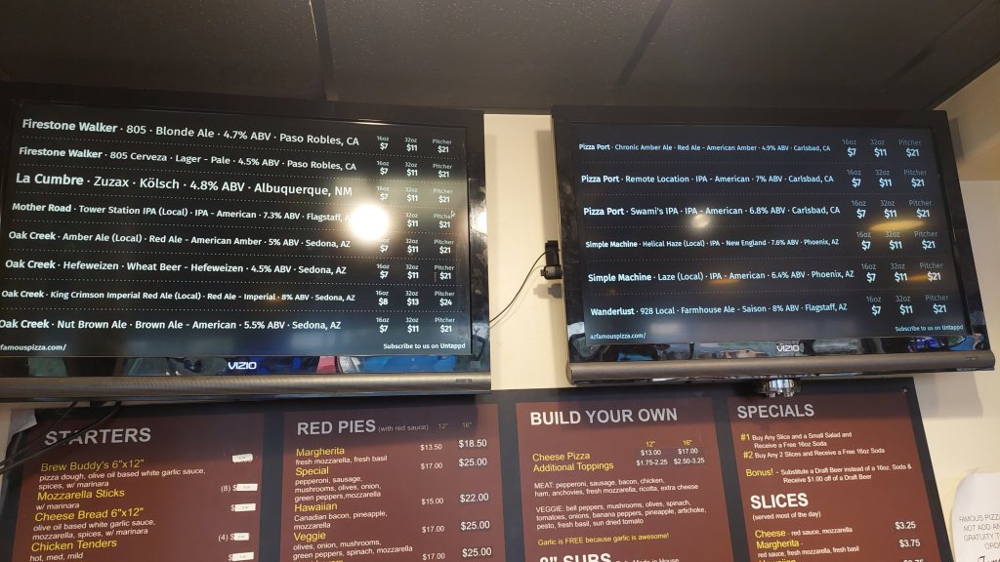
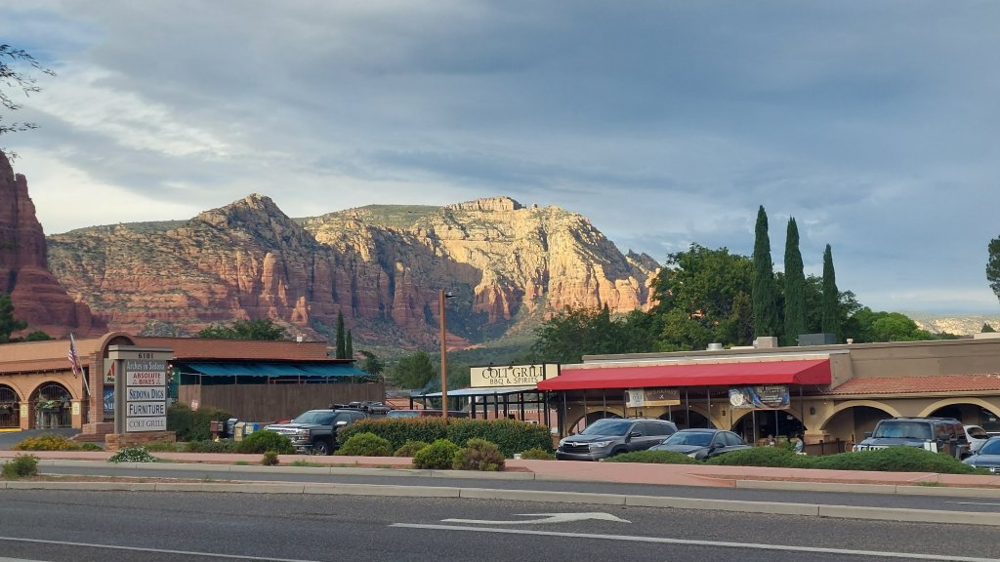
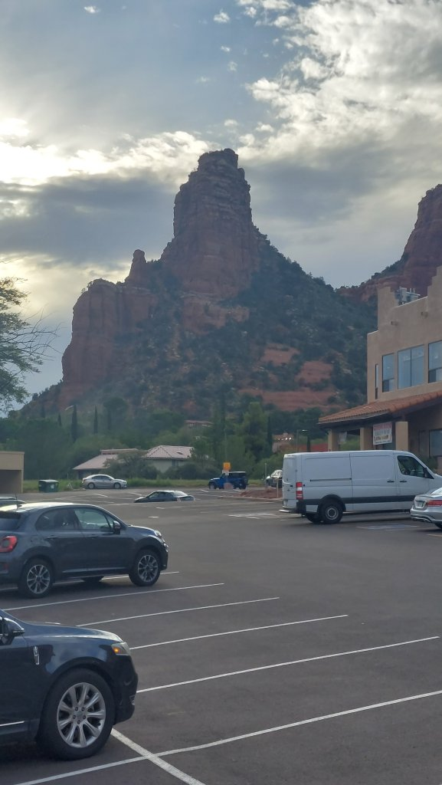
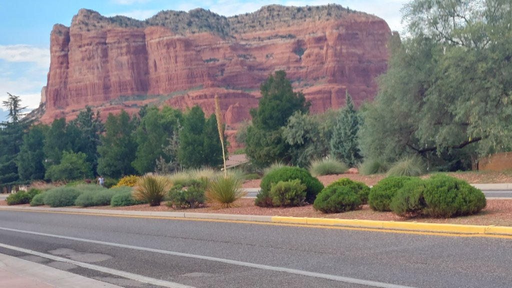
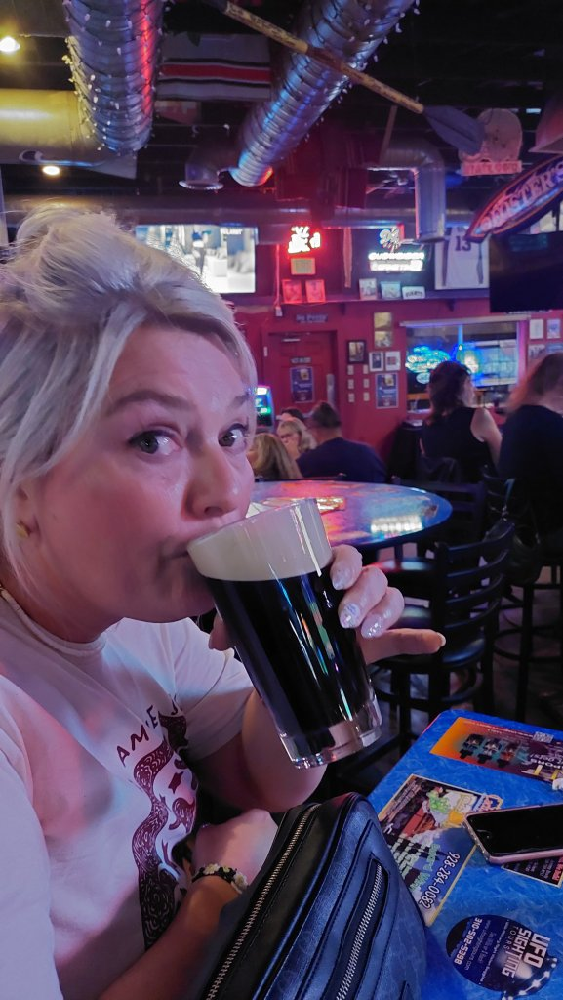
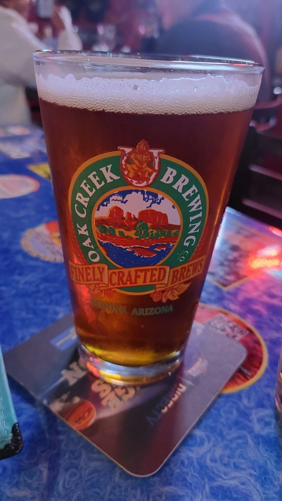
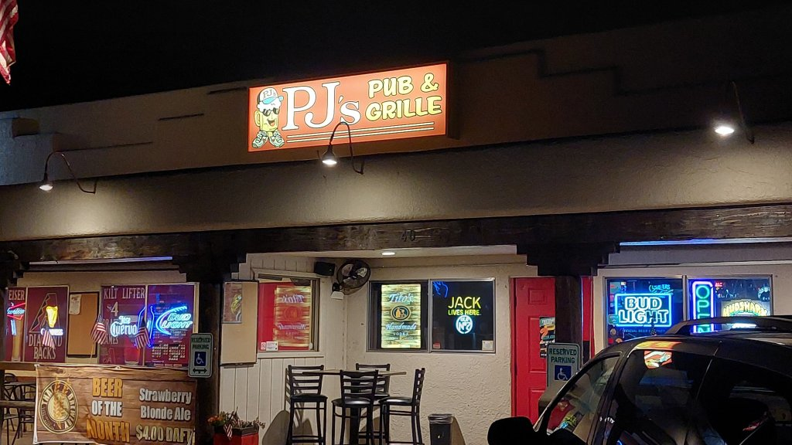

Travelled to the Sedona Lodge Hotel in the Village of Oak Creek, arrived about 5pm, weather still cool about 22 deg. Checked in, had a suite with a fireplace and a separate bedroom. Headed out to furthest bar as walking has become non existant lately and going to be the size of a bus. About a mile to full moon saloon for a local red ale and a cocktail for Mel, then headed up the road to PJ'S village pub, what a surprise, brilliant I've music with a band singing all 90's classic hits, really good night, I had a cup of chilli and sweet potato fries, Mel had chicken tender, all really good....then stocked up at the local K as I am planning to climb Bell Rock first thing in tbe morning. Bed at 9:30pm

