Realised I missed a day out, Kingman, AZ. A fun stop over town on route 66 with a nice route 66 museum and photo opportunities. Weather hot mid 90's but bearable, stopped at the Arizona Inn, rough and basic but clean and good air con with the ubiquitous fridge and microwave. Walked into town first to Black Bridge Brewery for a light beer each and then wandered to the Cellar Door wine bar for a spot of live music, very cool place and the band were great. We then walked next door to The Rickety Cricket brewery tap where I indulged in a very large pizza and Mel had some Taco's (hers were quite small). We then walked the half mile back to the motel.

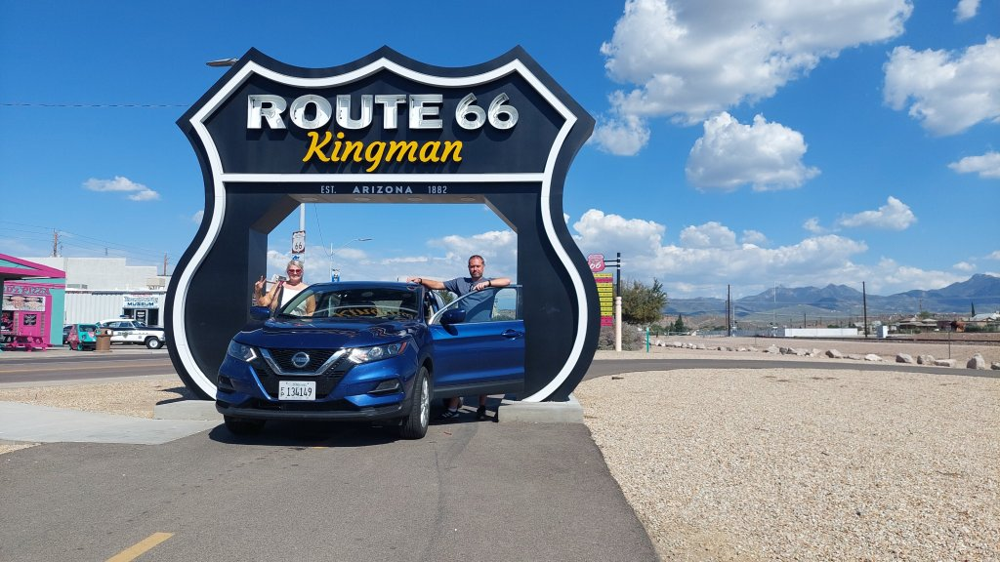

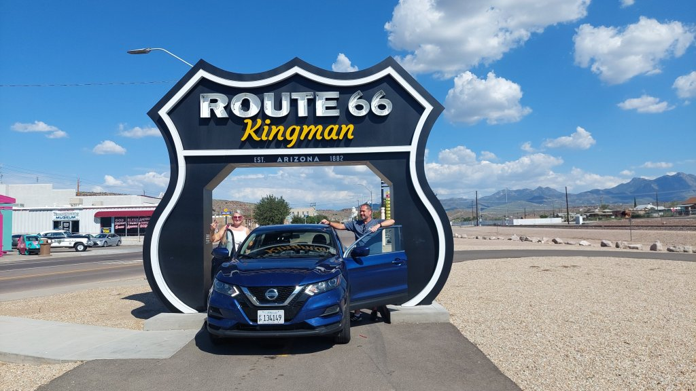

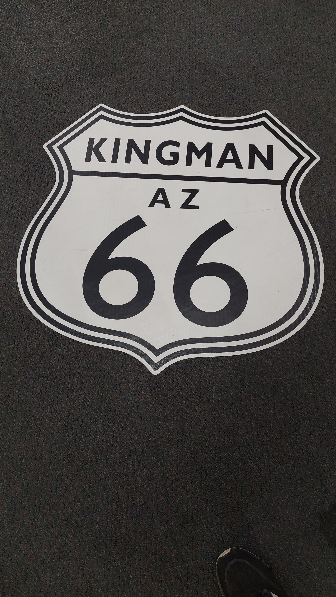

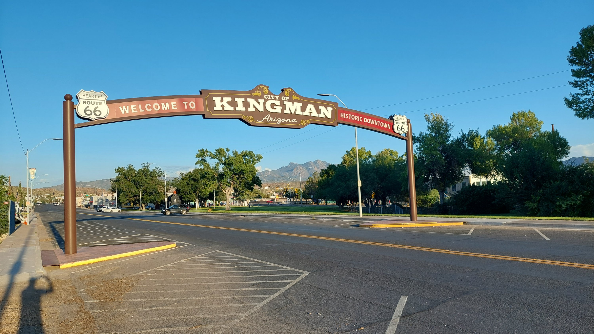

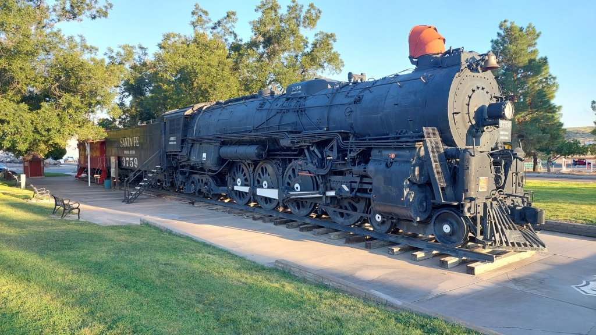

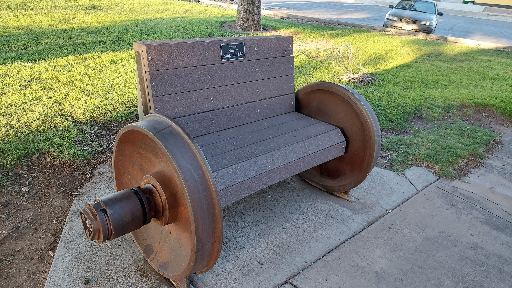

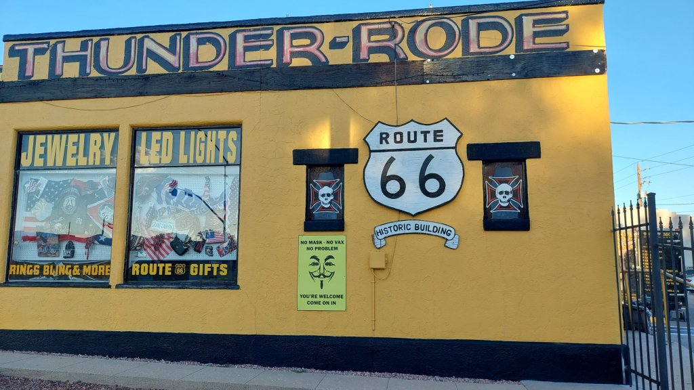

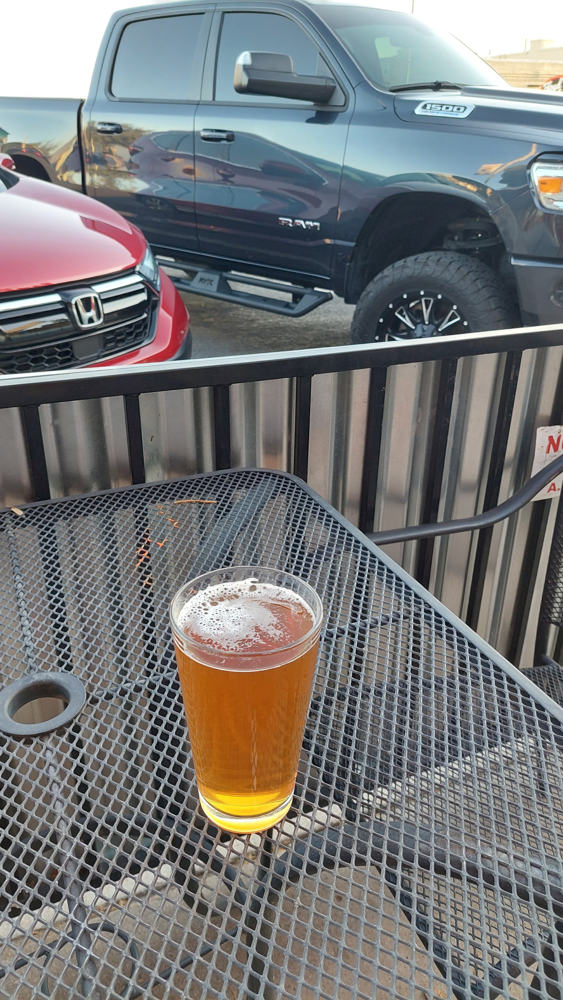

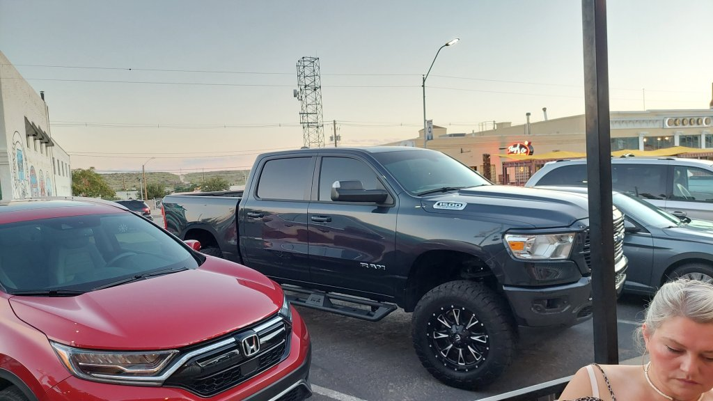

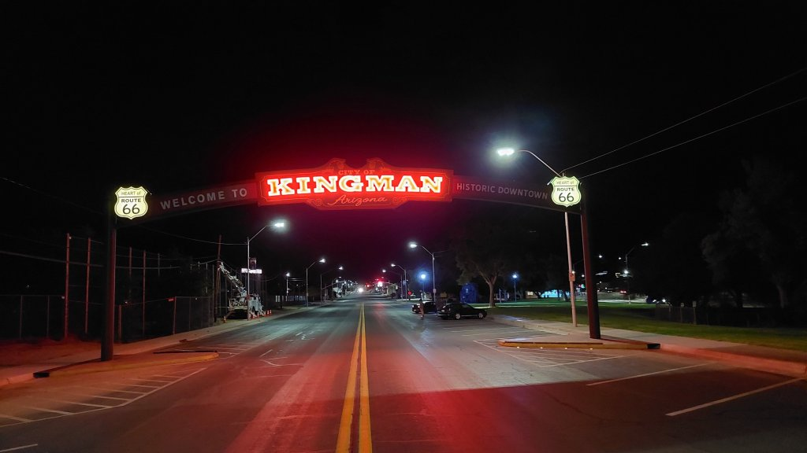

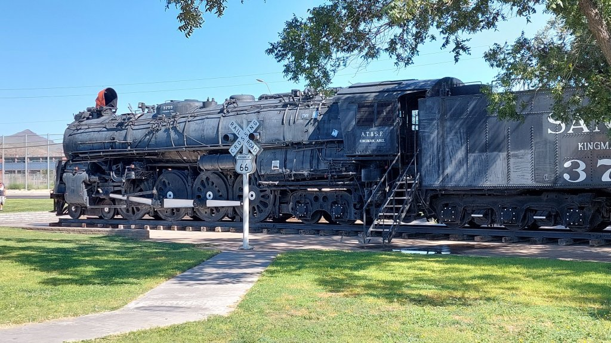

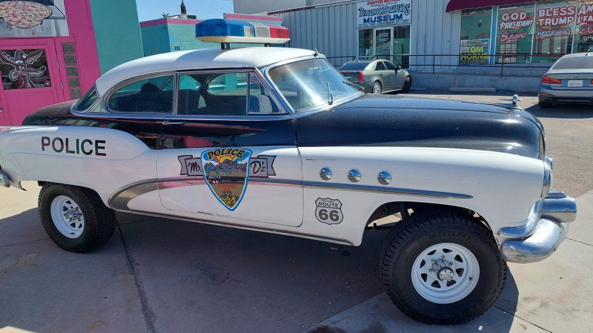

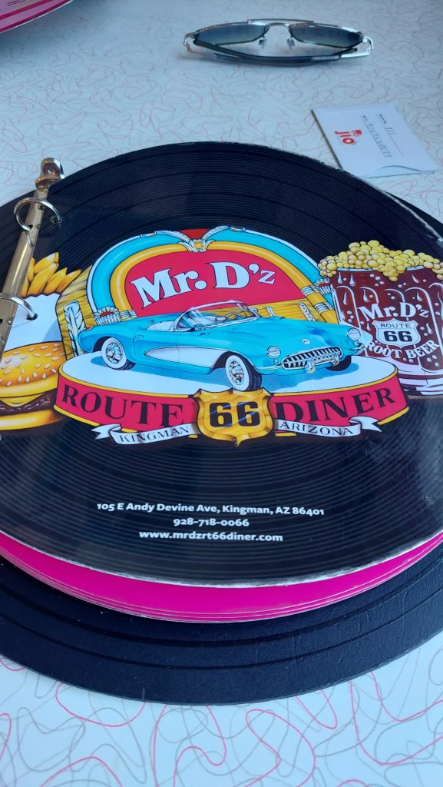

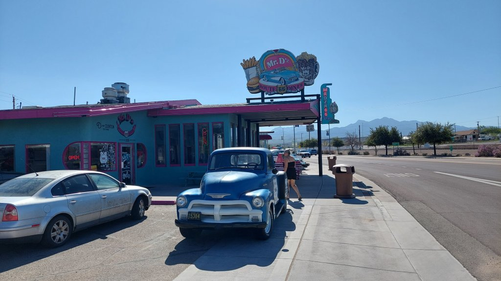

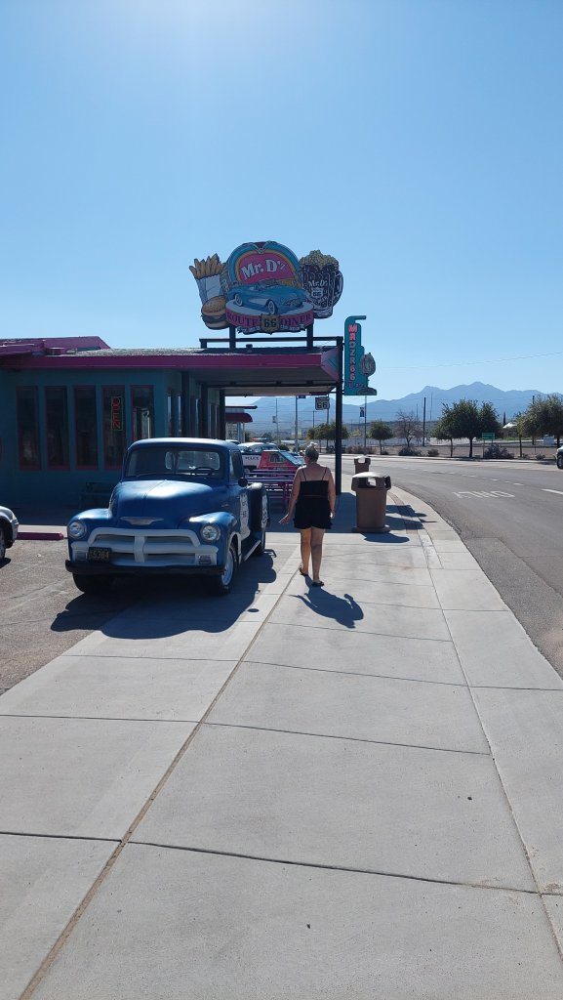

