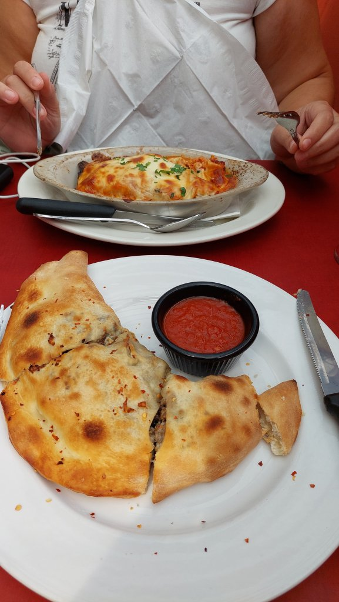
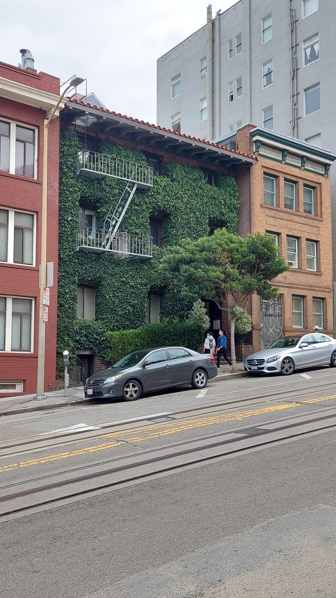
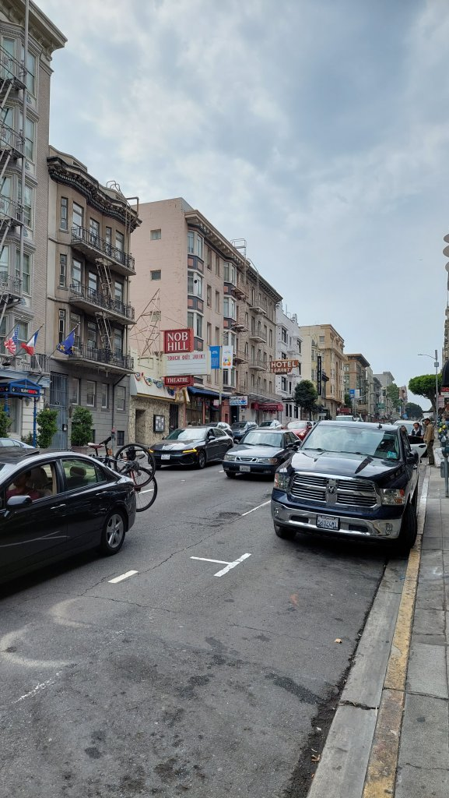
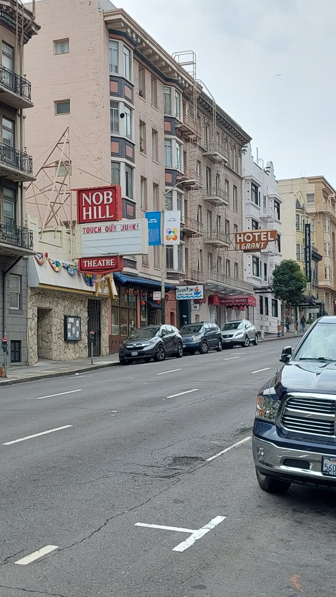
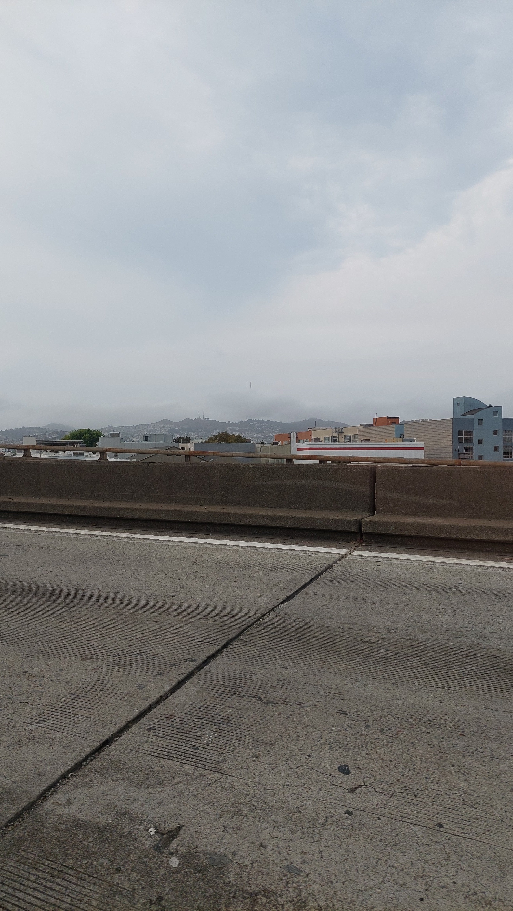
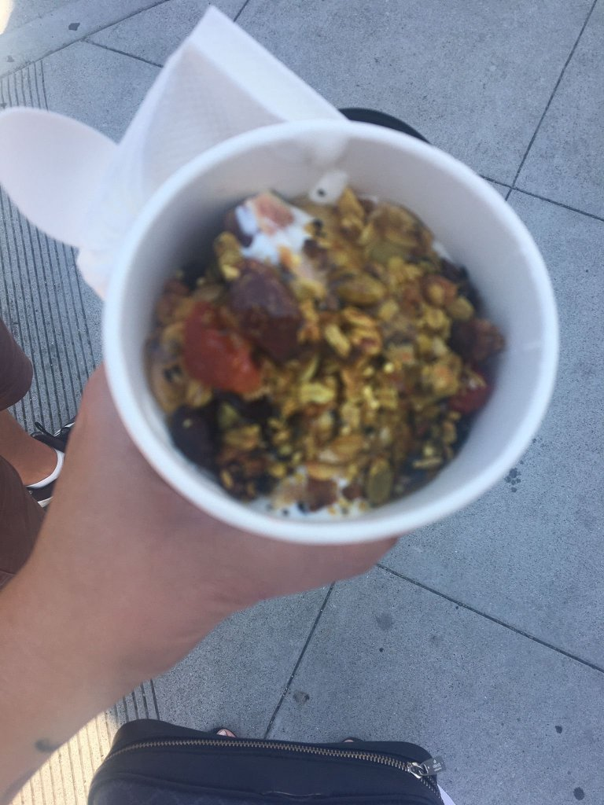

Up at 9:30 for the neverending journey home. Repacked and left a shed load of stuff for the homeless. I also look and feel homeless - same pants for the last 3 days, unshaven, unkempt, no toothpaste left and about a stone heavier, other than that all is good. I even took to wearing Mel's underwear at one point. Checked out at 11 and left all the luggage at the hotel. Scaled Kilimanjaro to get a cold coffee and walked to an Italian for a final lunch - Luisa's ...the lady owner has ran this place since 1952. I had a calzone and Mel had a lasagne with vodka sauce, both really good, $55 bill with cokes. Walked back to hotel, booked Uber for $40 for the 12 mile trip to the airport, checked straight as Premium on Virgin, 3 hours 30 mins early, headed to bar as it is the weekend after all. A 14 dollar Lagunitas each,then Mel got told off for not tipping! Ha ha . I told her to tell him to get stuffed. We have tipped the GDP of a small Country this holiday. Contemplating the next 24 hours of travel via Plane, train and automobile....specifically 9hr flight to LHR, a one hour "Megabus" to London Victoria bus station, a 6 hour National Express to Hanley bus station for midnight arrival then blag a lift / hitch hike home to Scholar Green. Signing out, Danny & Mel xxx

