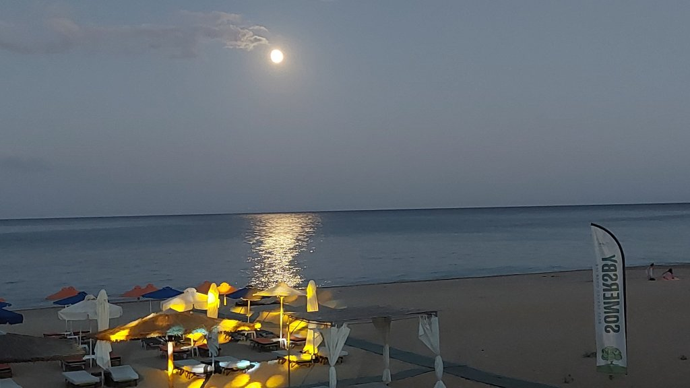
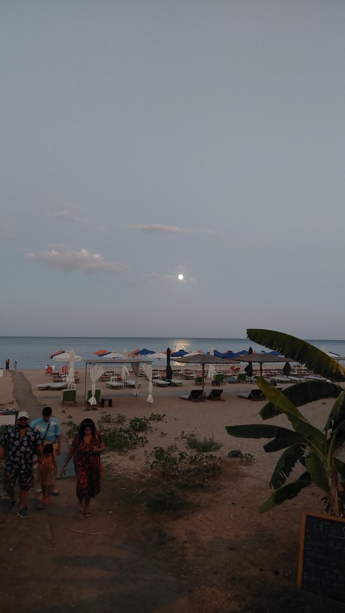
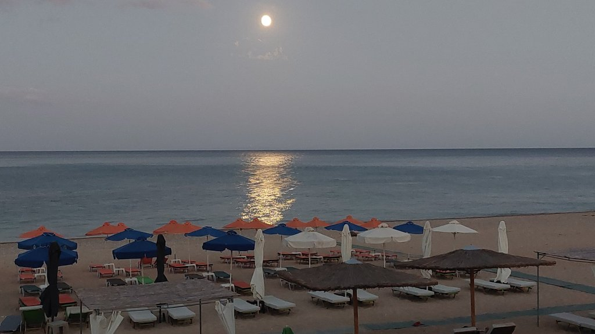
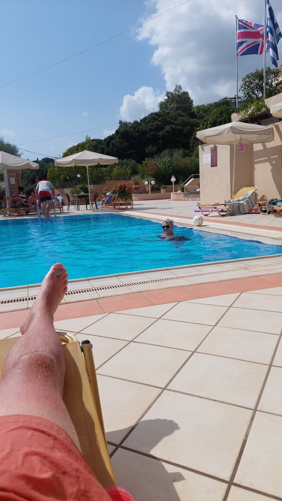
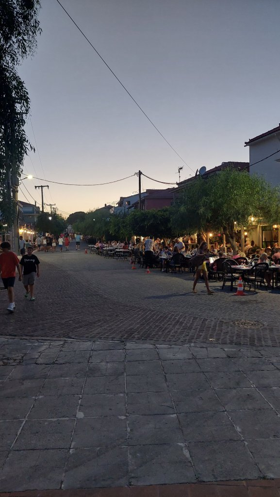
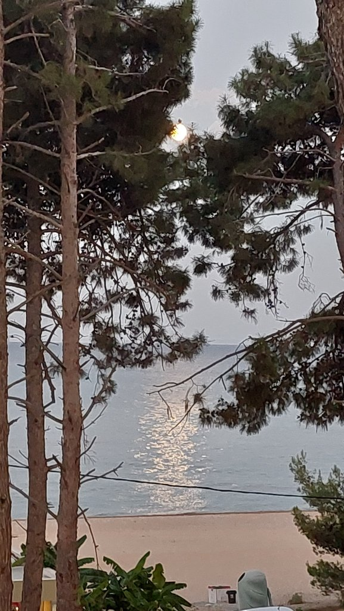
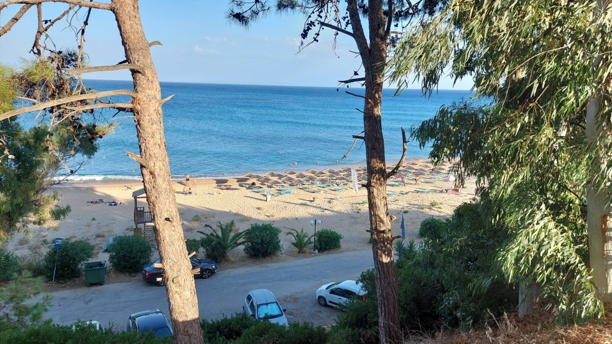

Lazy start, then pool day. Read "Into Thin Air" about the 1996 Everest disaster. Got me thinking I'd like to climb some mountains. Walked to the square with a mushroom pie and a sandwich for Mel. Lazed around the pool a bit more. Changed and out to Panarama - Mel is a creature of habit. Beer and a white wine. Lovely to see all the Greek kids playing in the square and not stuffed around electronics like you see in the UK (the weather helps). Went to Metaxa beach bar for "Motown Night". Had many cocktails and much red wine. Way too much. Met a lovely recently married on the island couple from Liverpool, lots of dancing ensued. Had a Gyros to help soak up the alcohol. I think we fell in the apartment around 3AM.

