Actually woke up for our breakfast today, a miracle! Had the standard cheese and ham toasties and Mel her boiled eggs....oh she loves her eggs. Pushed the boat out and decided on a beach day with sunbeds and an umbrella (13 euros at Metaxa). Finished my book and Mel finished hers. Had a couple of hours swimming in the warm waters. Nipped to the bakery for a spinach pie and a tuna baguette for Mel - she didn't like it as it had eggshell in it. I refrained from telling her I had accidently sloshed sand in there from my flip flopping flip flops. Went to panarama for a beer and a pornstar martini for Mel (happy hour 6 euros). Grabbed a couple of beers at the beach bar whilst we completed a crossword - rock and roll man. Also grabbed tomato and olives for me and Tsatsiki for Mel. Restaurant for tea was La Luna. I had Veal Stamnas and Mel stuffed peppers and tomatoes. Both shared a litre of white wine and a feta starter. Overall a very good meal. Mel went home and I watched the 10pm prem match at Vito.

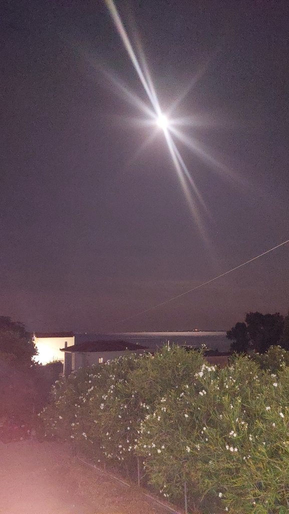

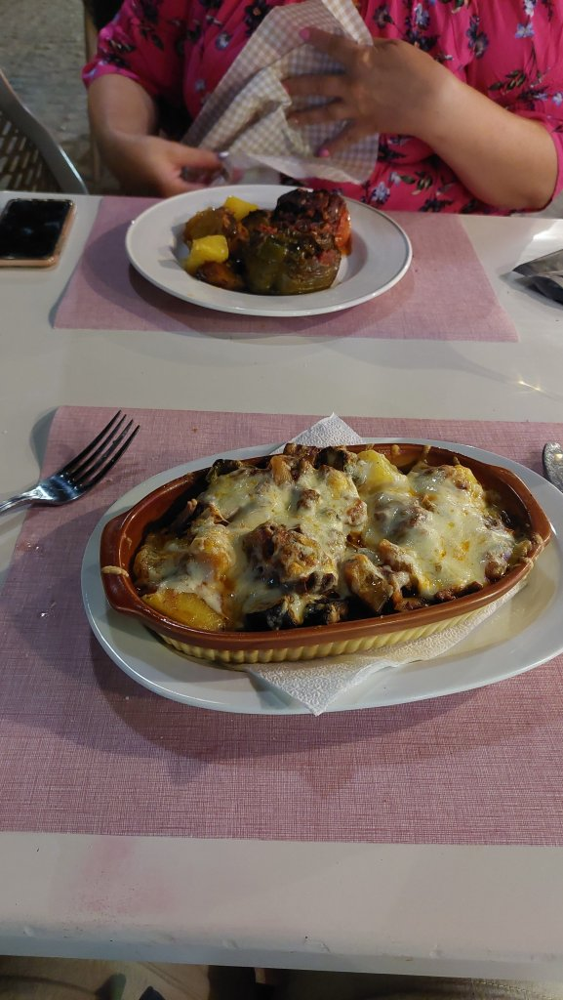

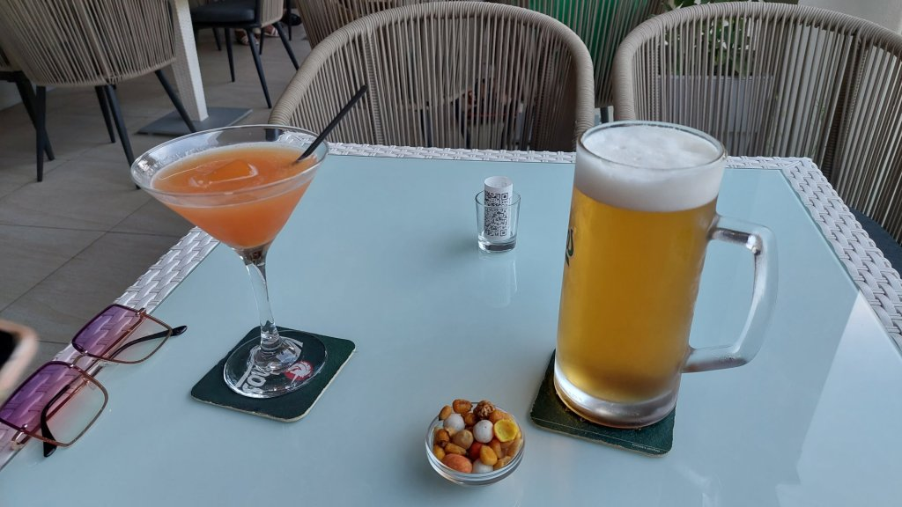

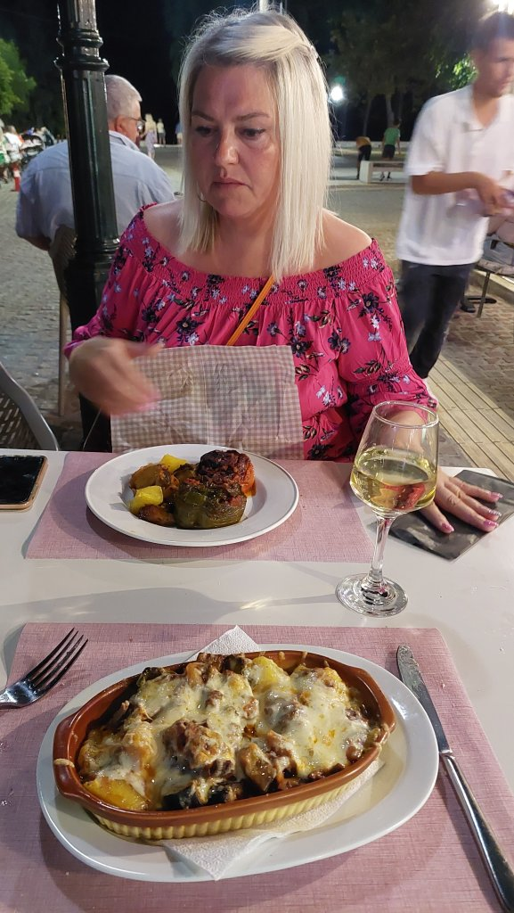

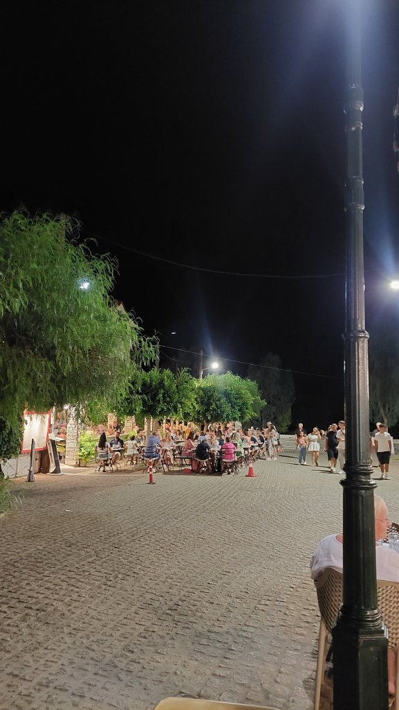

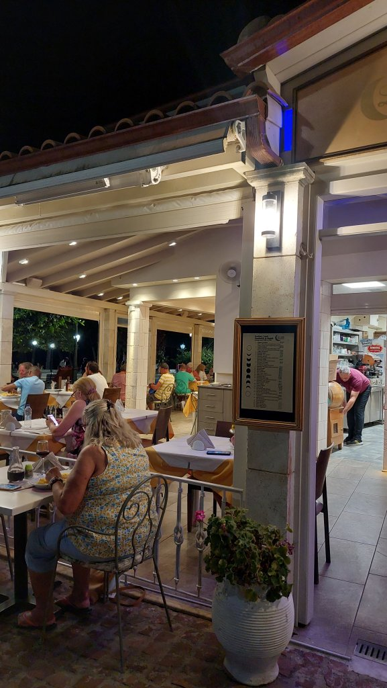

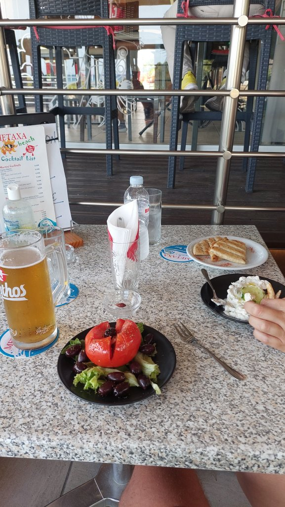

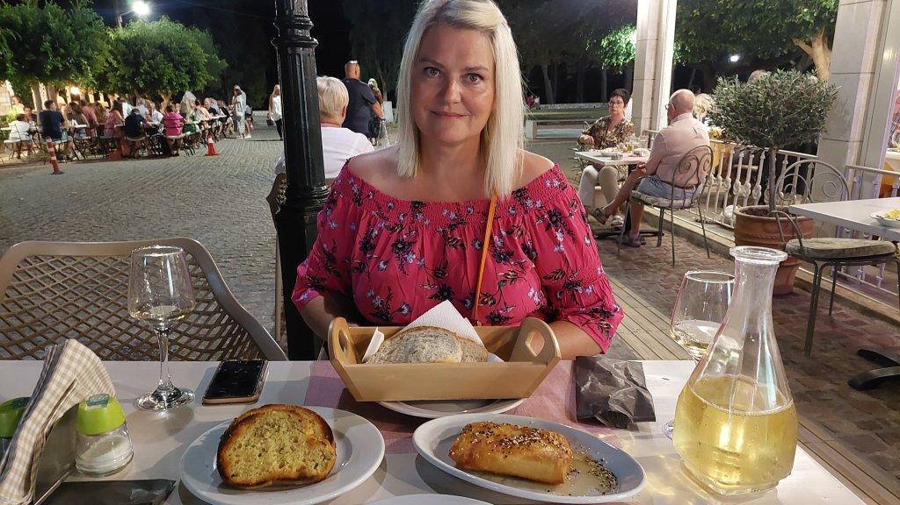

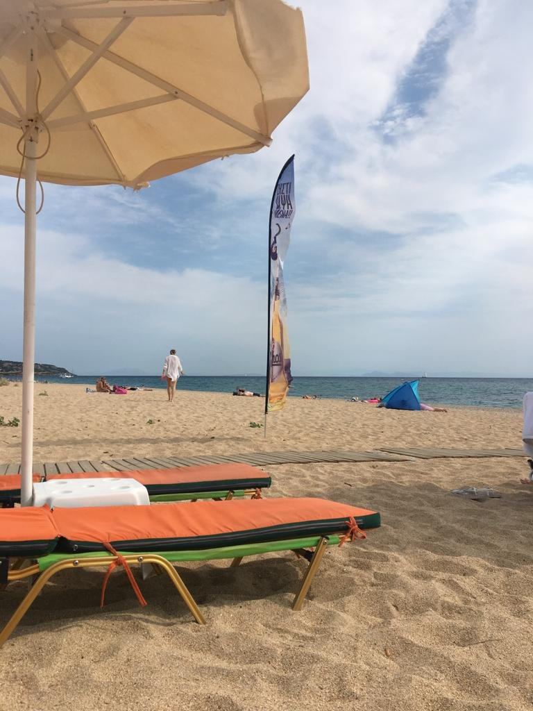

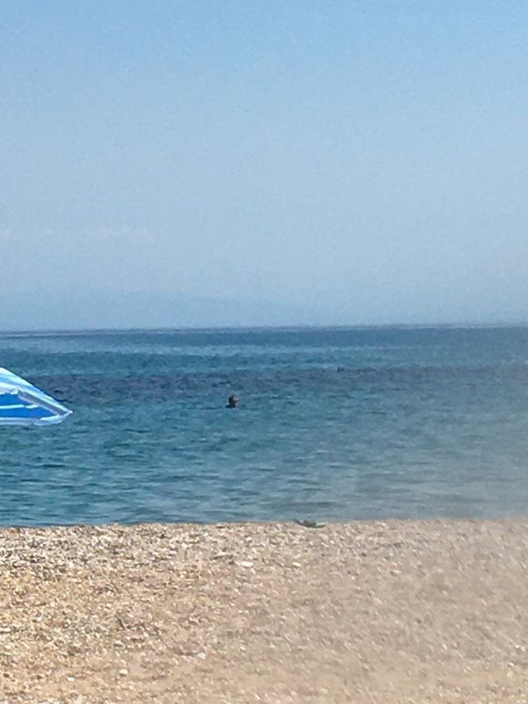

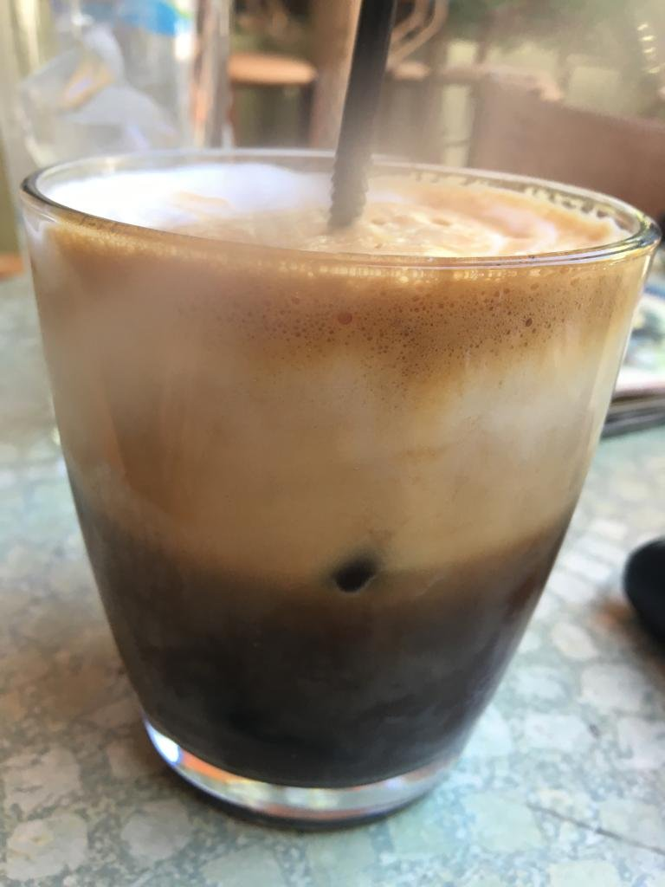

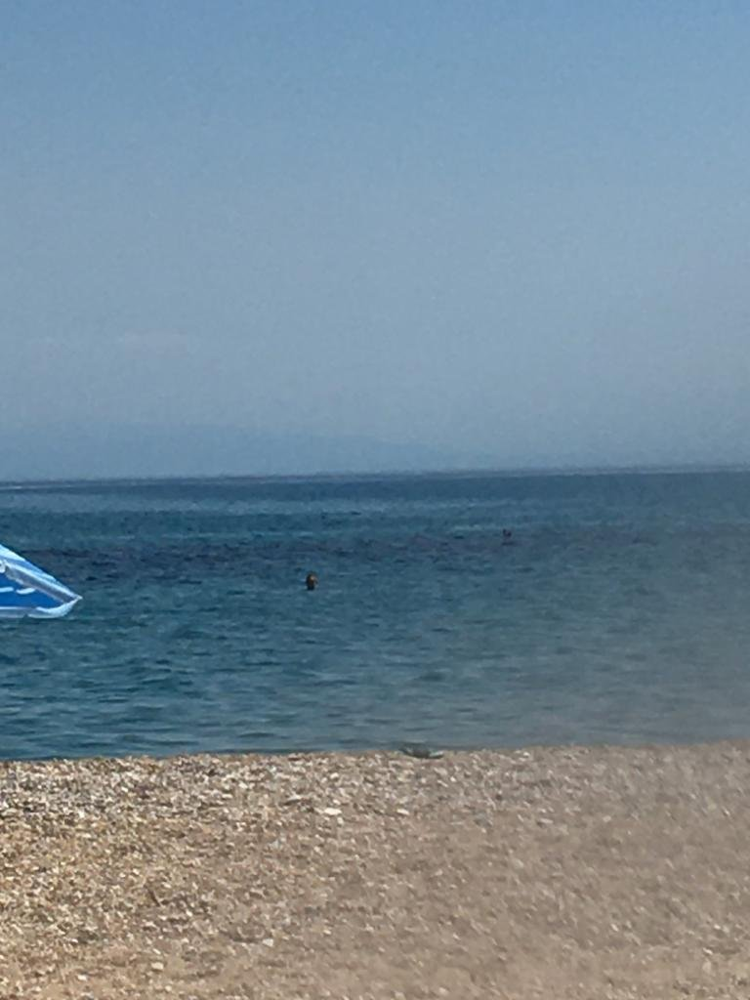

