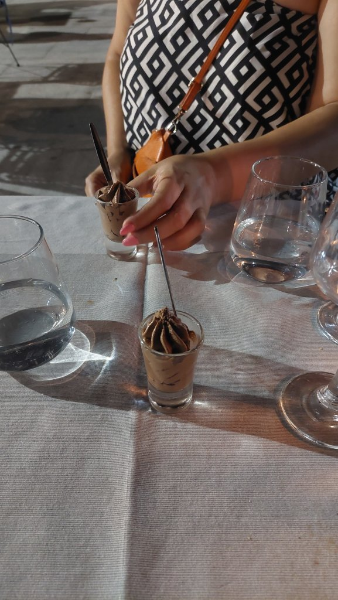
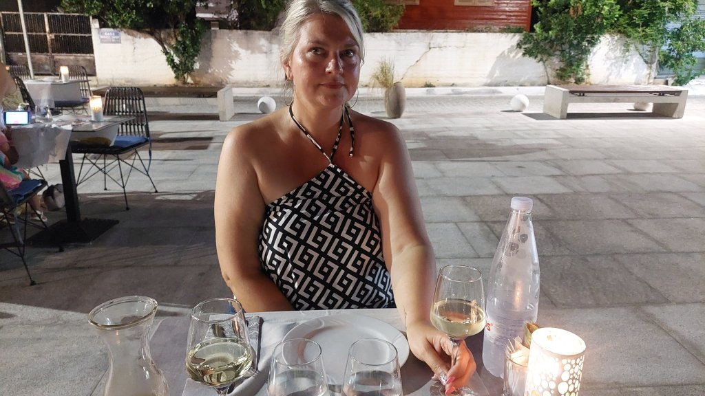
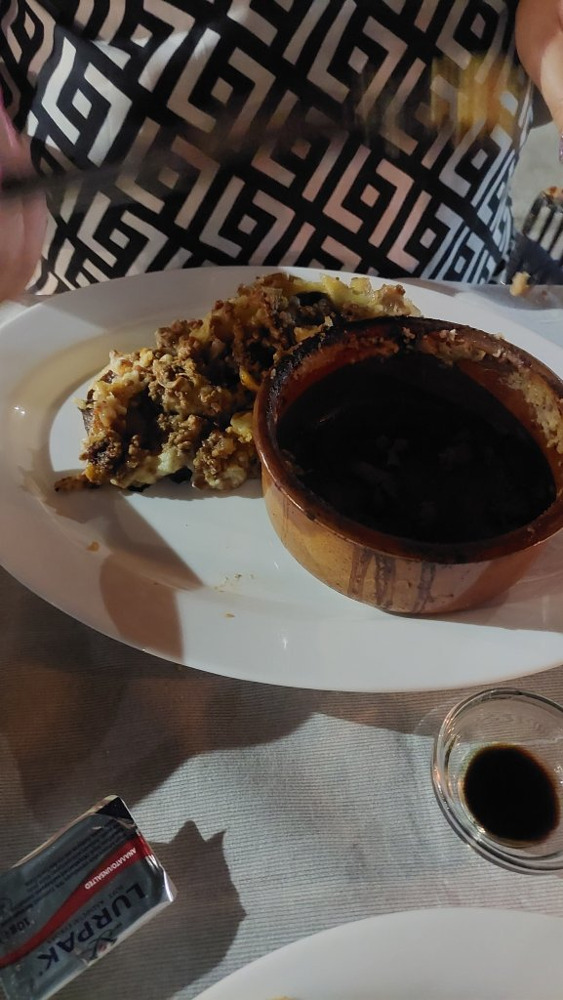
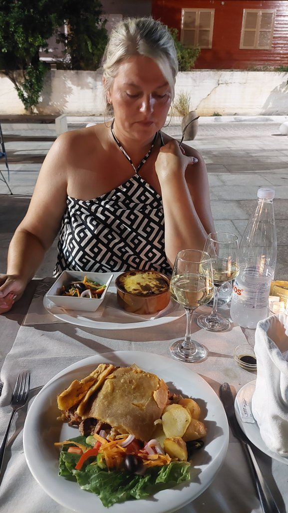
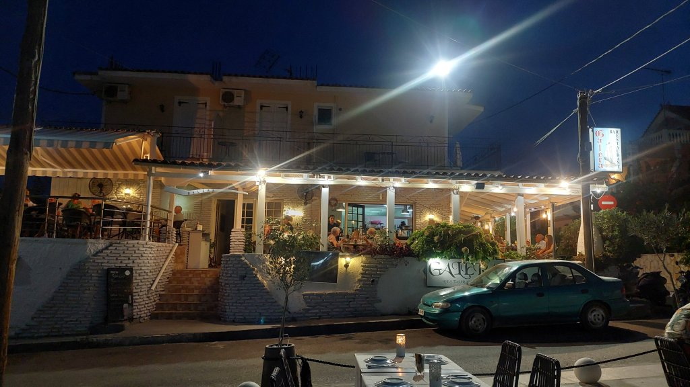
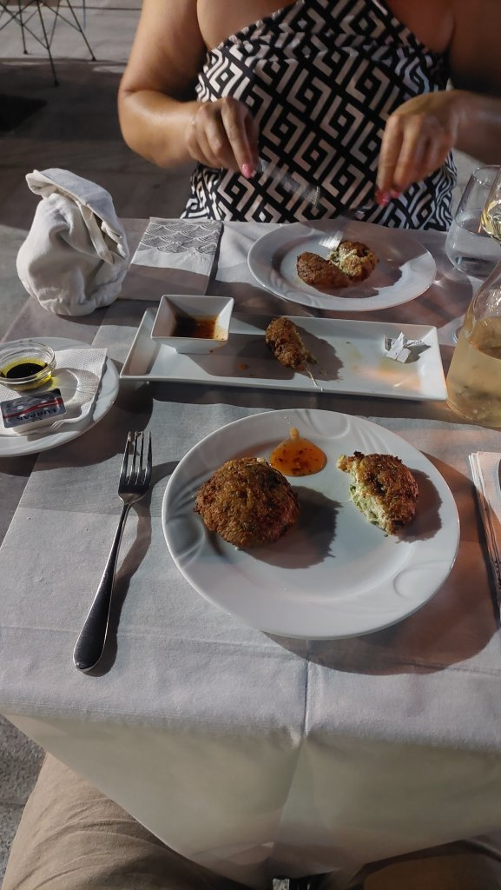
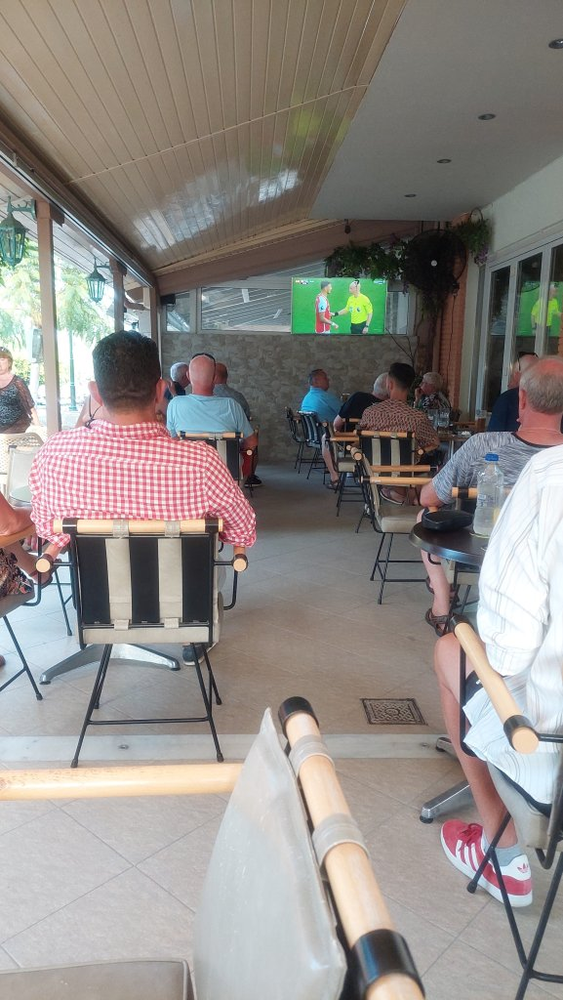

Mel was hanging from last night and didn't emerge until gone lunch. We managed to gather the strength to walk to Remvi for lunch - I had triple mushroom risotto and Mel had Chicken Carbonara and some garlic bread. Lovely it was. Mel then went back to bed and I went around the pool for a read and a swim in the afternoon. Mel managed to arise for tea around 6 ish and we headed to B.B's bar for the Arsenal Man U game. She let me watch until the 88th minute when it was 1-1.....of course I missed the next two goals. Went to Galera restaurant - Gorgeous place down a back street off the main strip, it was packed so we ate in the square where there is an overflow area of tables. We shared courgette and cheese croquettes with warm breaded roll and a balsamic reduction for starters which were divine. I had Kefalonia meat pie and Mel the Moussaka - mine was beautiful but as per Mel didn't like hers. Just the half litre of white between us tonight as Mel is tender. Free chocolate dessert was a nice bonus. Up the wooden hills for 22:30 sharp.

