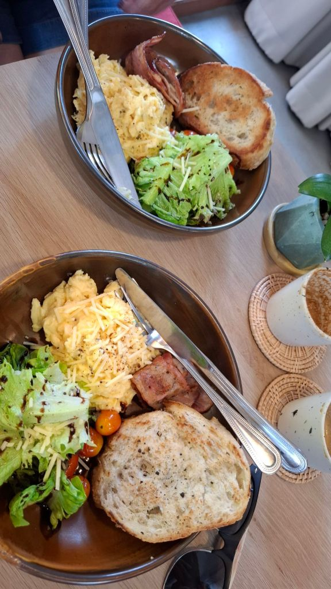
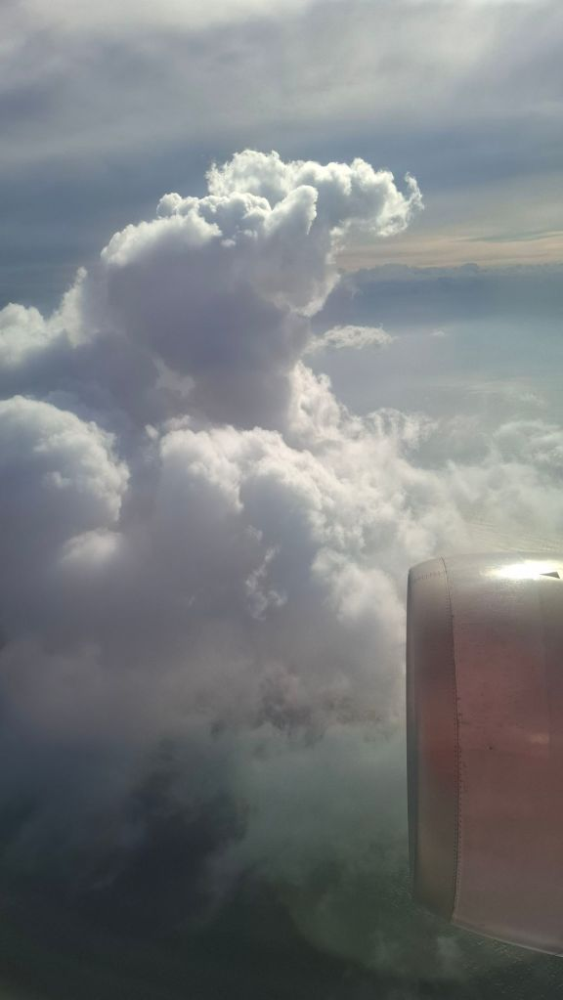
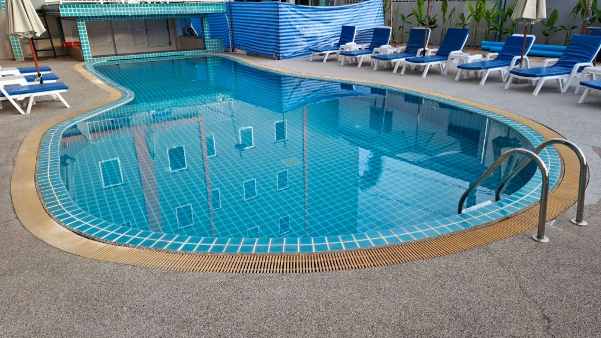
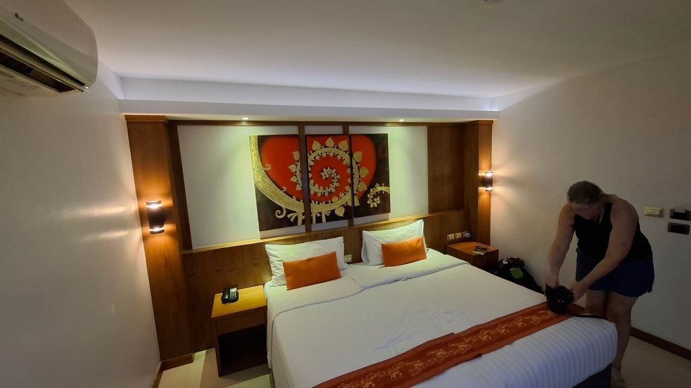
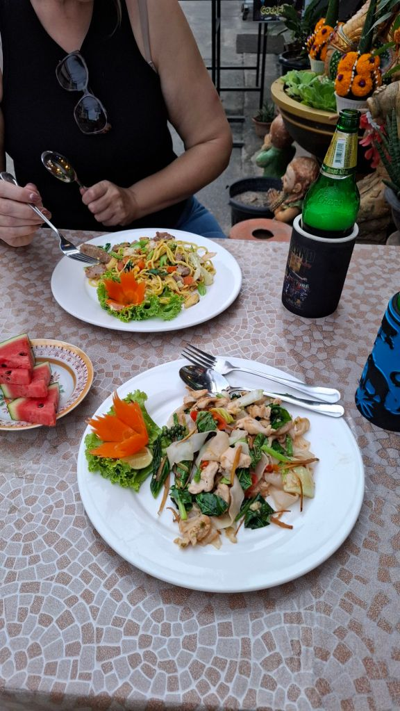
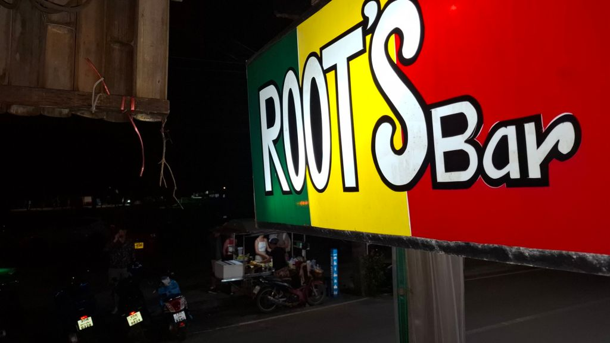
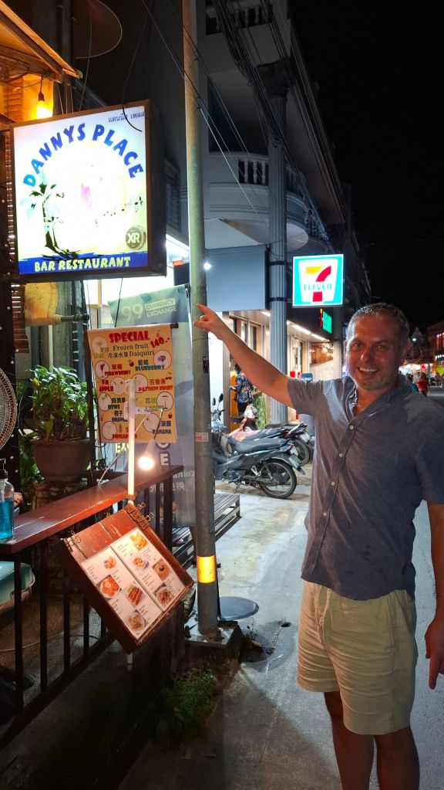
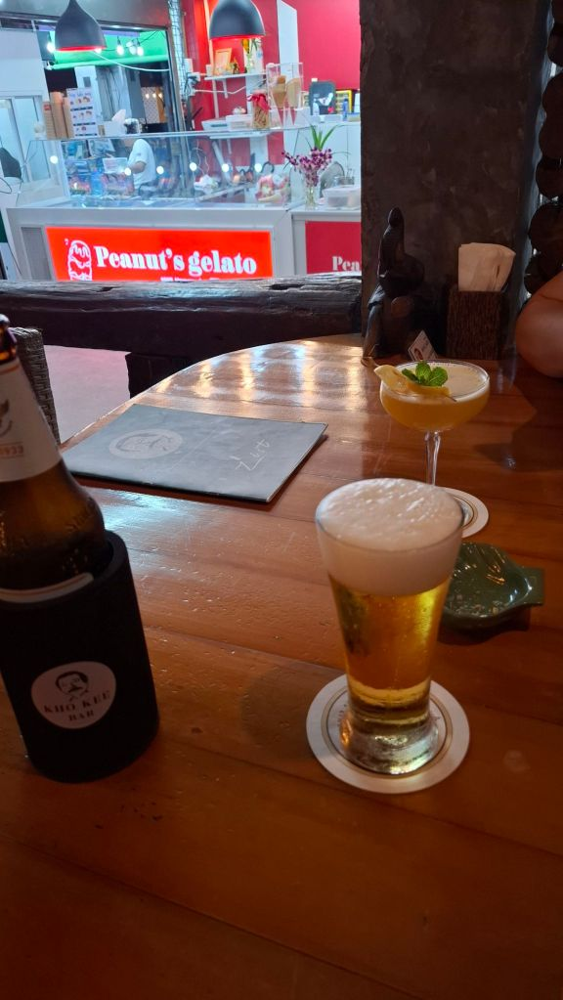
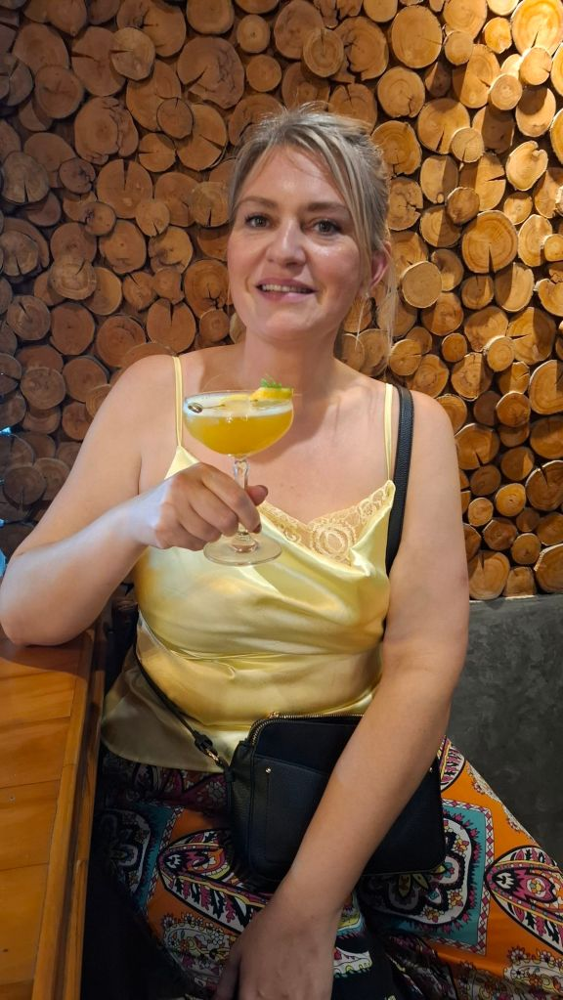

Started the 1.5km walk en route to airport and stopped for a lovely breakfast of cheese omelette and bacon each at Ma Lune cafe. Then caught a bolt to airport. Flight to Phuket was again delayed by about an hour this time. Bolt to Chabana Kamala - The island is heaving with people! Manic. Hotel is basic but clean and fine for a base. 5pm and both of us are ravenous, sneaked in some fried noodles and a beer before shower and change and out. Walked along the beachfront where this is the usual multitude of markets, tat shops, bars and restaurants, stopped at one for a Chang for me and a Leo for Mel - her favourite of the Leo, Chang, Singha brewing triumvirate. We then walked to the main road stretch of bars and Root's bar for a beer and a cocktail and persuaded Mel to watch the Liverpool vs Man City borefest at a random bar until 1am. Sorry duck. 2 x 711 cheese and ham toasties on the walk home for tea and bed.

* * *

