Checked out of that vomit infested room and headed for our third place in Phuket, Karon Beach - a short 15-minute Bolt away. Weather overcast but still so, so humid. Arrived early at "Allstar Guesthouse," a basic but very clean place run by a charismatic Scandinavian who keeps a very tight ship - no shoes on in his temple. We dropped the bags and went for breakfast, an omelette each. We then hit the beach, Karon Beach is lovely, and not as wild as Patong thankfully...spent a chilled day on the beach and watched the sunset then had a swift pint of Chang at a local hostel cum bar. Went to the Irish bar for a Guinness (terrible) whilst Mel did her hair. Still not feeling great and struggling to have more than a couple of drinks or a big meal. Watched some live music with a crazy Thai PR girl " WELCOME, WELCOME" booming in our ears louder than the music. Went to a cheap Thai place for a low key tea of Pad Thai and fried rice for Mel. Had a beer but couldn't finish it. Bed snoozing by 10pm

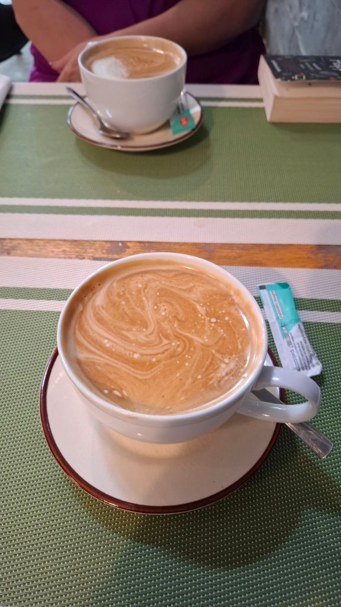

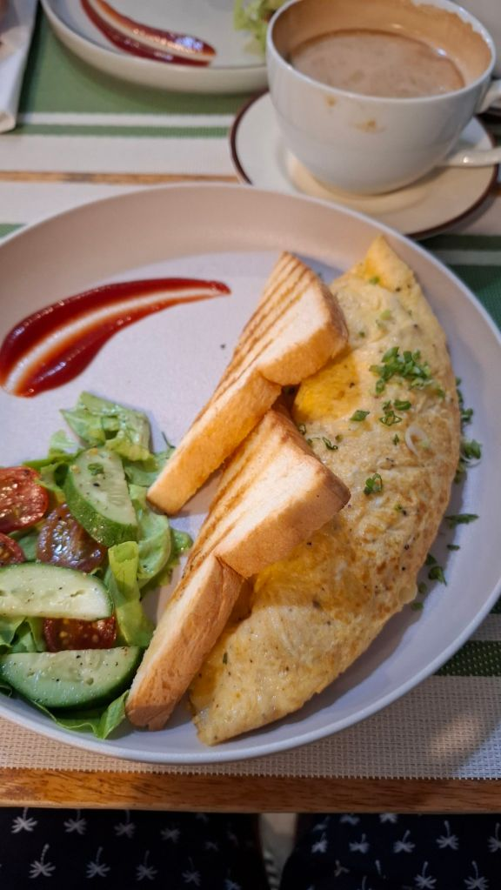

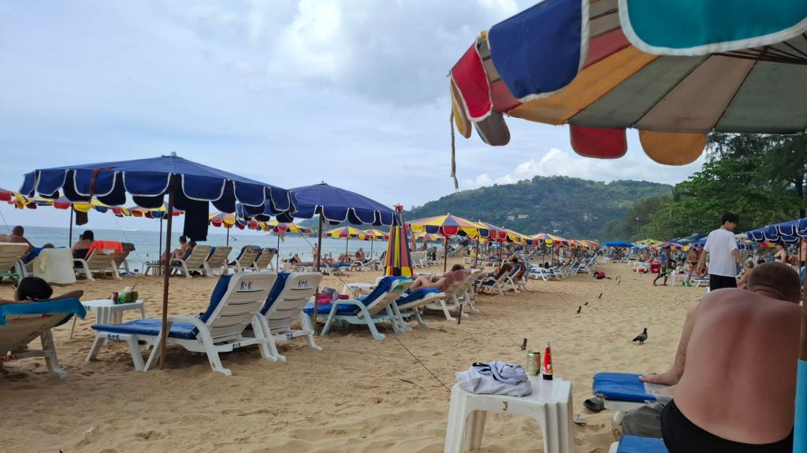

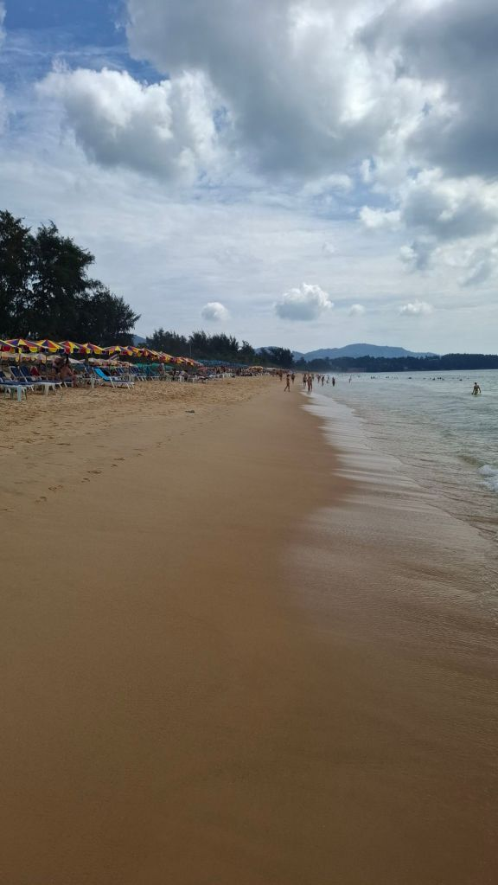

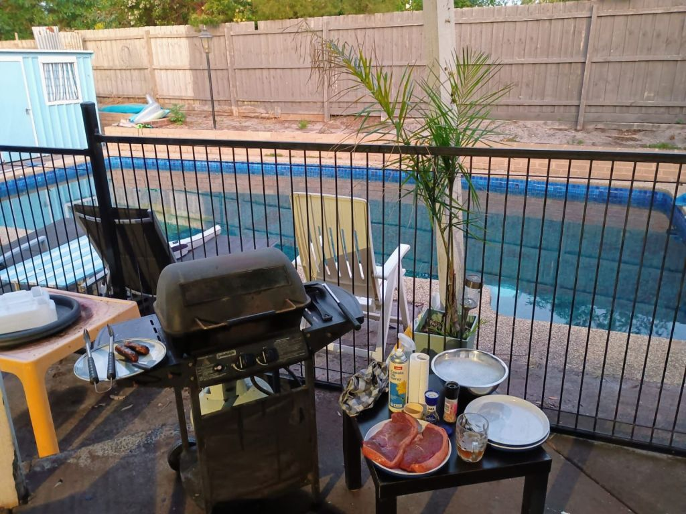

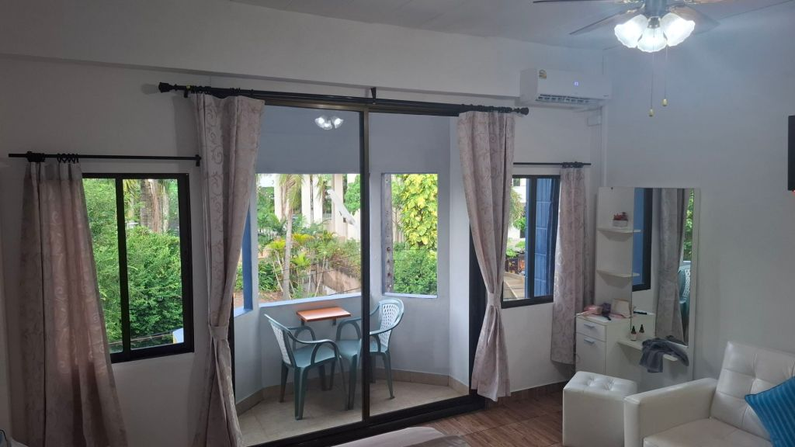

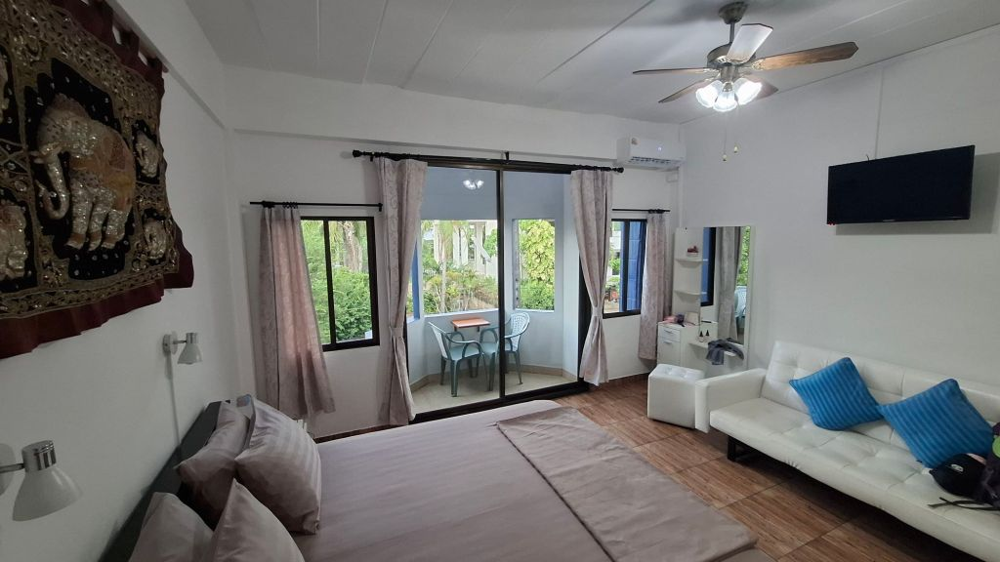

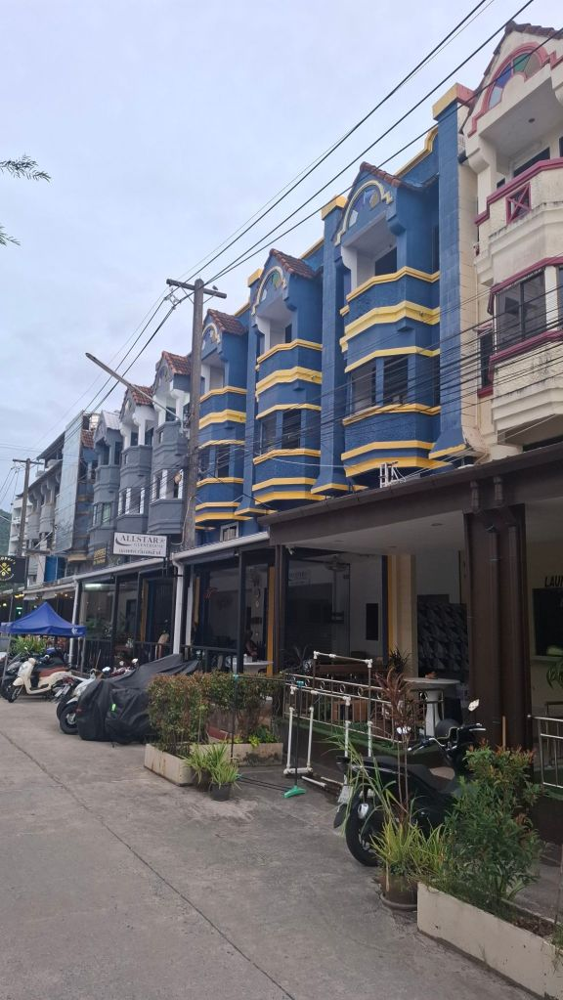

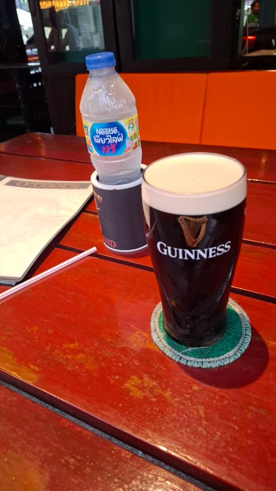

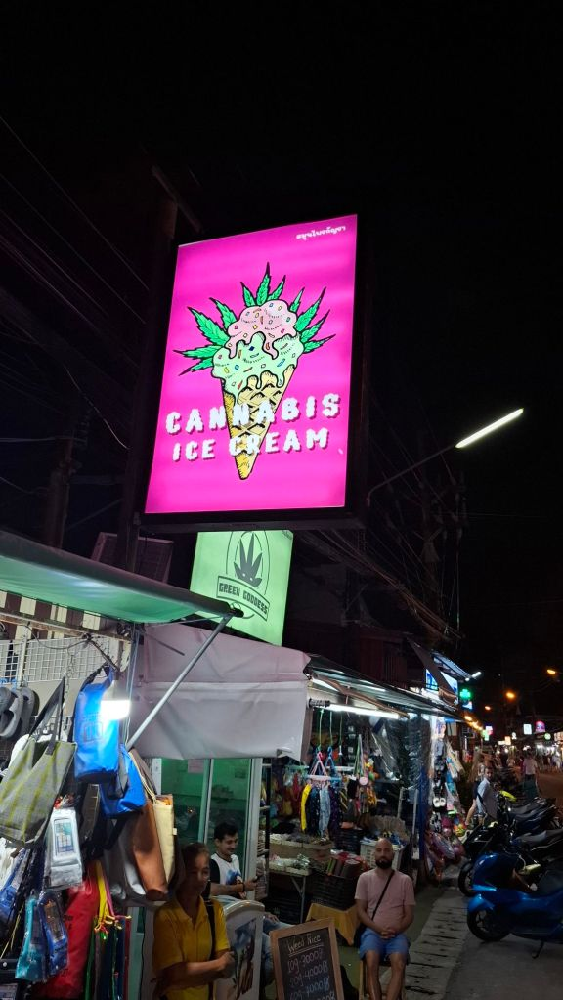

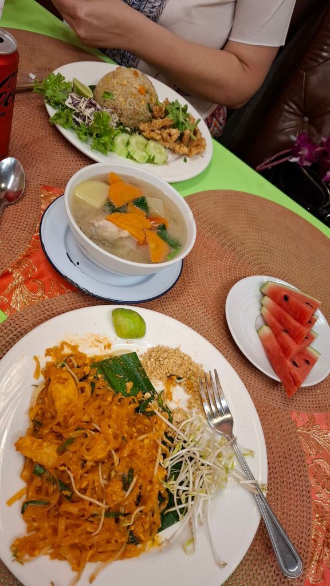

