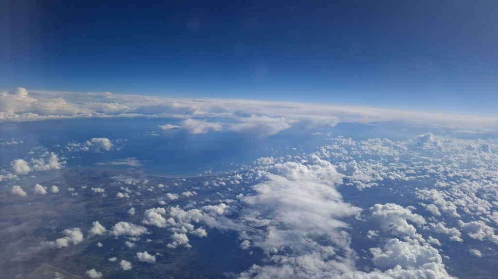
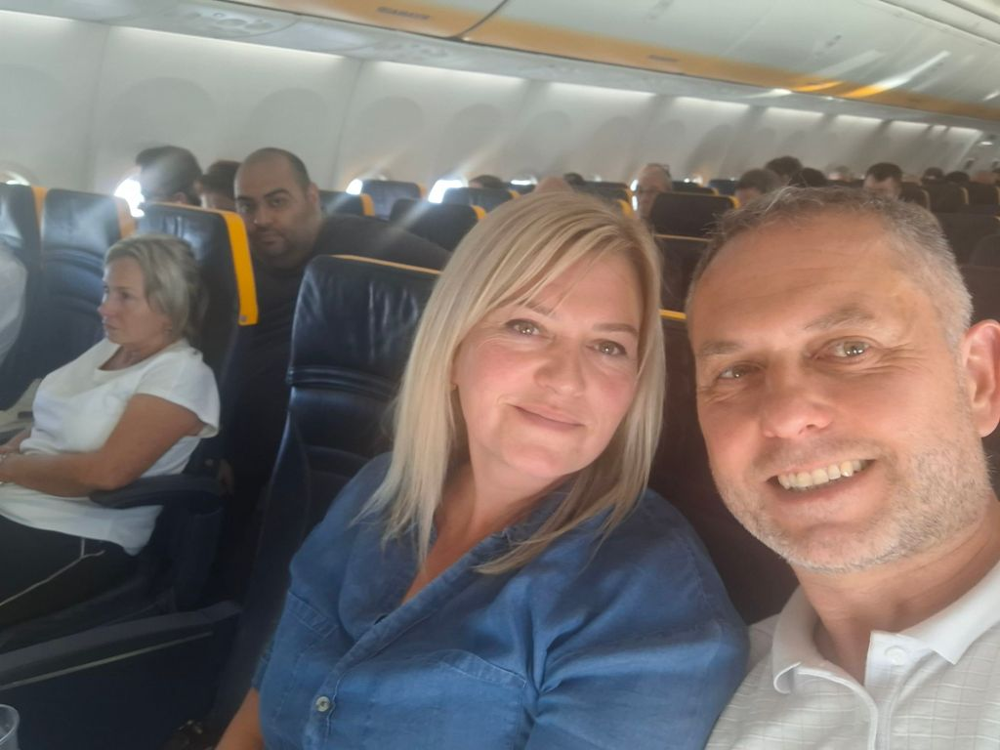
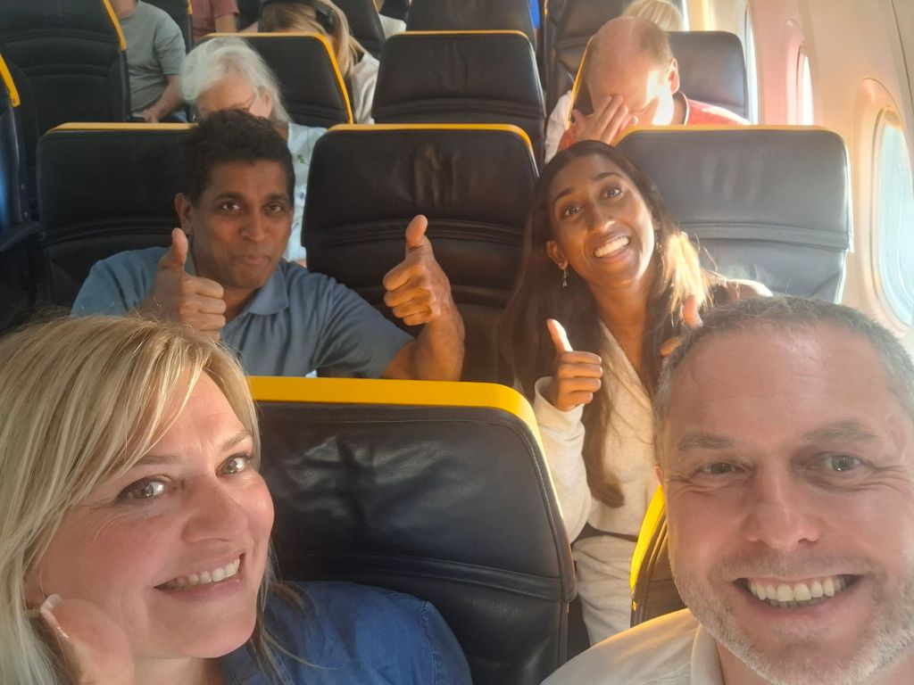
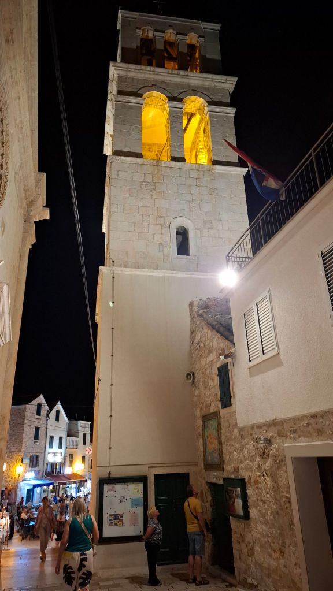
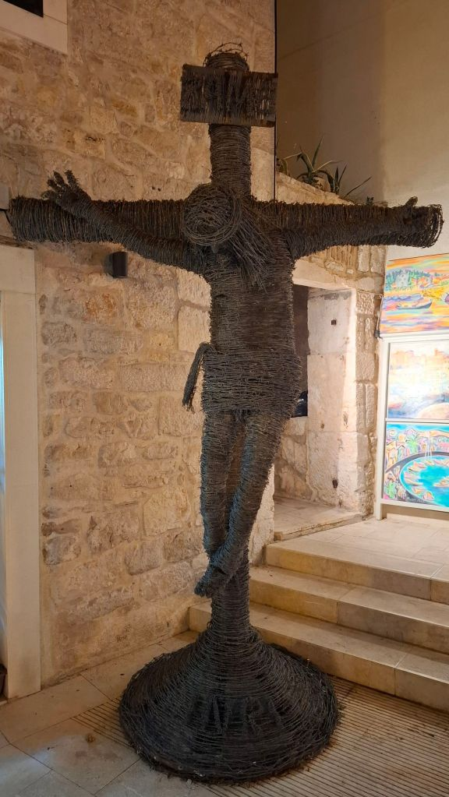
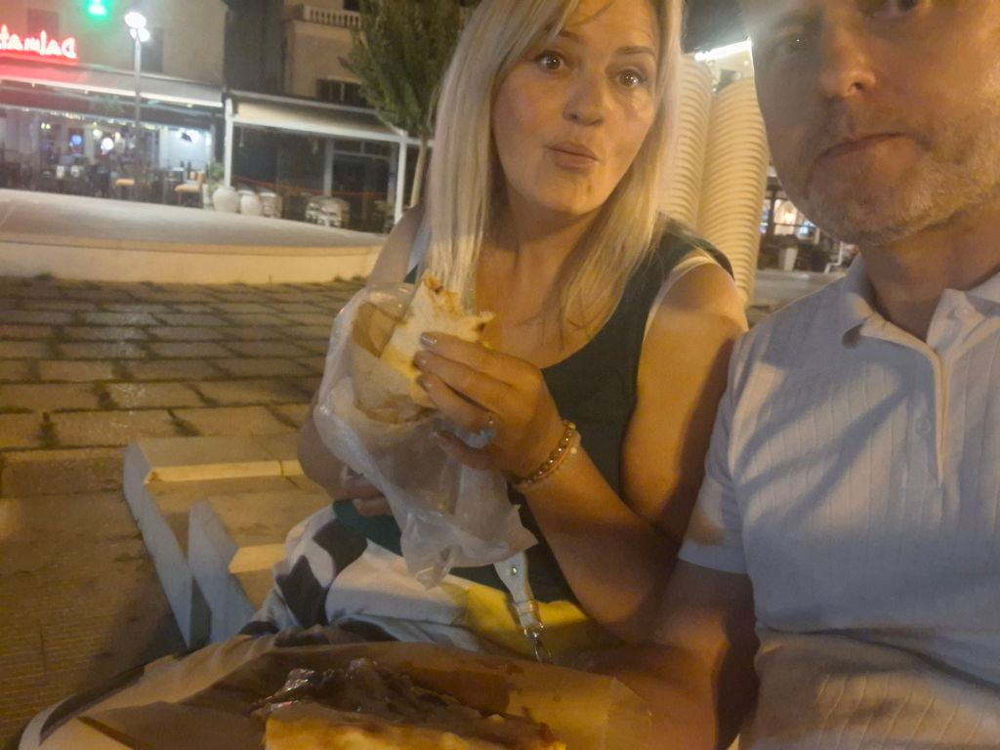
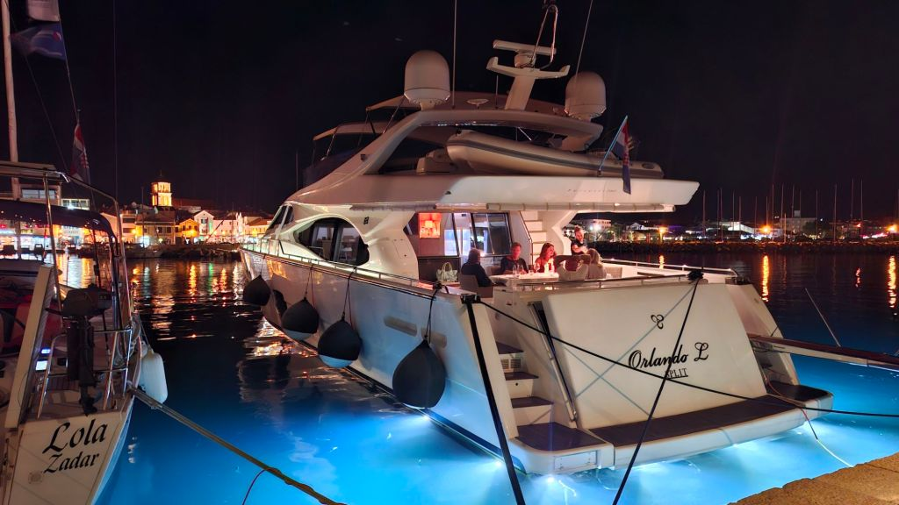
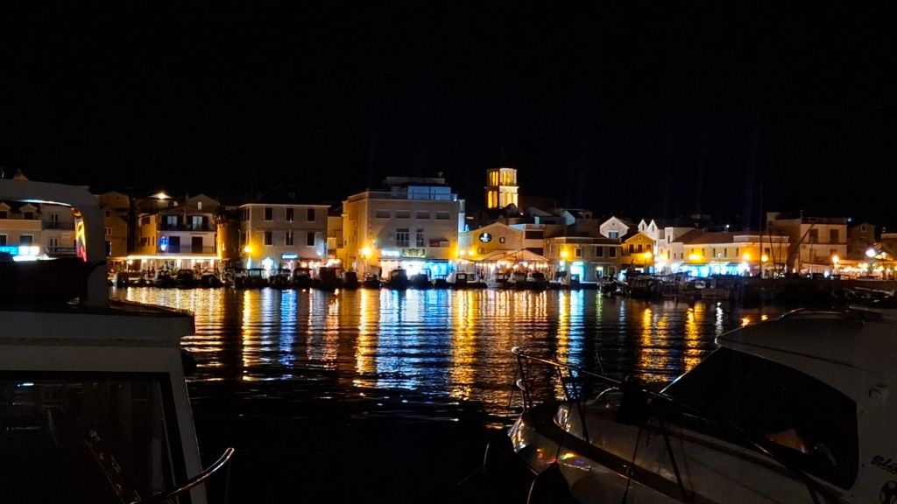
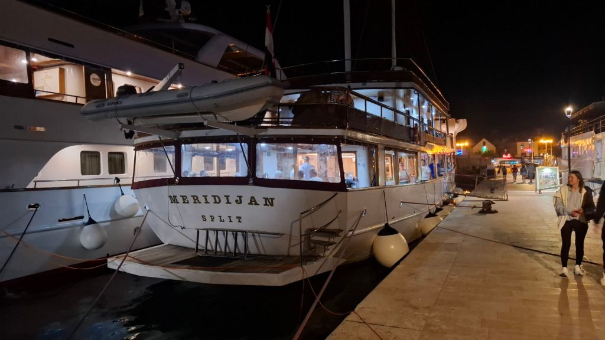

Train to Birmingham airport straightforward enough with no delays, until we got on the plane - 1 hour wait due to shifting winds and missing our take off slot, flight was sound, nowhere near full so sat at front with extra legroom and a couple of wines to heal Mels fragile nerves. Uber at Zadar airport was 25% off for some reason so took it with both hands - £66 for the hour or so journey to Arancini Residence in the town of Vodice.

Small boutique aparthotel is lovely, ful size apartment with living room, bedroom, bathroom and large balcony and 2 air conditioning units and full kitchen. Dropped bags and headed for the 5 minute walk into town. Vodice is beautiful! Very chilled and family friendly, loads of restaurants and chilled bars.

Started at Virada bar for a pint of Croatia's finest - Karlovacko which was about £4 so similar to UK prices. Then had a walk around the beautiful harbour where a full blown boat party was going on in complete darkness!

Then some rather large yachts with well to do people were having their tea (dinner). We then moved onto some beachside bar whose name escapes me - for a couple of low key pints then moved on to a place for takeaway pizza slice for me and a chicken wrap for Mel. Both absolutely knackered so arrived back at apartments around 11:30pm.

