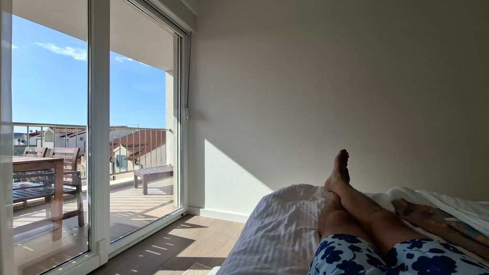
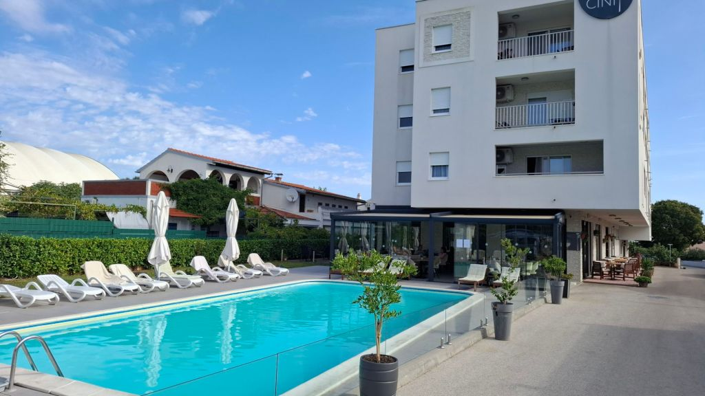
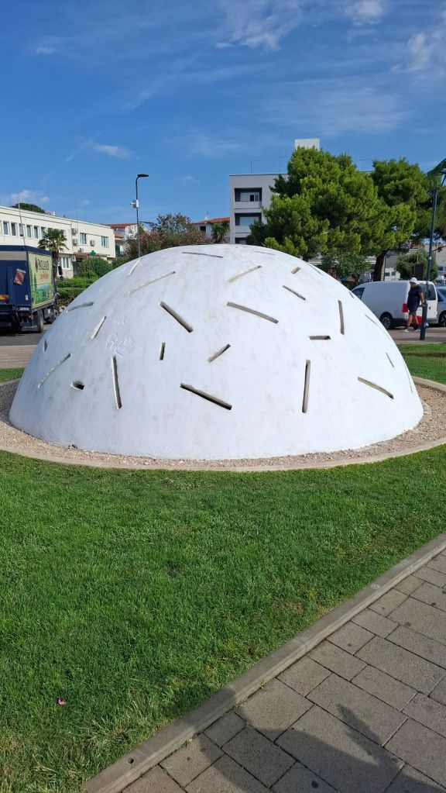
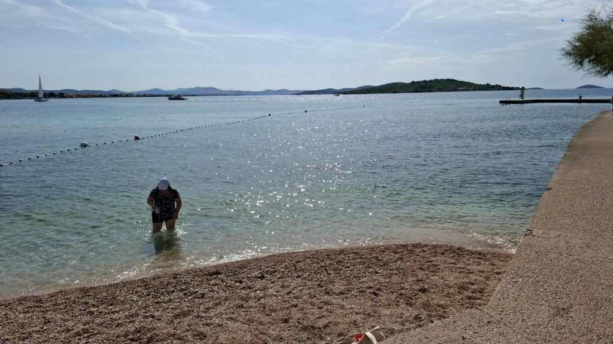
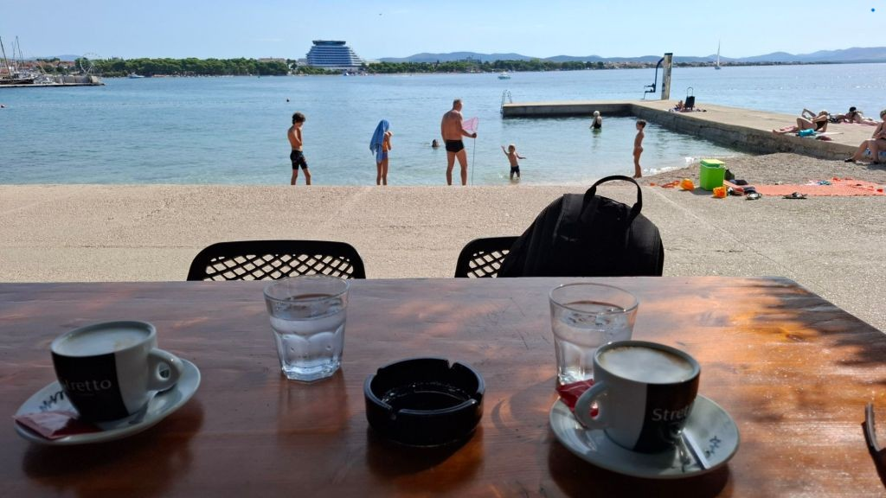
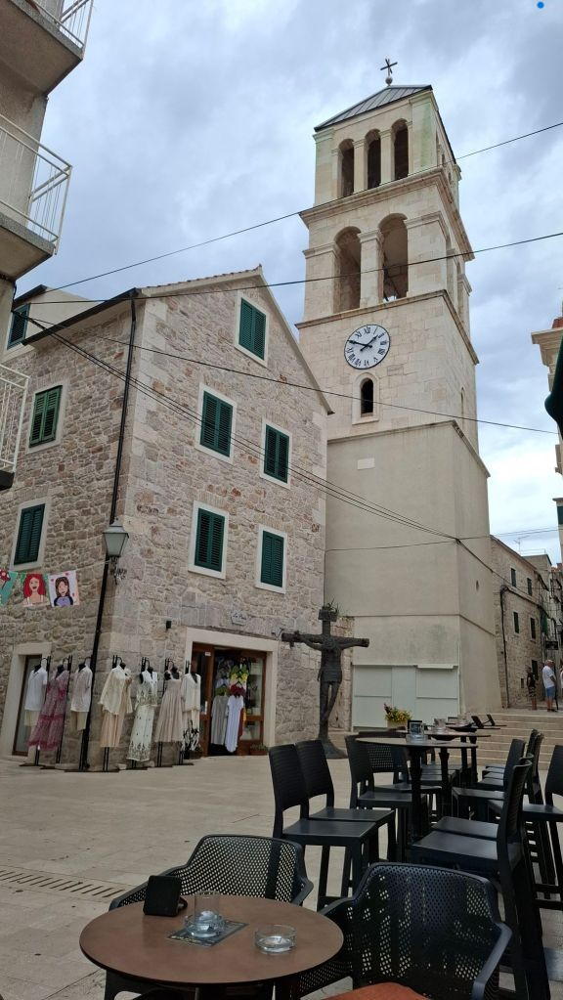
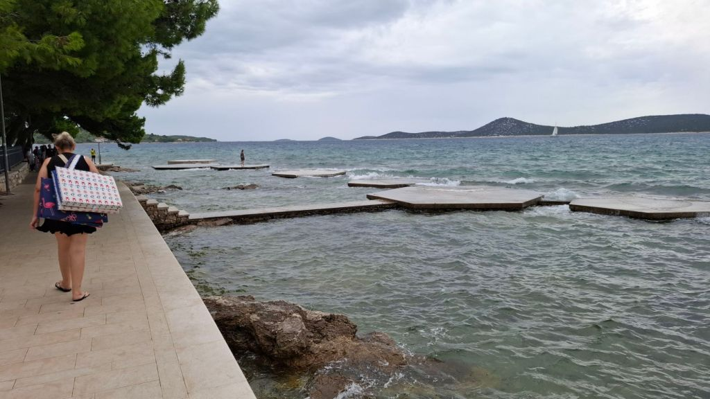

Woke around 8 for our first breakfast at the aparthotel Arancini Residence....what a fantastic selection! Literally everything you could ever want. All the healthy stuff from granola, fruit, yoghurts, vegetables, nuts and seeds....I naturally went for the bacon, sausage, cheese, and scrambled eggs combo with a spinach pie - divine.

Walked down to the nearest beach, grabbing a coffee on the way and a couple of padded beds as a towel wouldn't do as the beaches are not sand but more stoney. Along with a towel set us back 40 euros but hopefully last the full holiday. Settled on the beach and started reading 'Into the Wild' about that guy who headed to Alaska 'to find himself'...only lasted a couple of months and died after eating poison berries....that's why I avoid healthy stuff. Mel is reading 'Friends, lovers and that terrible thing' by Matthew Perry..that didn't end too well either.

After an hour or so fancied a beer at the beach side gaff then the weather started turning with a gale force wind. Could see the heavens were about to open so scampered around collecting everything and headed back. Called into caffee bar center to avoid the rain and grabbed a couple of beers and Mel ran across the road to pick a couple of feta pies which were delicious. Back to room at about 3:40pm while Mel had a sleep for a couple of hours and I chilled on the balcony with a beer doing the blog listening to the rain which was hammering down.

This soon cleared up, so we were up and out for 6pm for the 4km walk to Tribunj, which is the next village westwards along the coastline. Lovely walk stopping at a couple of beach bars then onto Tribuj Island - had a beer at bar 'Stray Cat' then a beer for me and coco chanel cocktail for our Mel at Cocktail bar Nautica (10 / 4 euros). Had dinner at Konoba Markiolac. Large pizza for myself and chicken and chips for our Mel. Walked the 4km back along the beachfront with lightning strikes all around us but no rain, thankfully. Bed at a very respectable 11pm.

