Woke around 9am for another stunning breakfast, Mel went to the gym first which is small but functional (and free). Booked an Uber for the 15km journey to Sibenik, it never showed up though so we decided to walk to the bus station and we are glad we did - only 2 euros each and very pleasant with air con and very comfortable seats - public transport is impeccable here - another area in which a country knocks spots off the fast becoming slums of the UK.

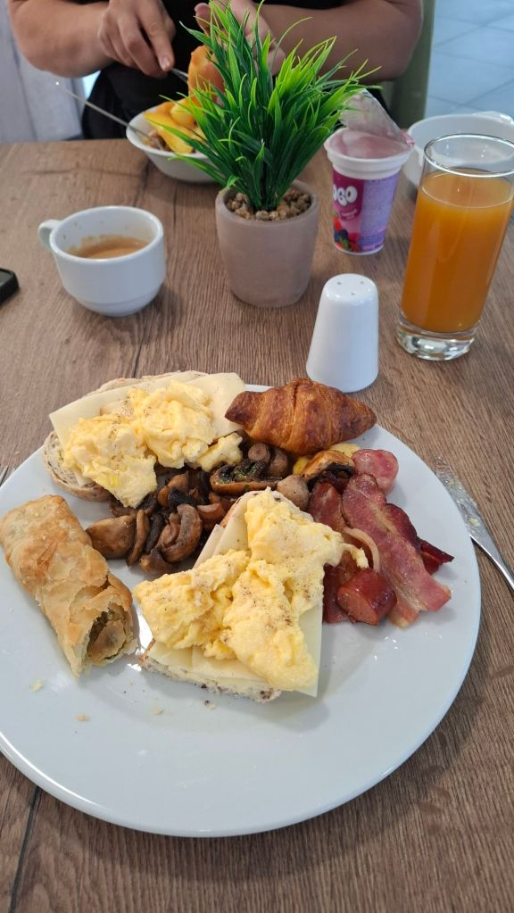

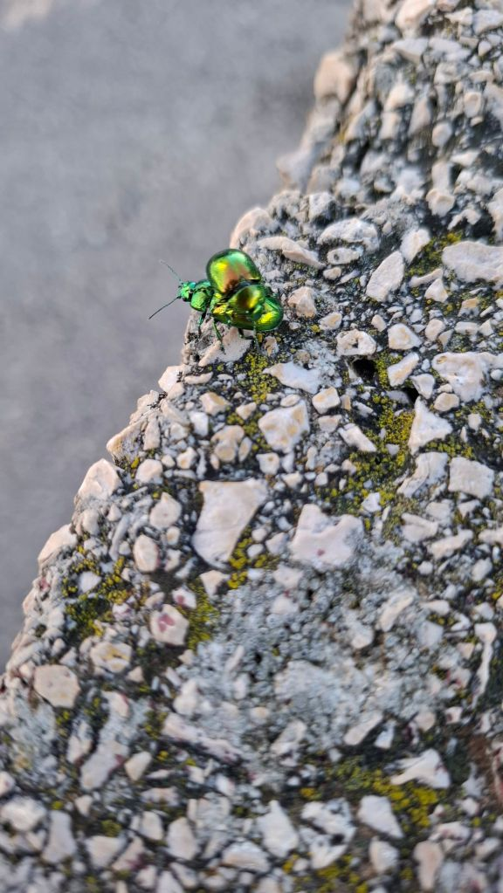

Had an iced coffee and walked to St Nicholas Fortress overlooking the town - this is old, very old - it was mentioned in the 1066 local scriptures. Then wandered to St Jacobs cathedral whose architecture is unmatched. Did lots of walking and stopped for a Staropramen and some French fries in a local bar.

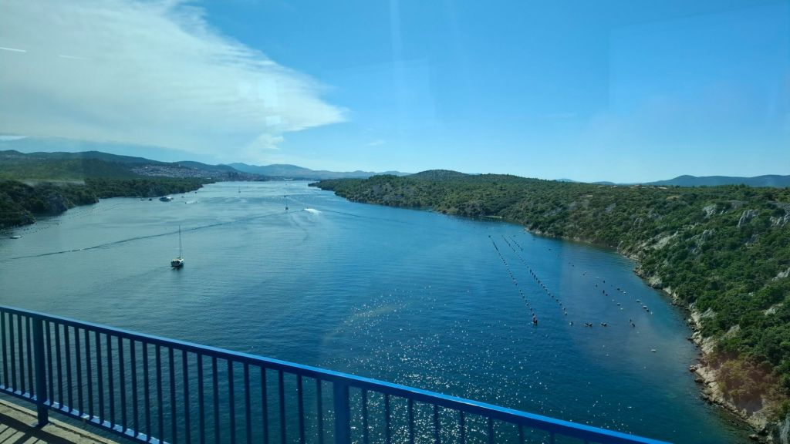

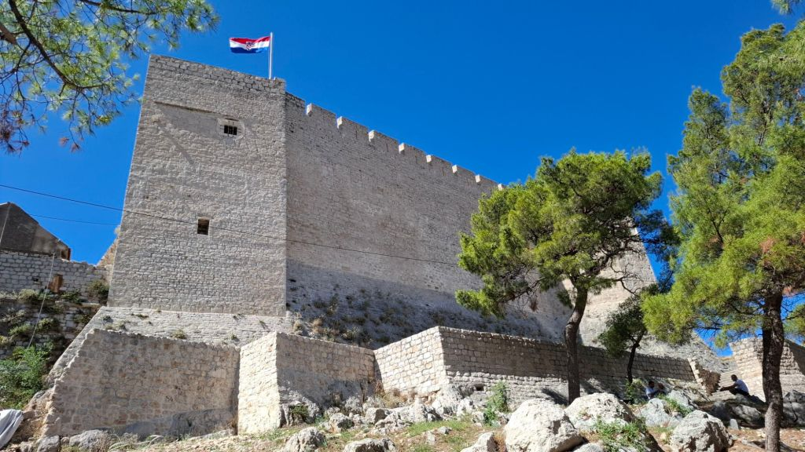

We walked a fair few miles just checking out the local amenities, what a gorgeous place Sibenik is. A huge cruise ship was docked up there so went and had a look at that. Then fancied a early tea so tried Black Cuttlefish risotto - the blackness comes from the ink of the squid like mollusc which it releases as defence mechanism...this is then mixed in to the stock. It was really good but stains your lips and tongue. Mel had spinach and chicken pasta, both were lovely - 16 euros each.

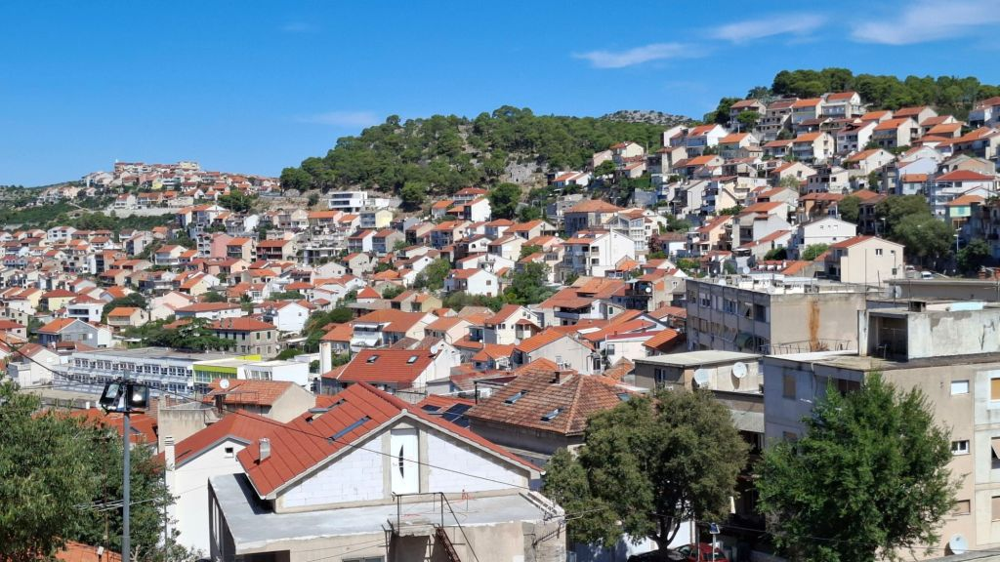

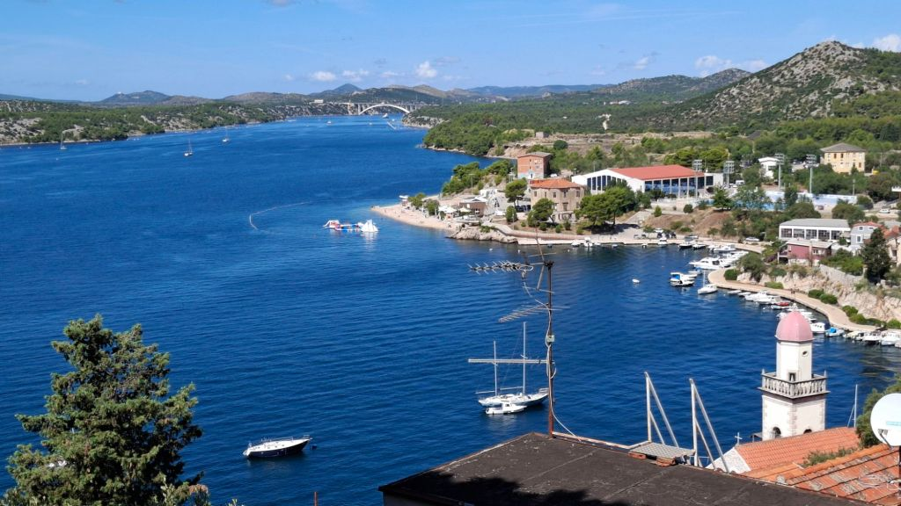

Got an uber to pick up the hire car from Sixt - very pleased with it, Renault Clio with all mod cons! Vroom vroom. Mel as usual a nervous wreck as a passenger, but it's just white noise now. Drove back to apartment feeling rather shattered but forced ourselves to get ready and head out for a low key evening. Headed eastwards along the coast line which had a completely different vibe - much more touristy and lacking in culture relative to elsewhere in Croatia. First bar was a 9.5 euro Limoncello Sprinz cocktail for Mel - tasted like cheap lemonade with zero alcohol. Next bar for a cocktail and beer and a wander....walked around 5 miles again then back into Vodice old town for a beer at Solcani Sat. Mel had a pizza slice and I had the leftover feta pie warmed up in the microwave when I got back. In bed asleep by 11pm.

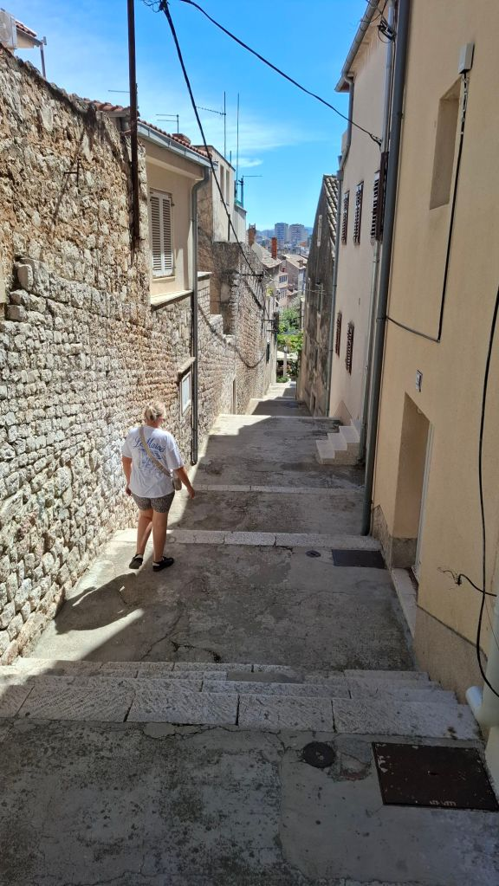

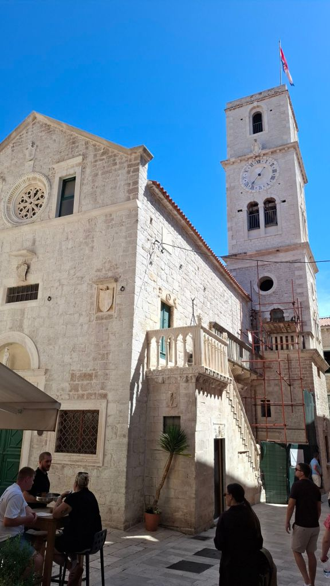

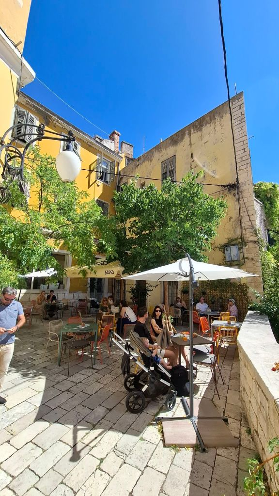

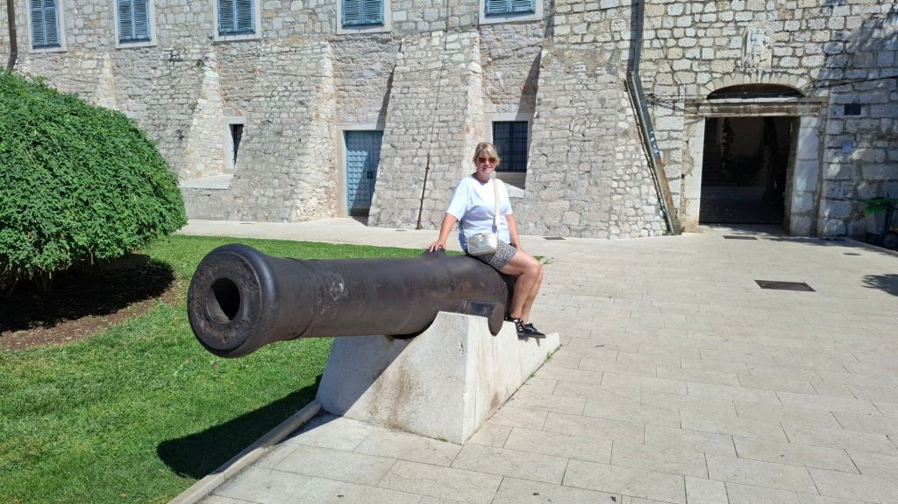

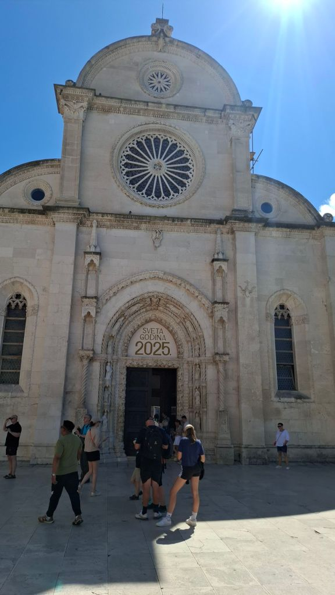

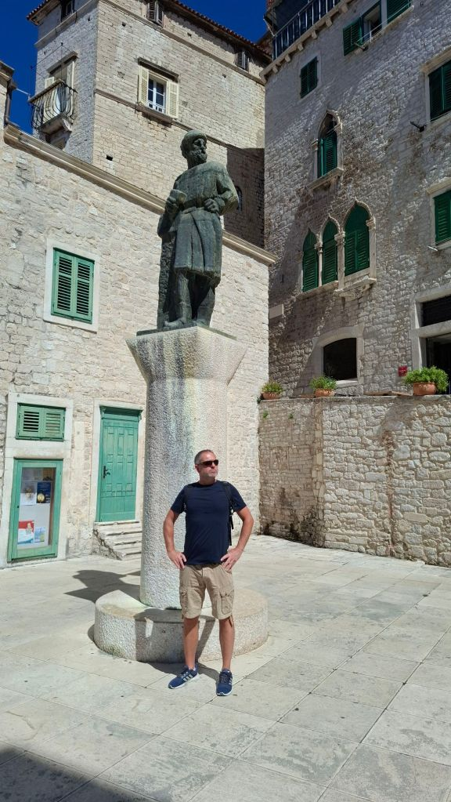

