Busy day ahead so up and at 'em for breakfast at 7:45 for the tried and tested and out for 8:40 for the 40 minute drive to Krka National park. Stunning scenery all the way and arrived around 9:20 in the town of Skradin for the alightment of the 10am boat to Skradinski Buk waterfall. Stunning doesn't even begin to describe how beautiful the scenery is around here. Shoals of fish everywhere and so much history including the first AC power supply in Europe from the ancient hydro electric plant built from a Nikola Tesla design.

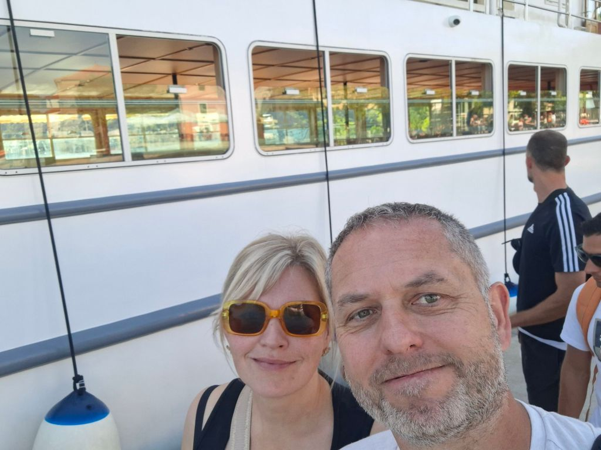

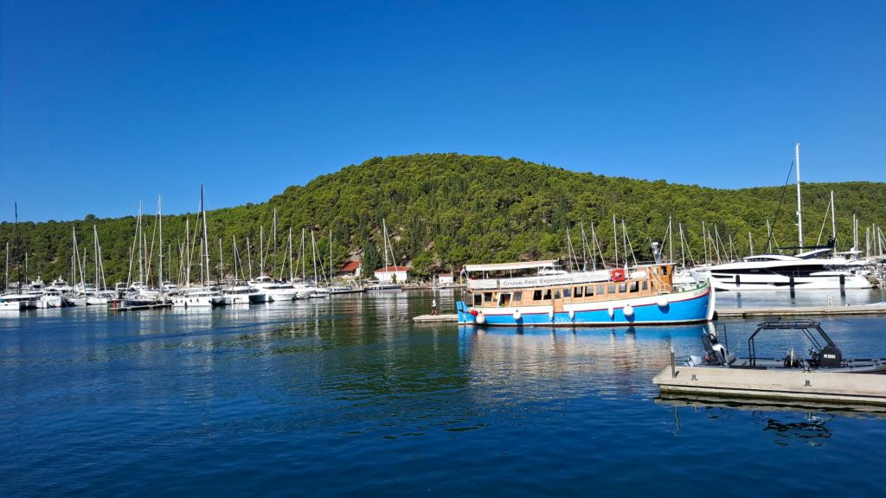

Walked for around 5 miles in a circular climbing the various sections of waterfalls before returning to the start and an ice cream before returning on the boat to Skradin. On arrival, Mel decided to do a impromptu walk into a gorgeous garden advertising wine tasting. Next thing we know we have been suckered into 2 small glasses of wine and a tapas spread of cheese and prosciutto. After we had already ordered we checked the QR code for the price (schoolboy error not checking prior) - it was 30 euros a GLASS and 30 for the tapas. 90 euros later, we made our excuses and left as I still had to drive back, feeling financially sick. Nice wine though.

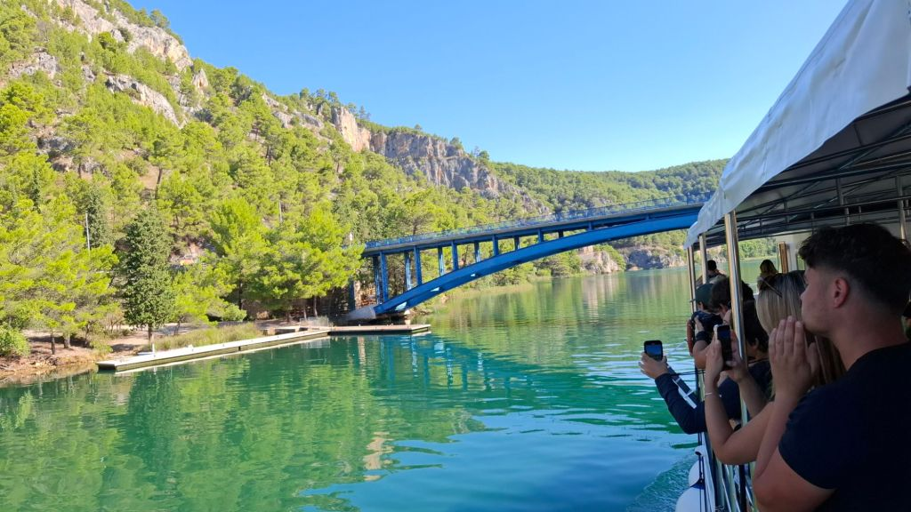

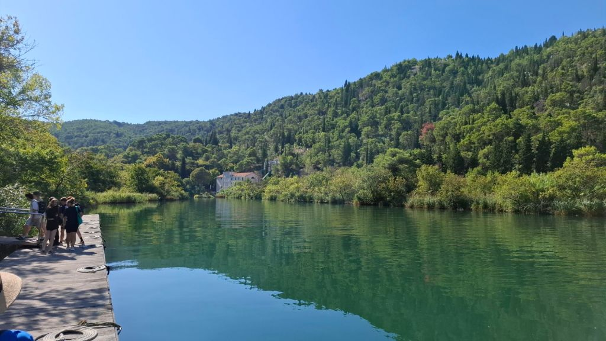

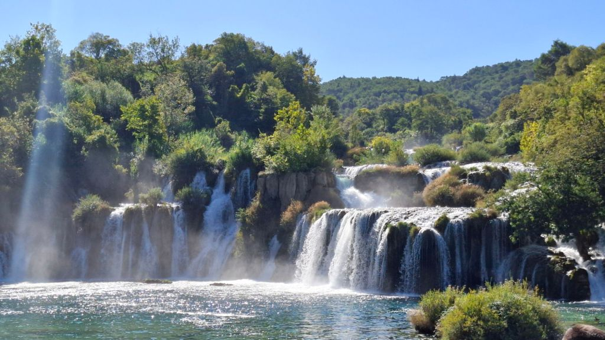

Back around 5pm and a lounge and swim in the pool with a very welcome beer and continue reading whilst Mel slept on the sun lounger. We got ready and went for a pint and a cocktail at Virada and caffee bar Dalmatino, respectively, watching all the children playing happily in the square - not a mobile phone in sight, refreshing to see.

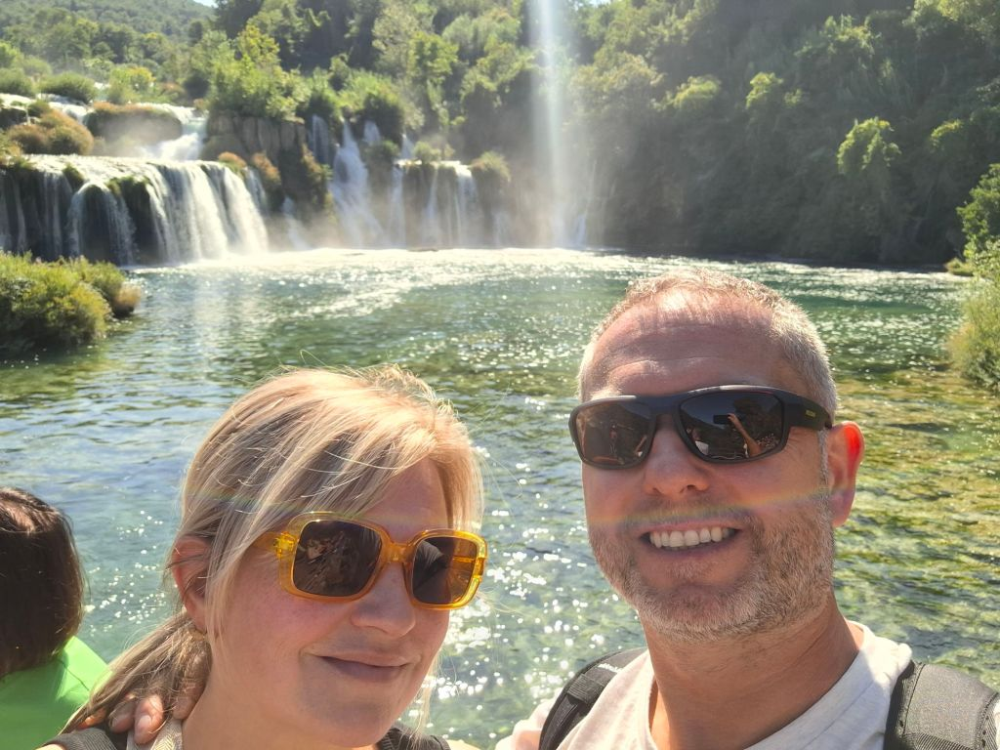

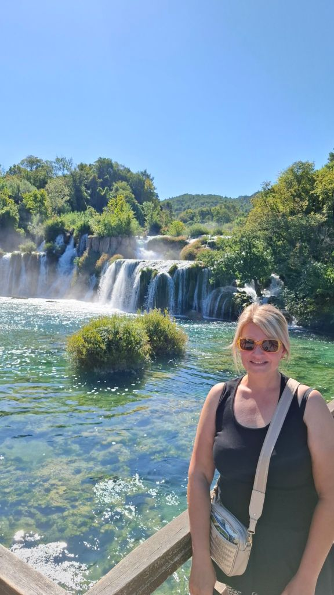

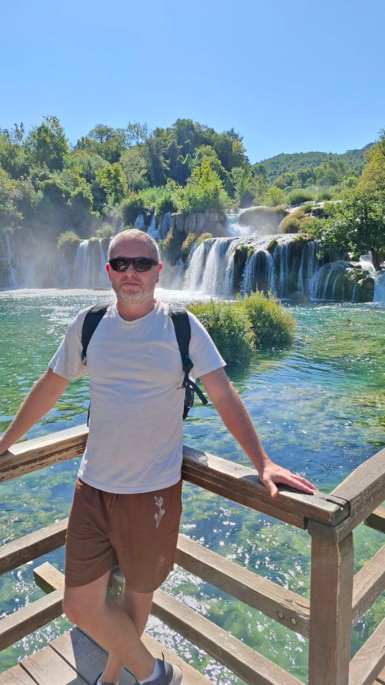

Headed to restaurant Tratoeia Taverna which is highly rated. I had a bisque of langoustine starter and main of seafood risotto - both were sensational. Mel had steak tagliatelle and we shared a litre of house white. It was all divine! Mel had an ice cream on the way back and both were snoring by 11pm.

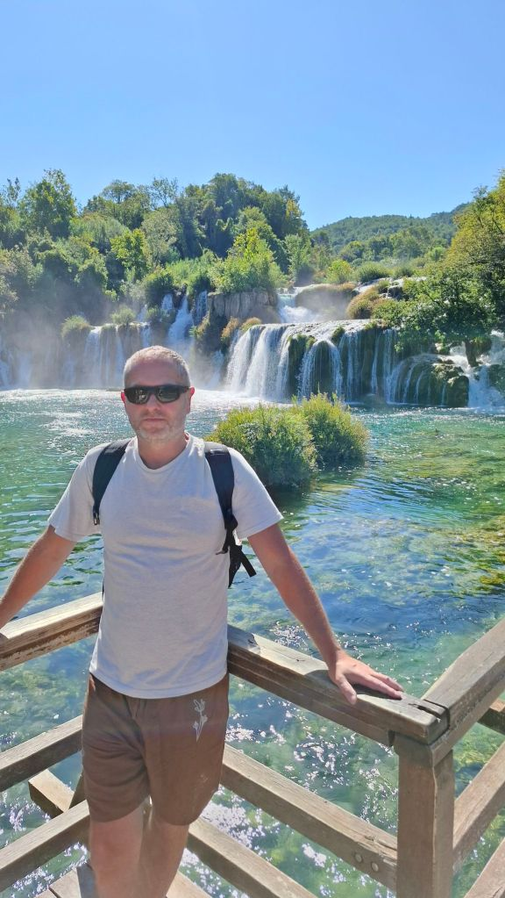

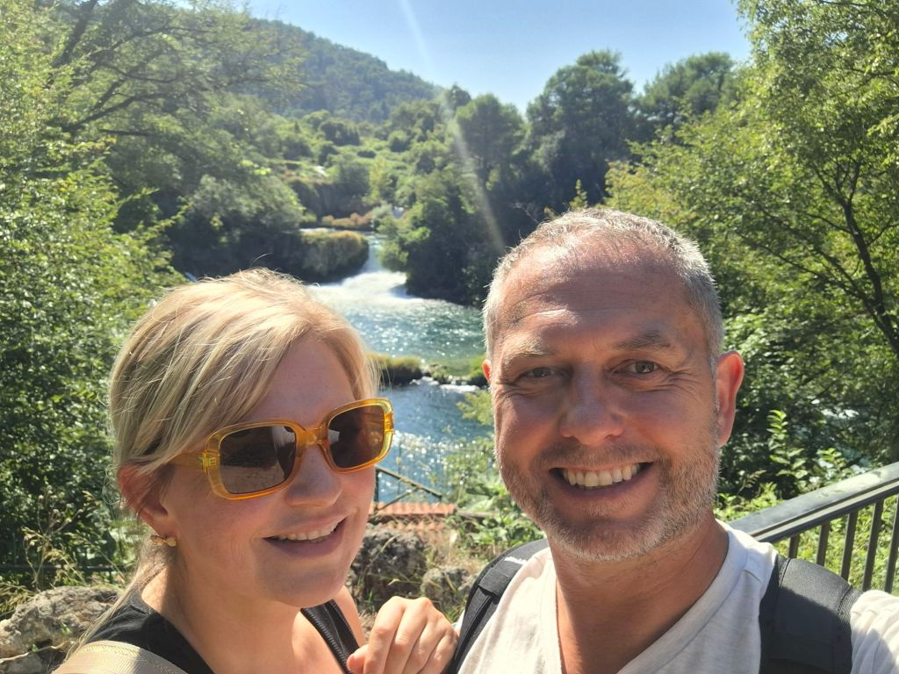

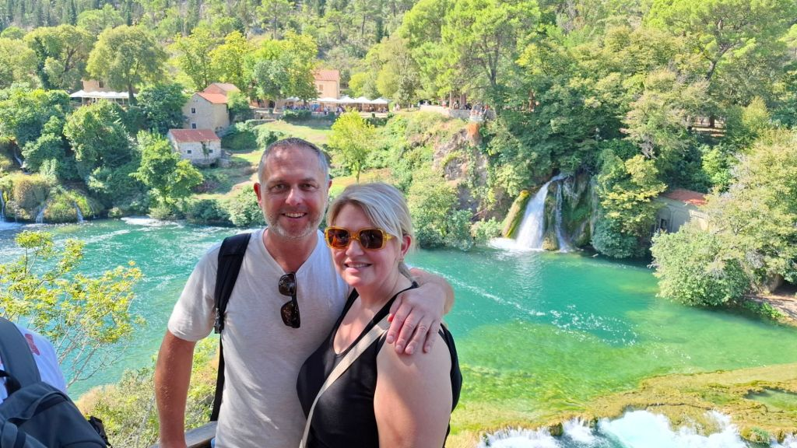

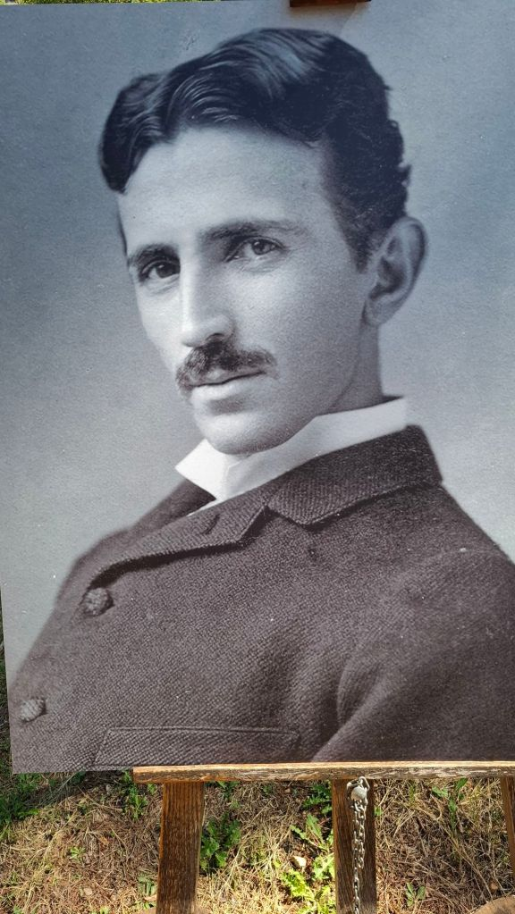

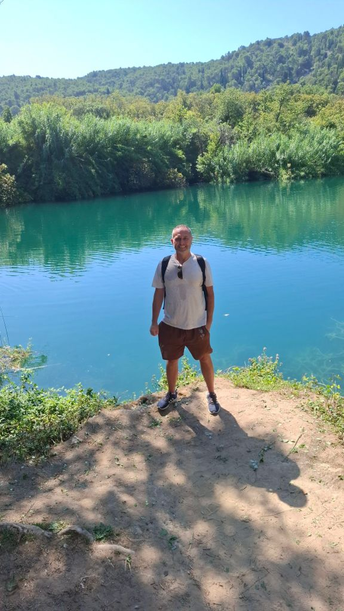

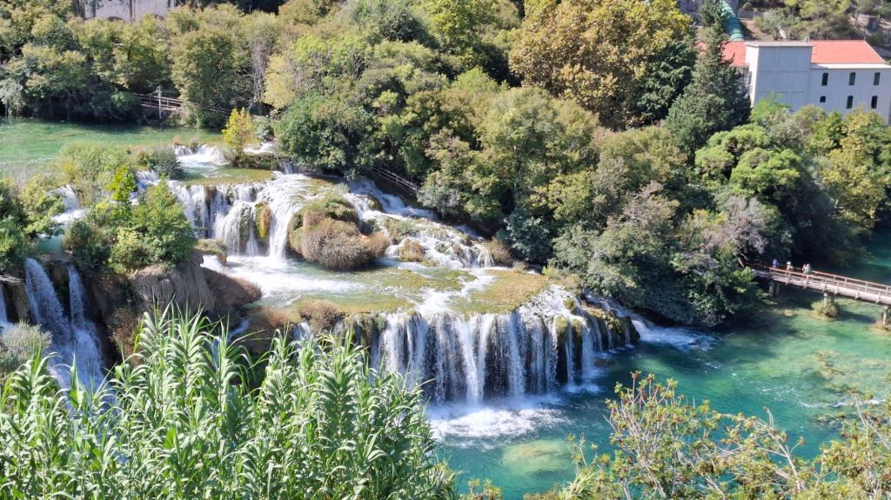

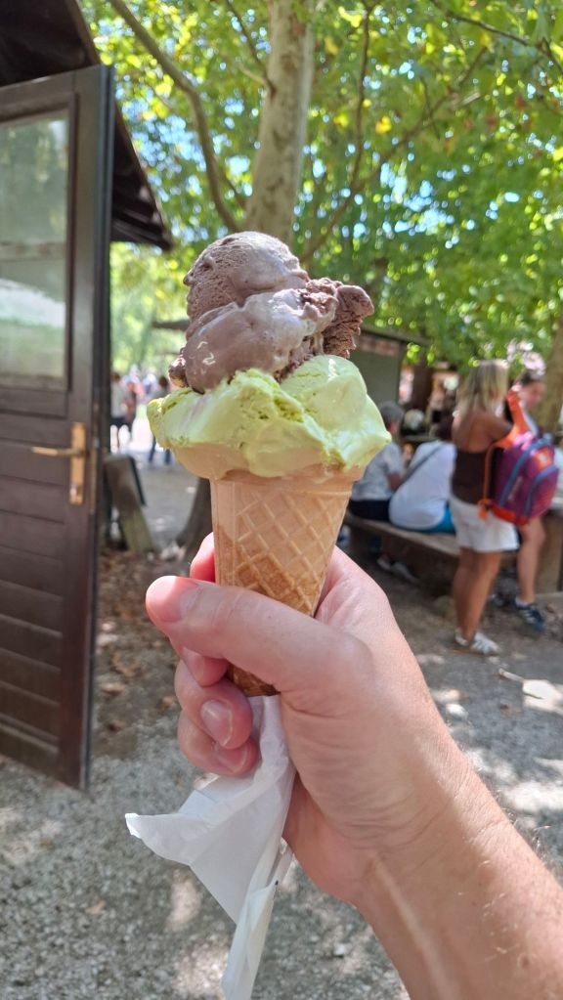

