Action packed day ahead so refuelled with the usual brekkie then headed out to the first stop of the day which is about an hours drive east - Klis Fortress. This is a medieval Fortress dating back to the 3rd century BC. Unbelievable. It has seen multiple battles over the thousands of years and generally held out until the Ottomans overtook it in the mid 16th century for a hundred or so years but the might of the Christians finally overthrew the Muslim invaders and kept hold of it. A truly amazing place and great spot over looking the city of Split. Entrance was 12 euros each and worth every penny. Even Game Of Thrones was filmed here - we have decided to watch it when we get back.

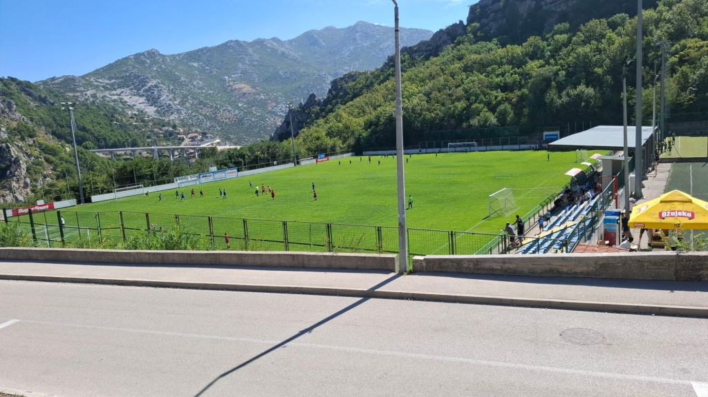

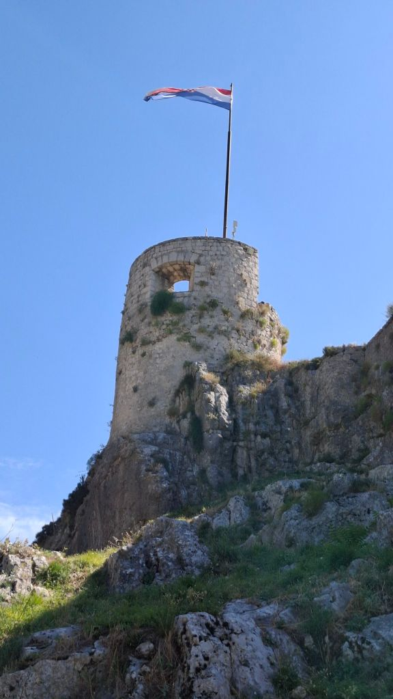

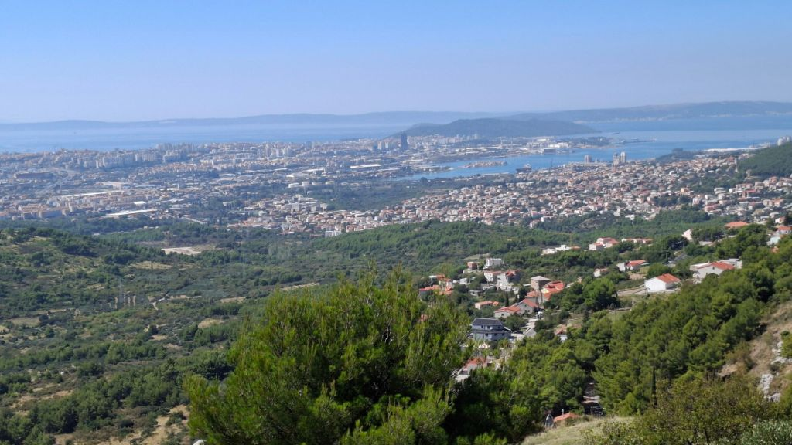

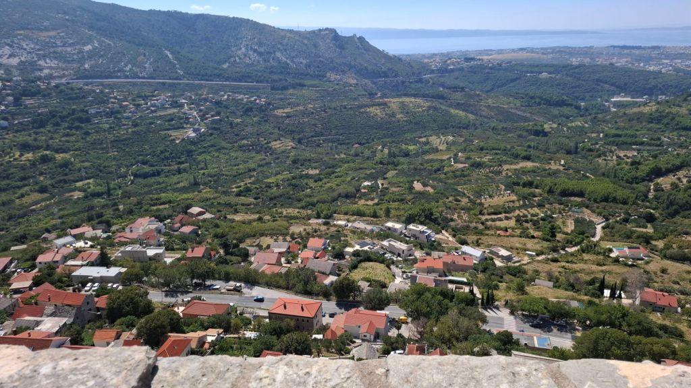

We then drove about 35 minutes into the city of Split. This is a truly stunning coastal city with history at every turn and a true smorgasbord of people from young to old and the odd hen and stag party thrown in for good measure. We spend a couple of hours here marvelling at the sights and jousting with the soldiers. Yes, really - I thought it would make a good photo, but afterwards, they demanded 20 euros for the privilege.

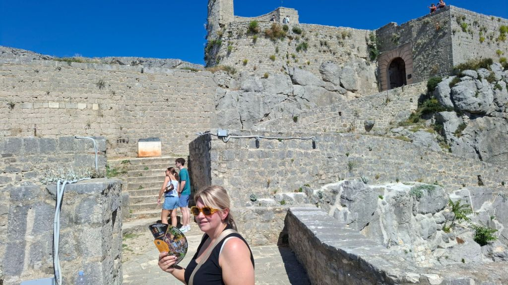

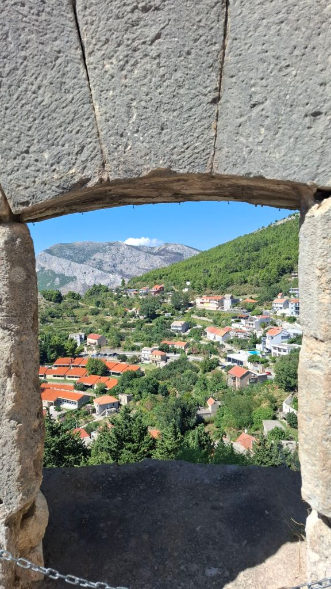

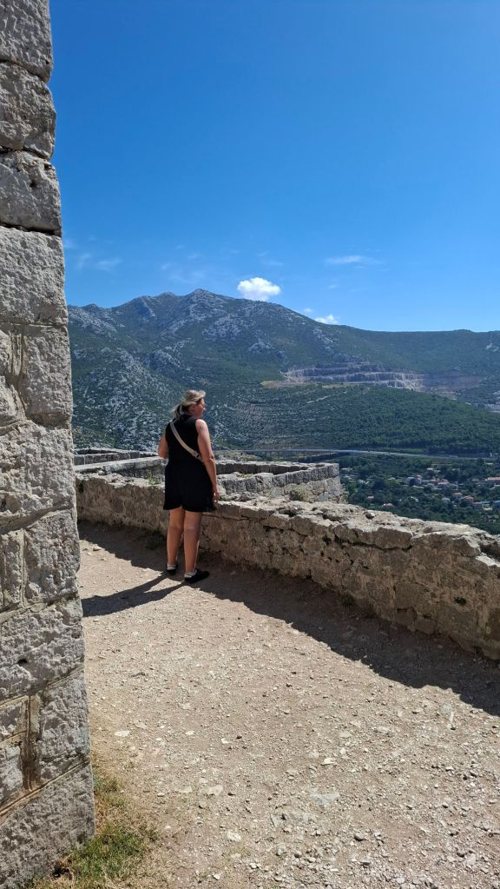

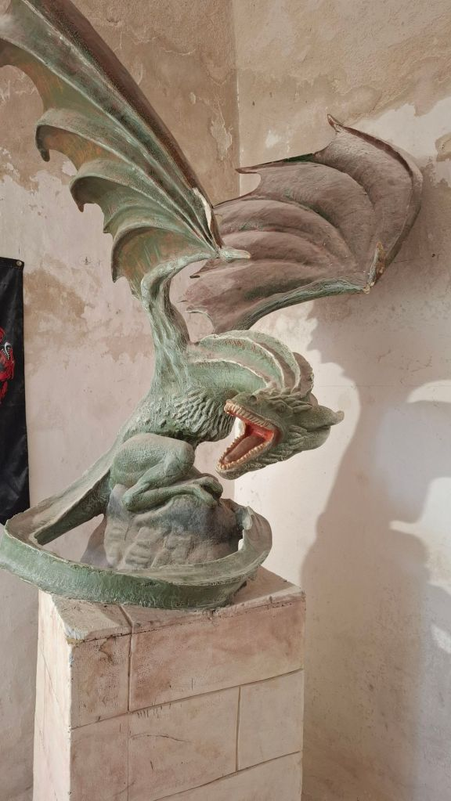

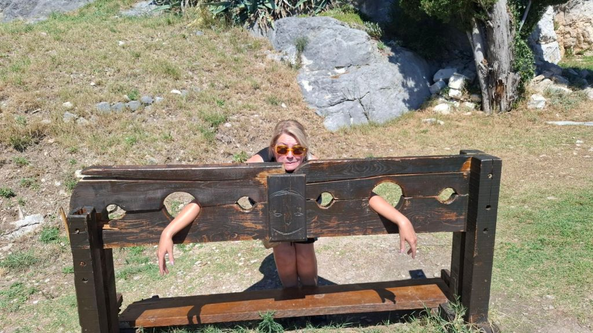

We picked up a couple of cheese pies for 79 cents and ate them on the harbour and had a beer at a local bar. All bloody lovely. Headed back home and arrived about 6pm - quick shower and change and headed into Vodice. Pint at Solcani Sat and then went to a local Pizzeria - Burrata. The pizzas were divine. All done and tucked in by 10pm. Rock n roll baby.

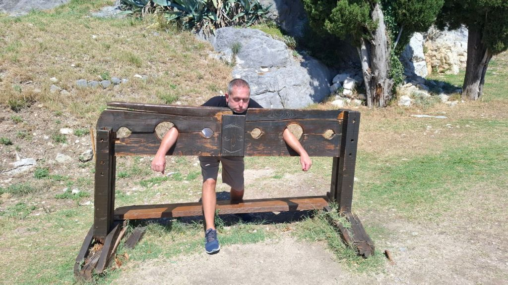

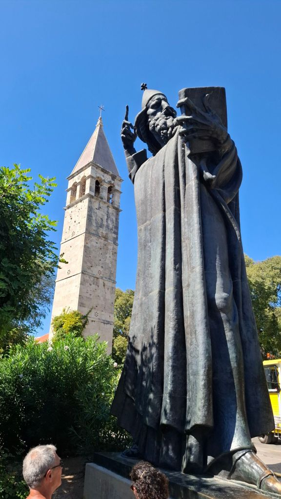

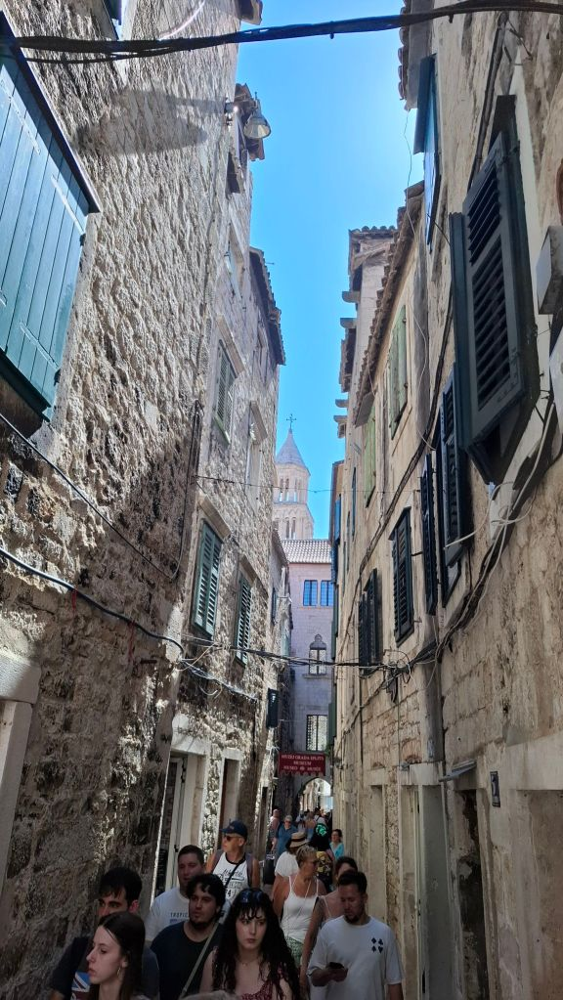

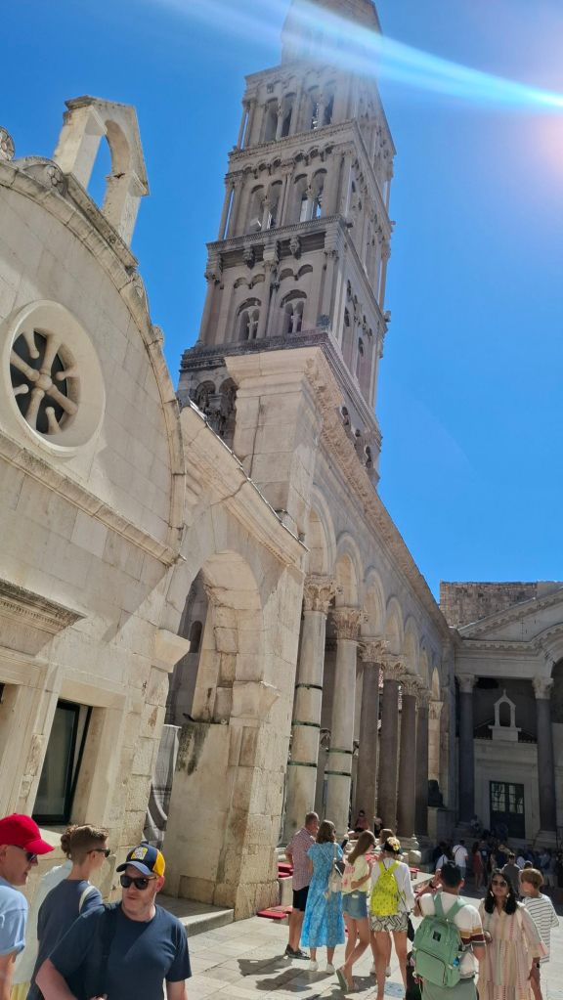

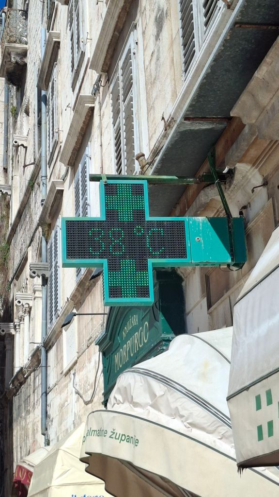

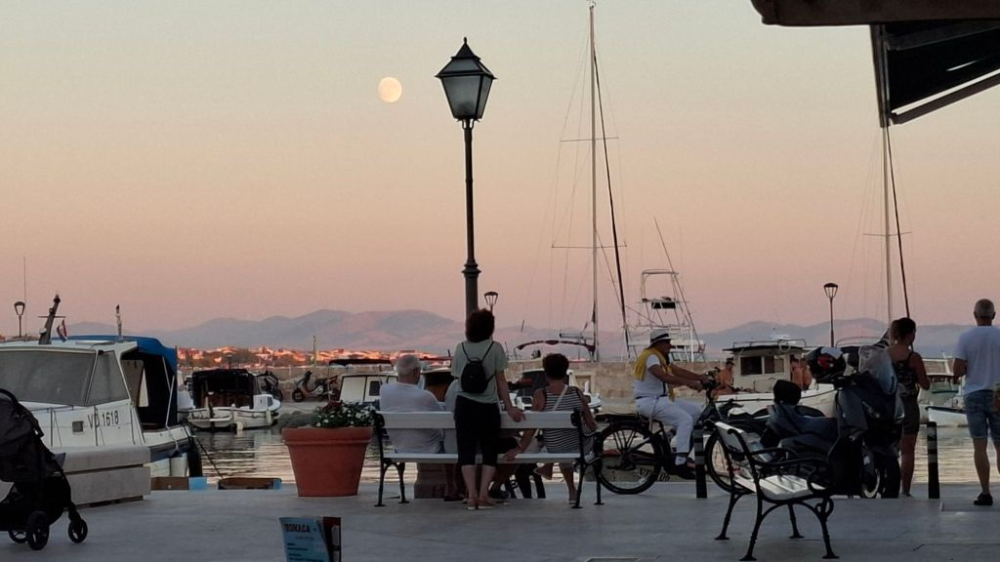

