Usual breakfast then went for a coffee at caffee bar center. Headed for the ferry to Zlarin island which leaves at 12pm - 3.6 euros each. Journey took around 30 minutes. Headed for Bucina beach - literally not one person there - had our own private beach..beautiful!

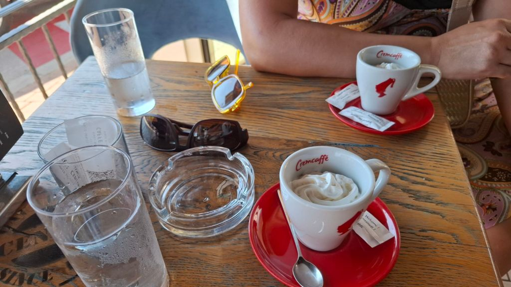

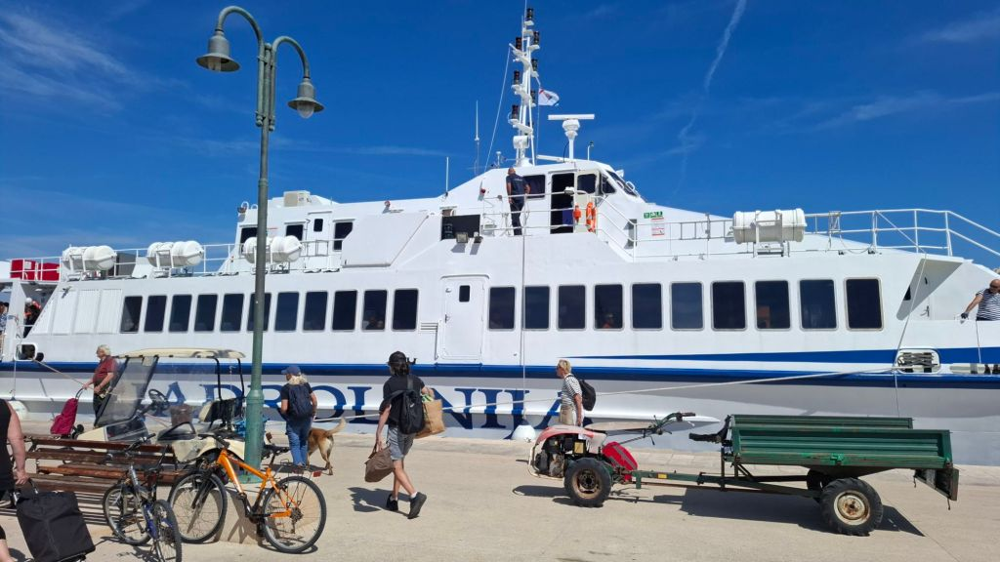

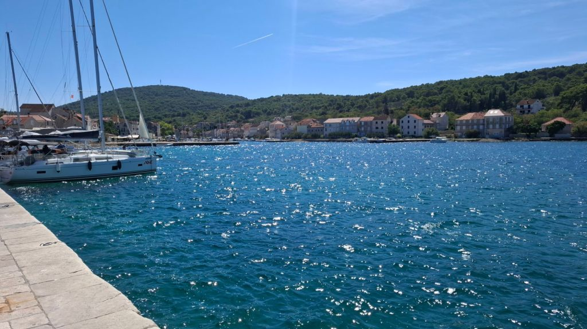

Relaxed for a hour and read Mel's book then wandered to a local bar for refreshments - a pint of Croatia's finest - Ozujsko. Plenty of locals here - it is a stunning island, about 5 bars and restaurants and a town with school and mini market completely car free but everyone seemed to own the golf carts instead - there are luxury villas everywhere.

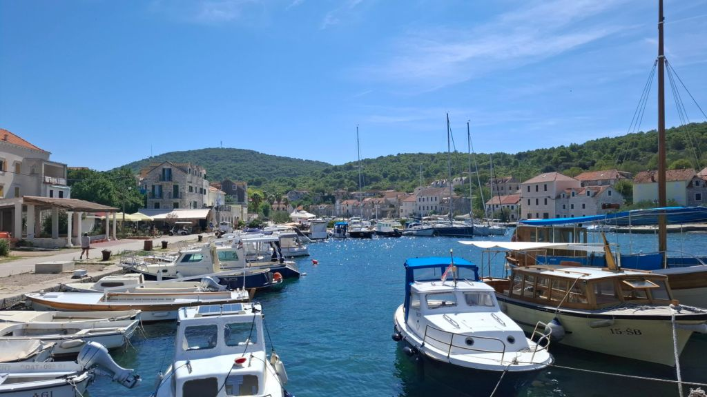

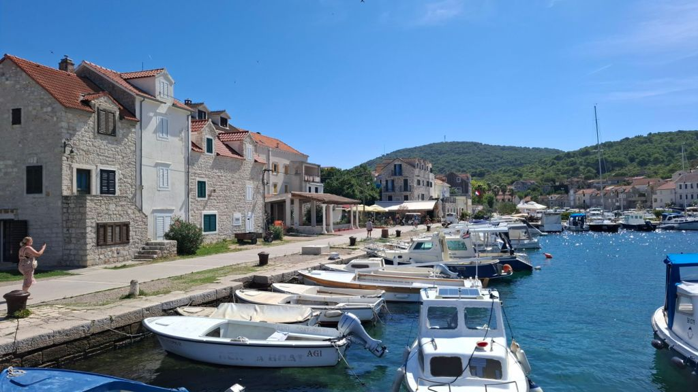

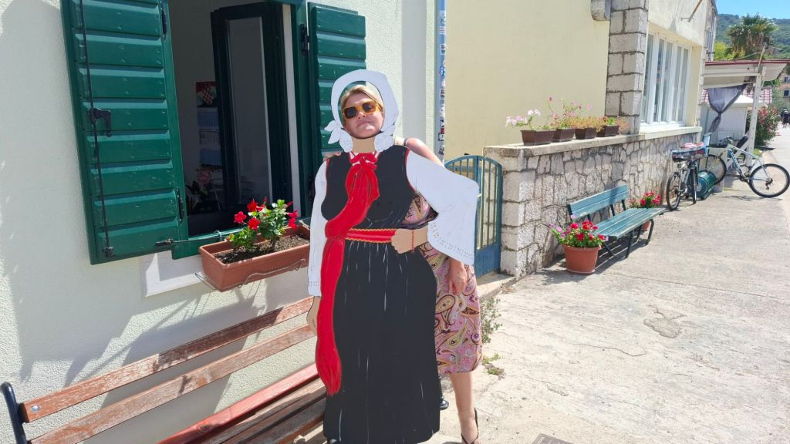

Walked to the snack bar for a toastie and a beer then caught the 4pm ferry back to Vodice. Decided to walk to Tribunj from Vodice which is about 4km along the beach front stopping at Sempro Positivo beach bar. Lovely stretch of the waterfront and so relaxing.

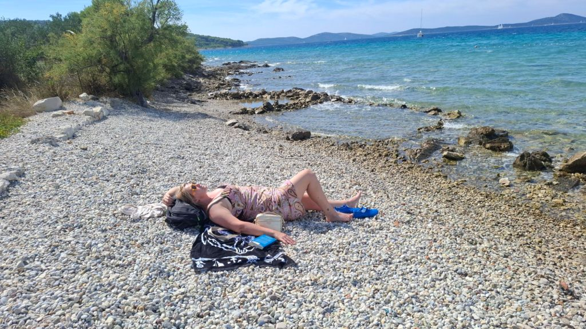

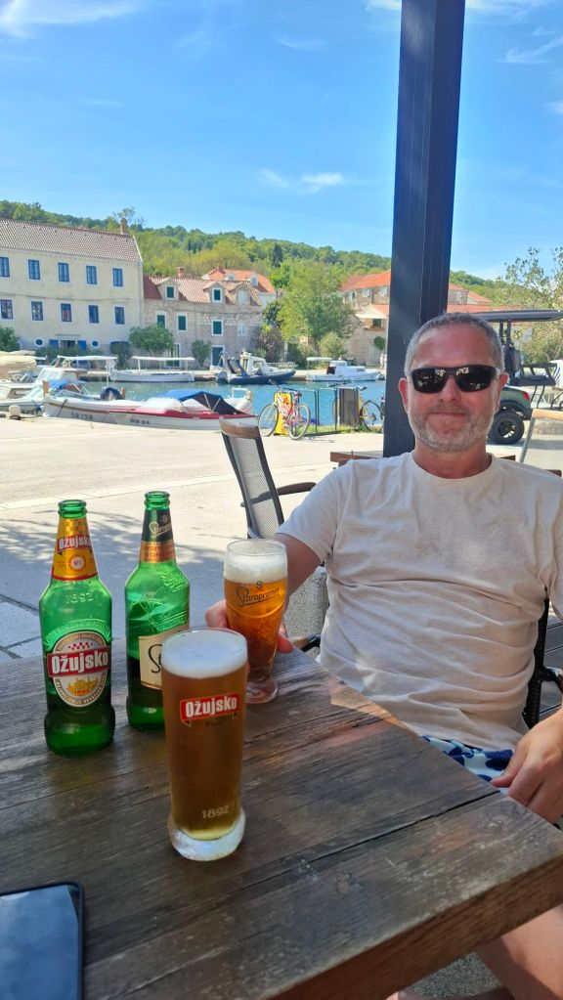

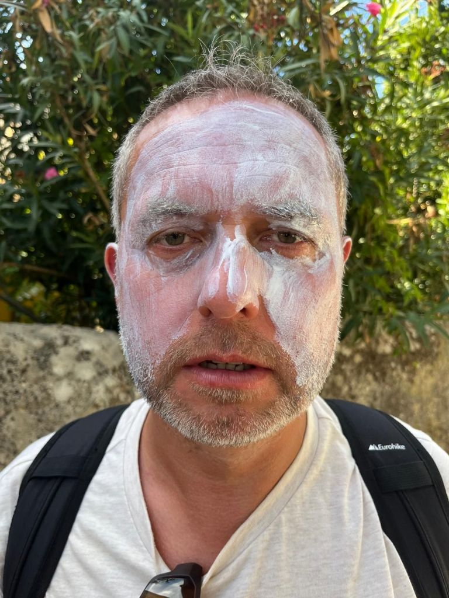

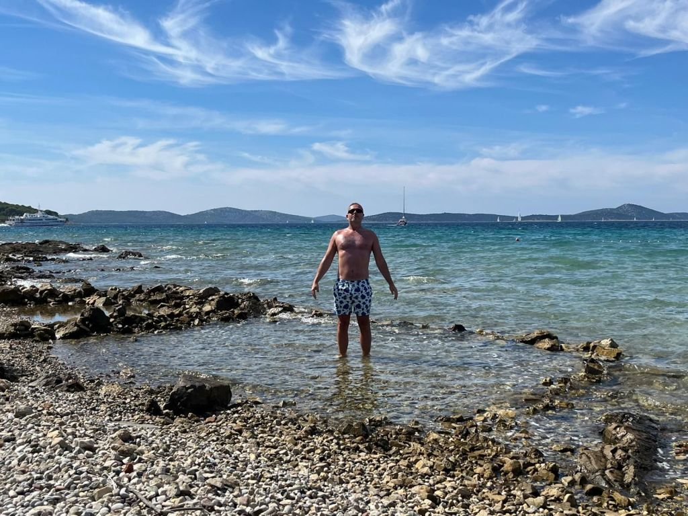

Then continued to Stray Cat bar and bar nautica for a couple and headed to Restoran Luna. I had Spaghetti Frutti De Mare - fruits of the sea (not real fruits obviously as I don't like fruit) and Mel had spaghetti with salmon and we shared a litre of house white. Gorgeous meal and lovely waiter who I had an hour long conversation around the Croatian war of independence which I had studied before getting here. Mel was really impressed with my thorough knowledge of the subject :). We also discussed the state of the UK and the reasoning behind it and differences between our Countries. Walked home along the seafront arriving around 12:40am.

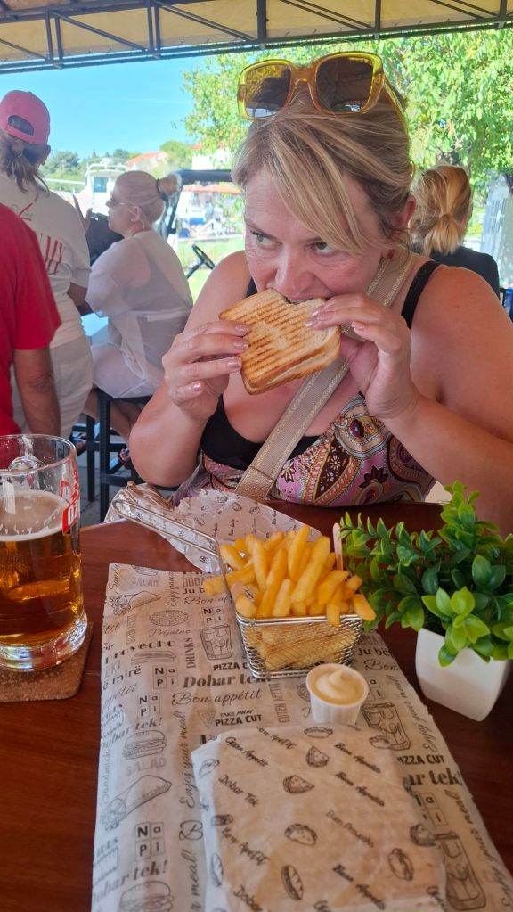

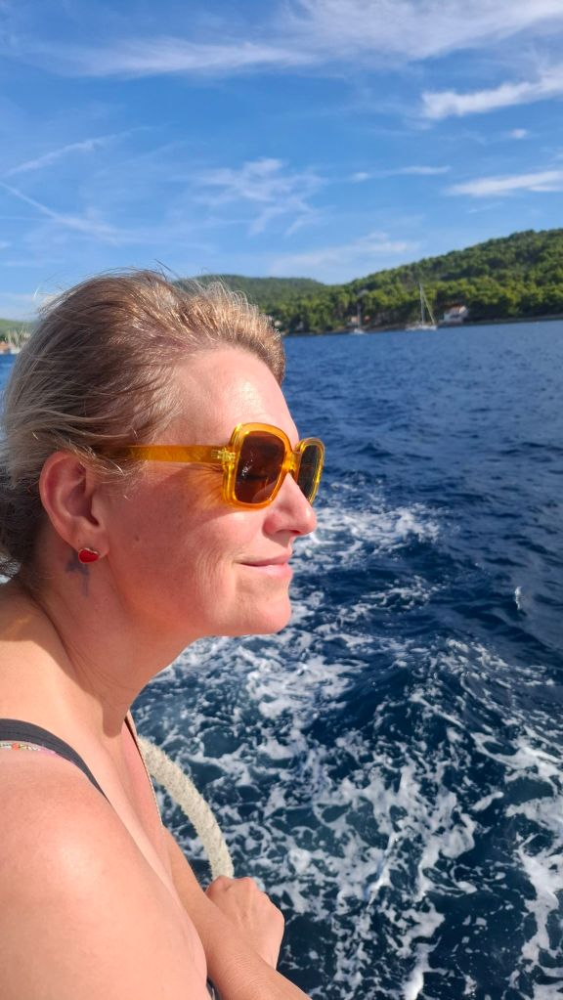

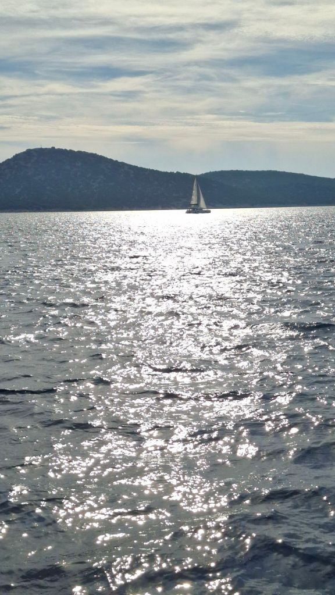

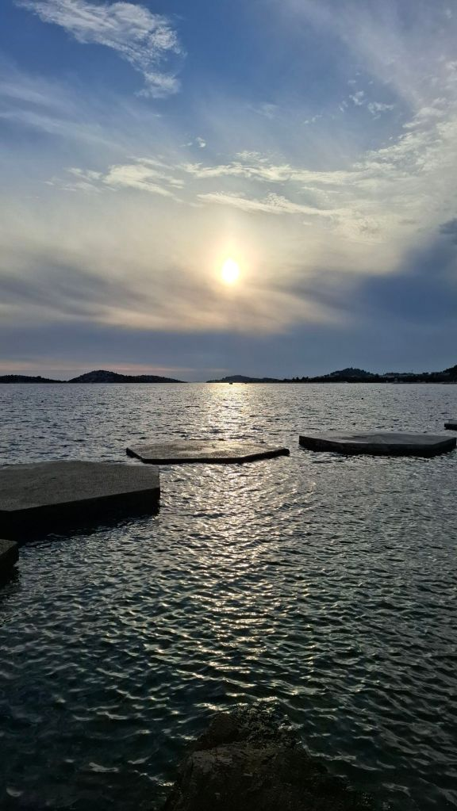

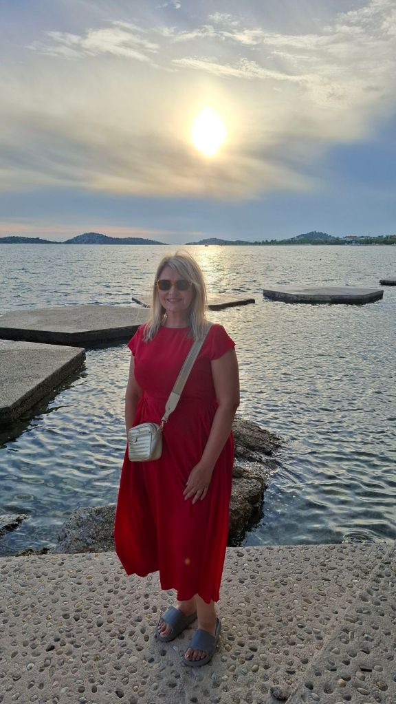

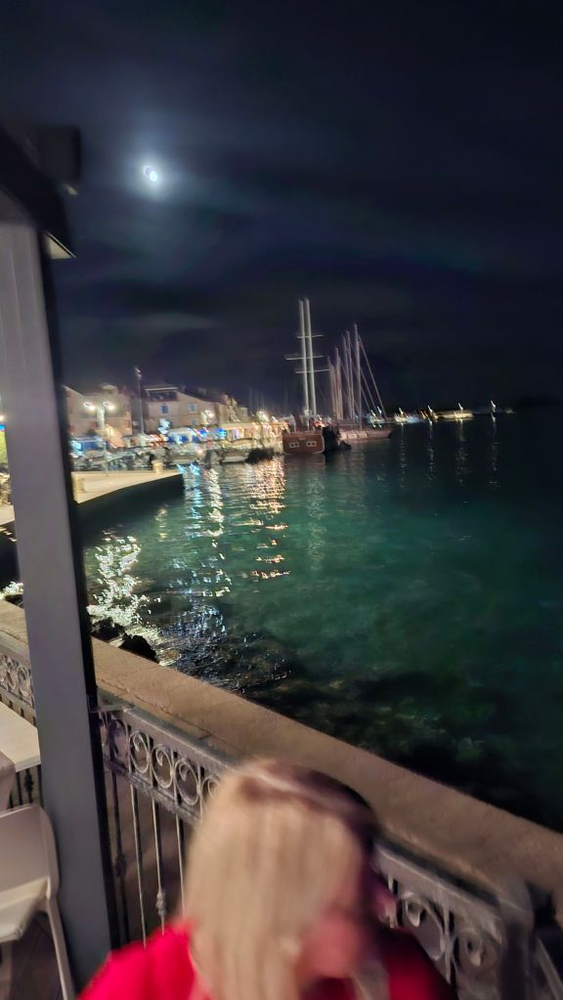

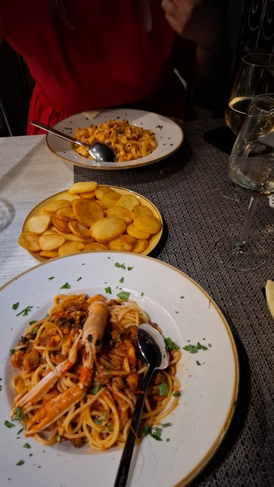

