After the previous night's birthday carnage, we granted ourselves a much‑needed lie‑in. "Woke up" is generous — we more emerged around 10:30 like two zombies crawling out of a crypt. The room had developed a certain… stale ambience, so checking out felt like an act of mercy. Outside, the weather was absolutely hammering it down, which at least slapped us awake.

We trudged through the gloom to College Street Café, where scrambled eggs and sausages on toast revived us just enough to realise we'd made a catastrophic error: booking an 8pm flight. With luggage in tow, soaked through, and unable to have a drink because we'd be driving later, we were staring down the barrel of the longest, bleakest Monday imaginable.

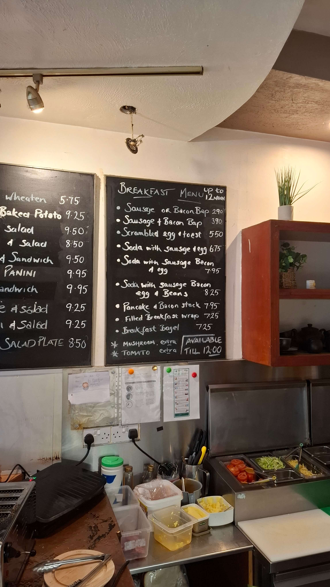
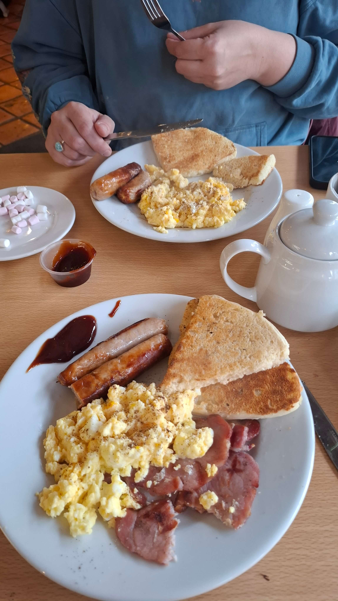

We spent the next few hours wandering Belfast with no plan whatsoever — about six miles of aimless trudging, dodging rain, grabbing coffees, and pretending to be interested in Irish tat we couldn't even take home. Eventually we surrendered and headed to the bus station, where we bought an overpriced, depressing sandwich that tasted like regret, and waited for the airport bus like two people who'd made every wrong decision possible.

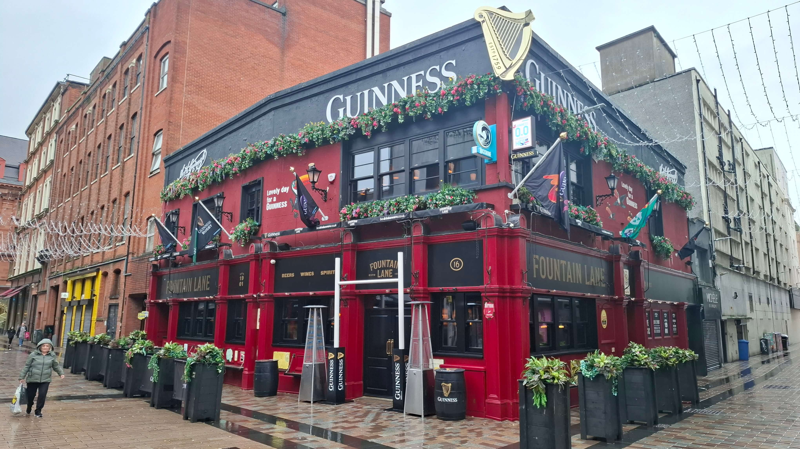
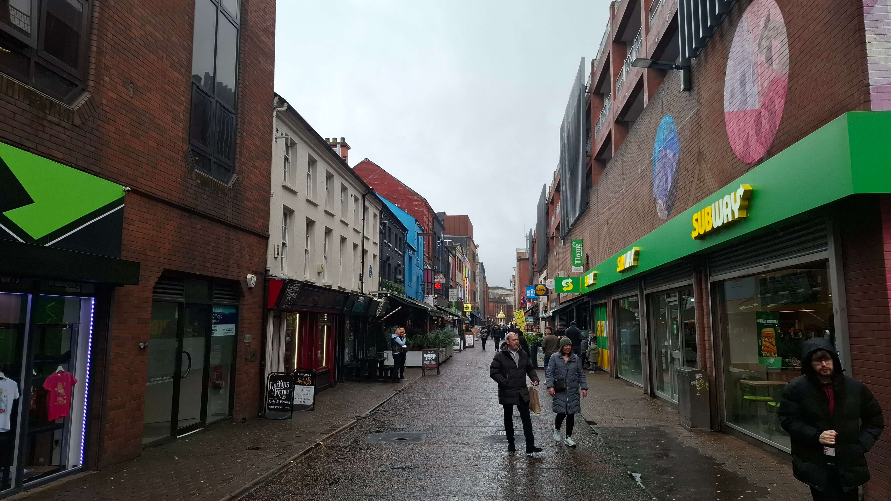
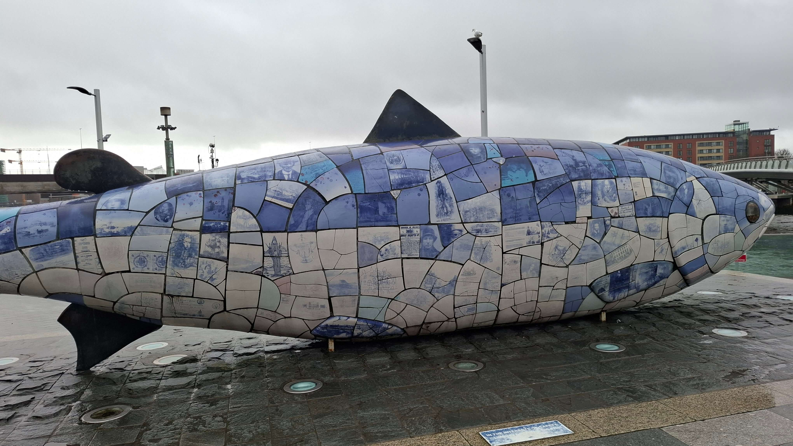
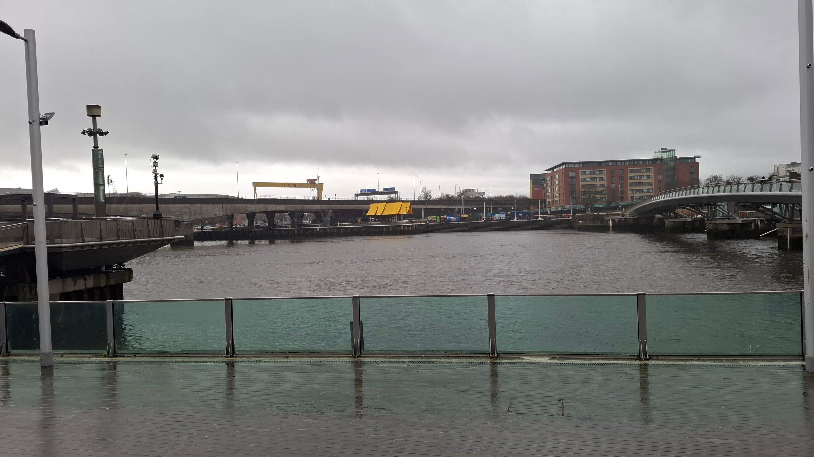
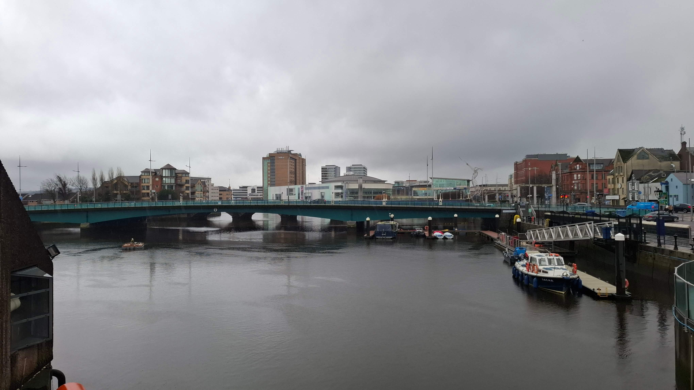
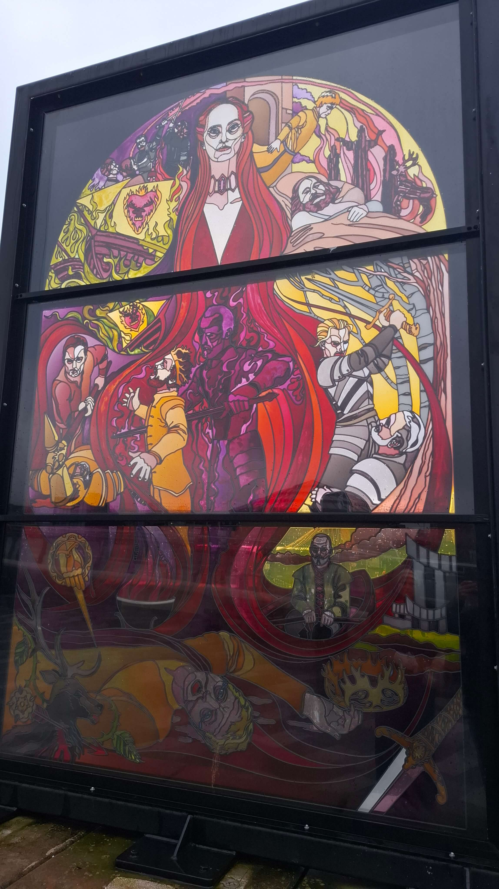
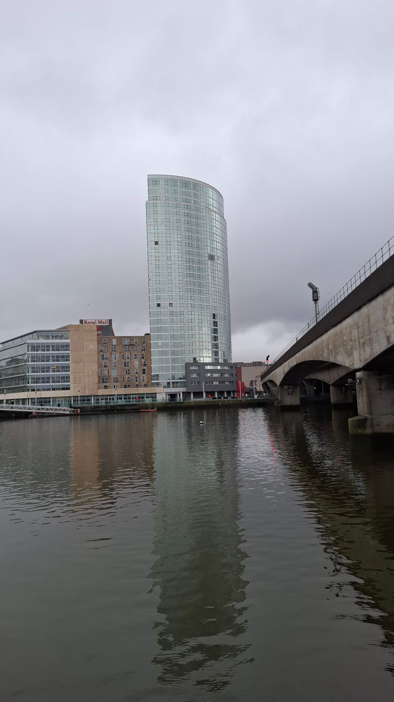
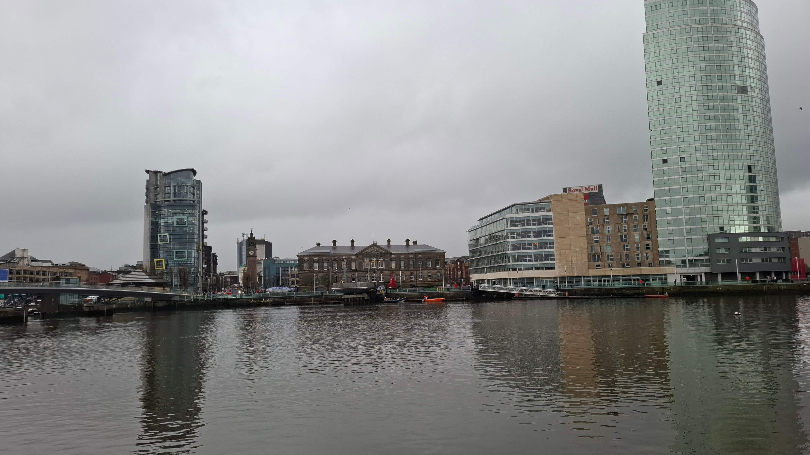

Arriving at the airport four hours early was the final insult. The place was a construction site with delusions of grandeur — nothing open, nothing to do, nowhere to hide. We passed the time with podcasts, YouTube, and professional‑level huffing. Then the flight was delayed. Then delayed again. And then delayed again. By the time it was pushed to 11:30pm, we'd lost the will to live.

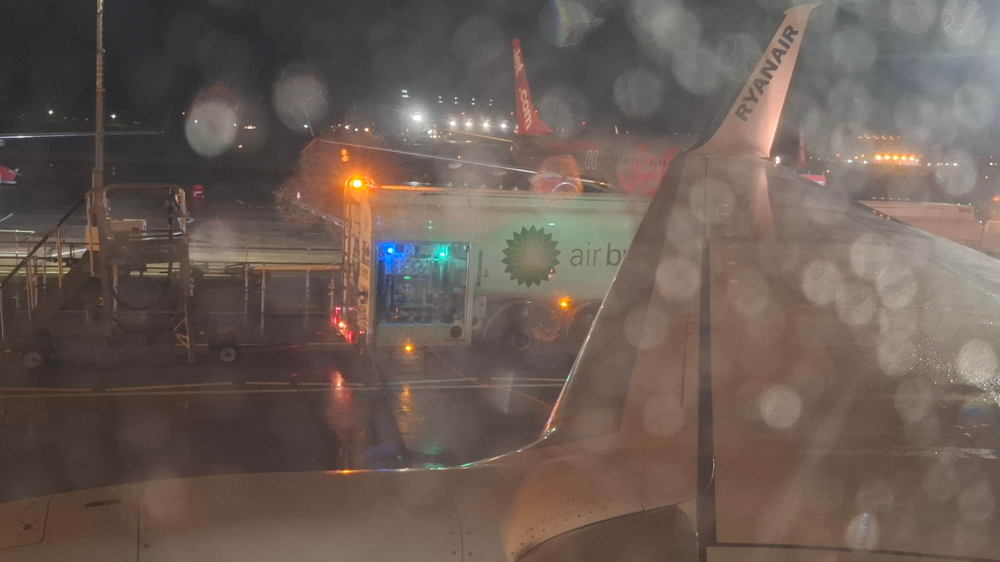

We finally stumbled through the front door around 1am, only to be greeted by the delightful prospect of a 5:30am wake‑up for work. A perfect ending to the longest, soggiest, most soul‑draining day imaginable. Yippee indeed.
