Camp site: The Coastguard pub, Dover

First day of the epic European trip and we are hanging following Harry's 21st birthday...well worth it though! Set off about 12pm after the prerequisite oatcakes. Journey down to the "Coastguard Inn" pub in St Margaret's at Cliff took about 6 hours 30 minutes with a services stop en route.

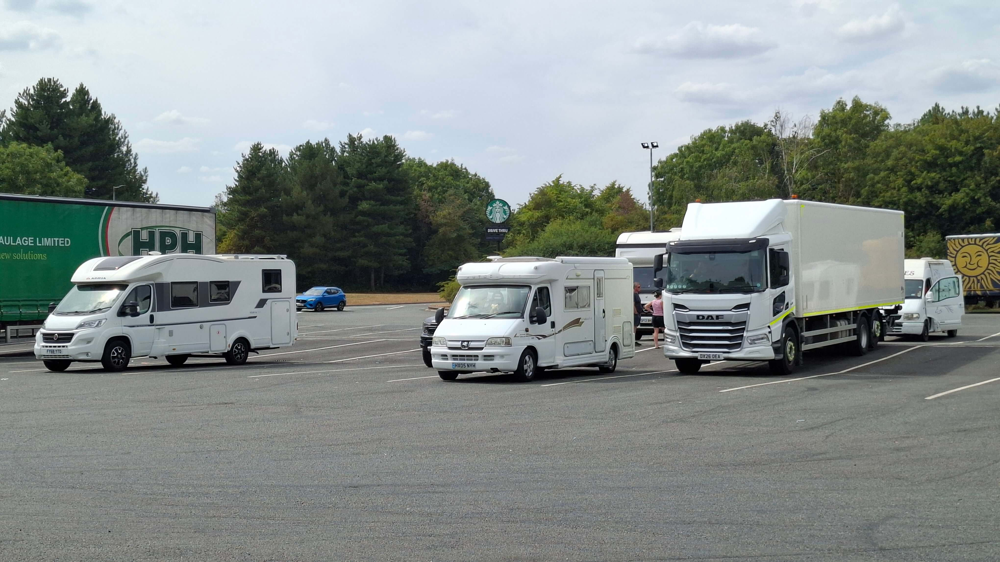

It has been almost 6 years to the day since we last stopped here before our first major trip in our old campervan touring France - The Autosleeper Symbol or "The Chip Van" as unnamed "special" friends referred to it as. The pub looks exactly the same as before other than the prices have doubled. We got the last spot overlooking the sea and went in to order.

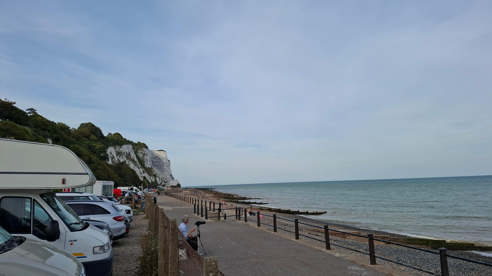
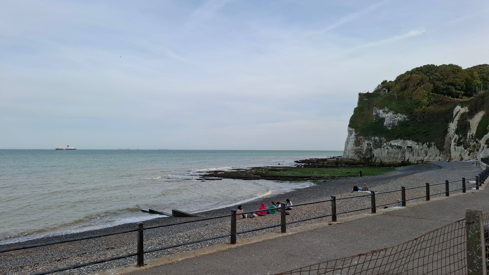
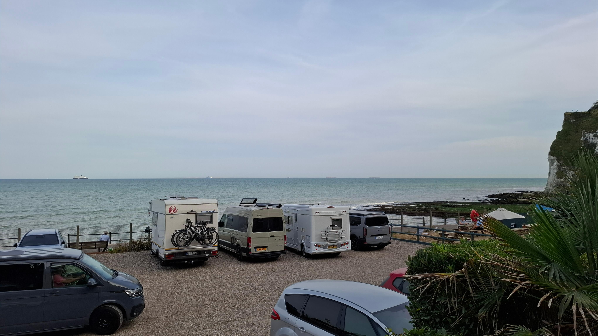

A pint of IPA for me and a Pimms for Mel.

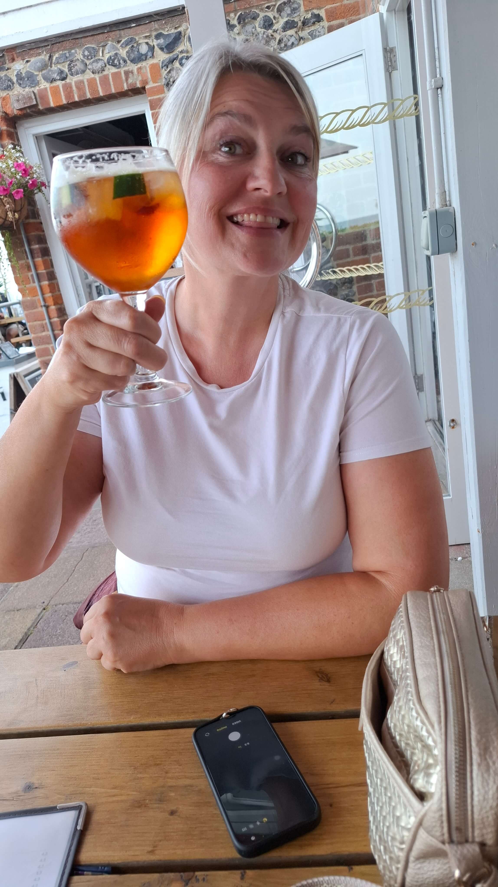
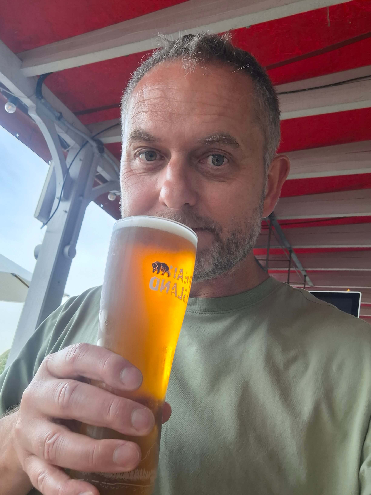
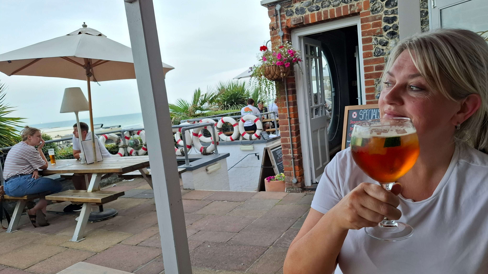
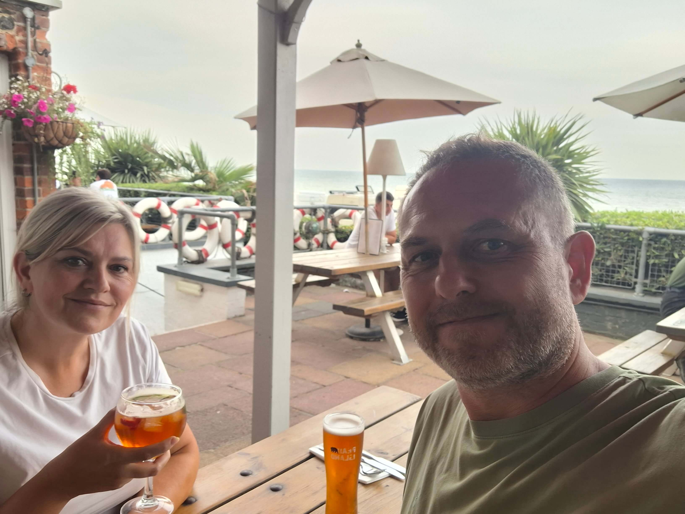

For the food - Mel went for the classic fish and chips - and I opted for the Hunters chicken with fries. Mels was really good, mine was really quite rubbish. Cremated isn't the word. Filled a hole though.

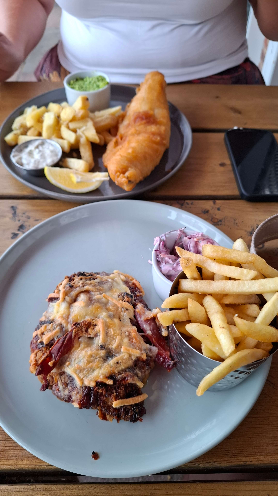
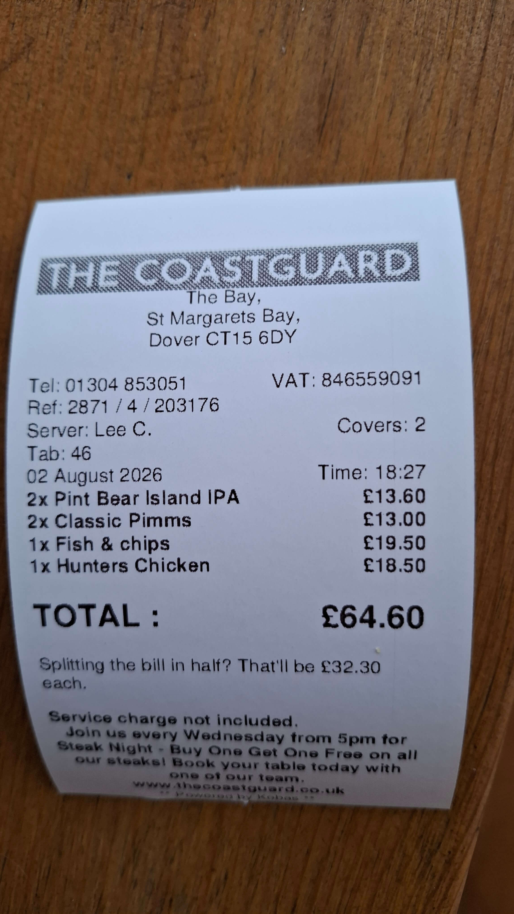

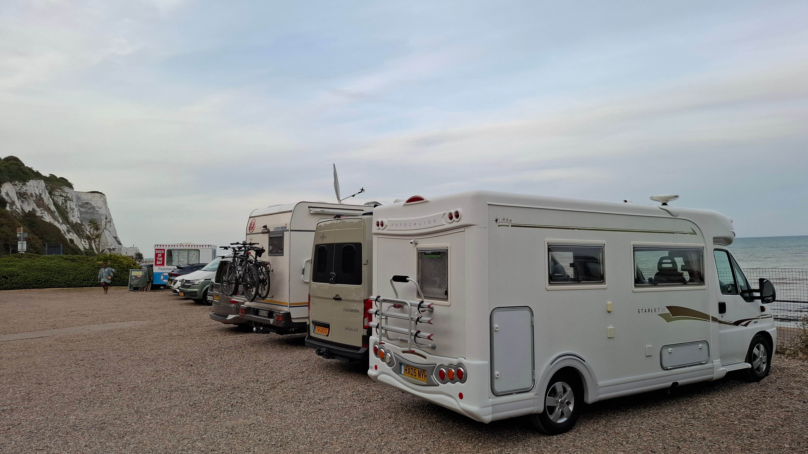

We went for a quick walk along the beach and there were quite a few more "unsavouries" than the last time we were here. Sign of the times, I suppose.

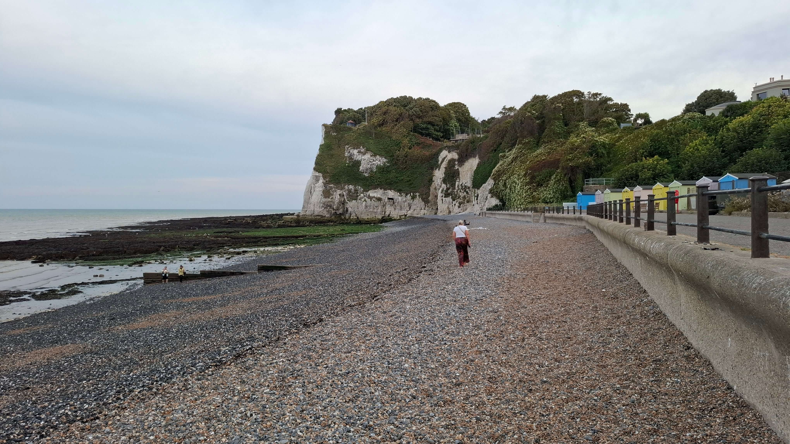
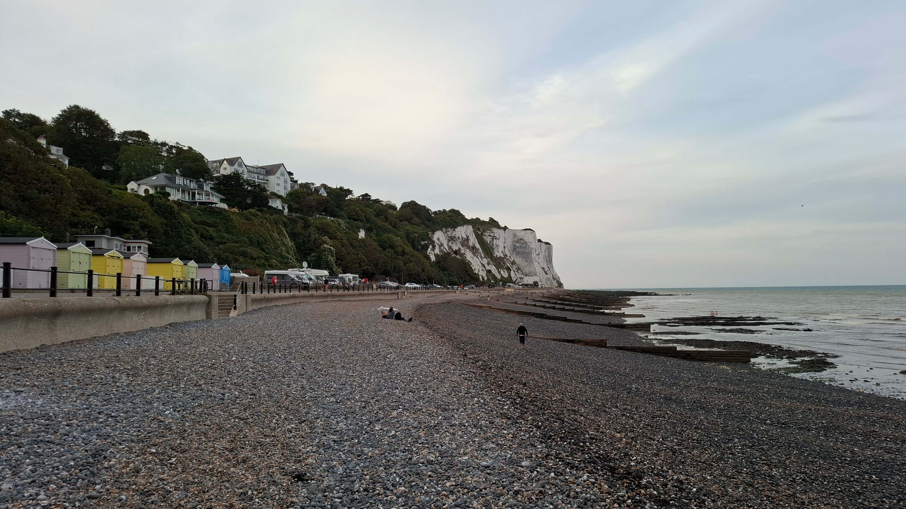
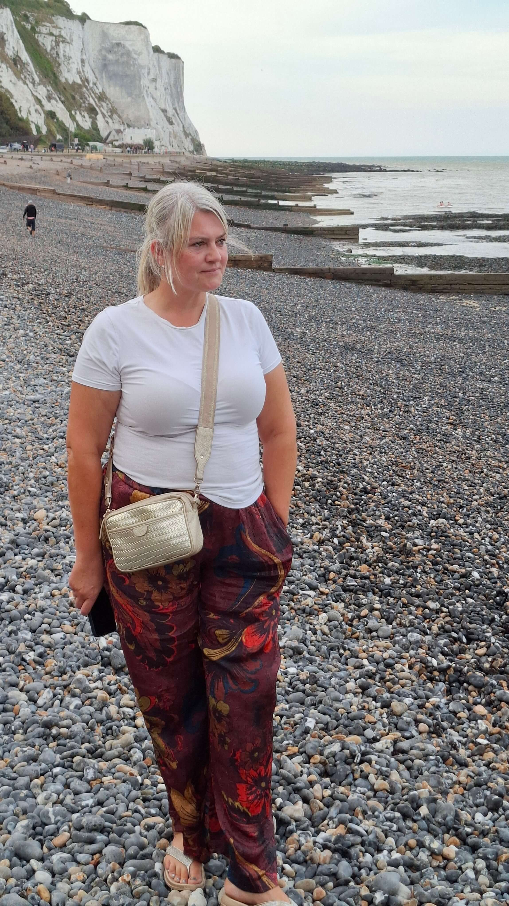

Tried to sleep from about 9pm but was to no avail. May have dropped off at about 3am...only for the sound of Bon Iver waking us for our 4am alarm for the ferry. Joy. Total miles today around 275.
