Campsite: Camping Alsace Les Castors, Mulhouse

Lie in prior to the relatively short distance of about 90 miles / 2 hour journey back into France and Camping Les Castors. Temperature is now low 20's and sunny. First stop, another refuel - about £1.81 a litre in Germany. 

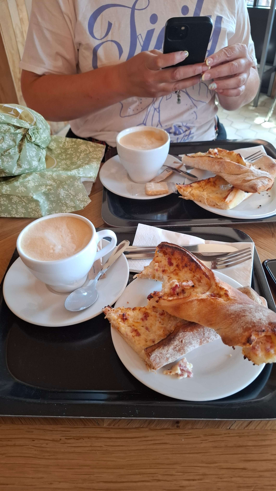

We then stopped for lunch at a lovely place called Feuillette Pâtisserie for a couple of rustic chorizo cheese / goats cheese flatbreads and a pistachio mousse type dessert, scrumptious! We could have eaten everything from here - stunning choice. And it was literally 5 metres from a McDonald's - I almost felt sorry for them idiots in there. 

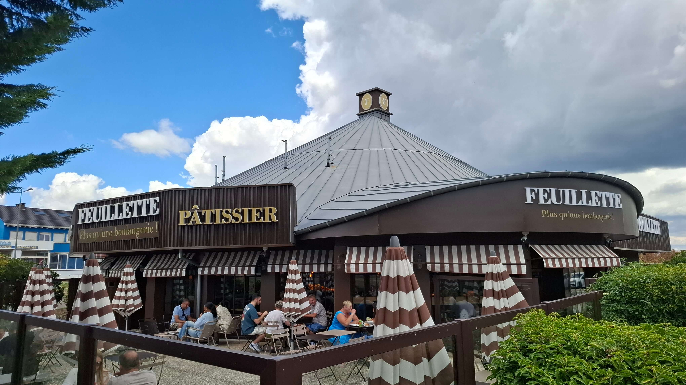
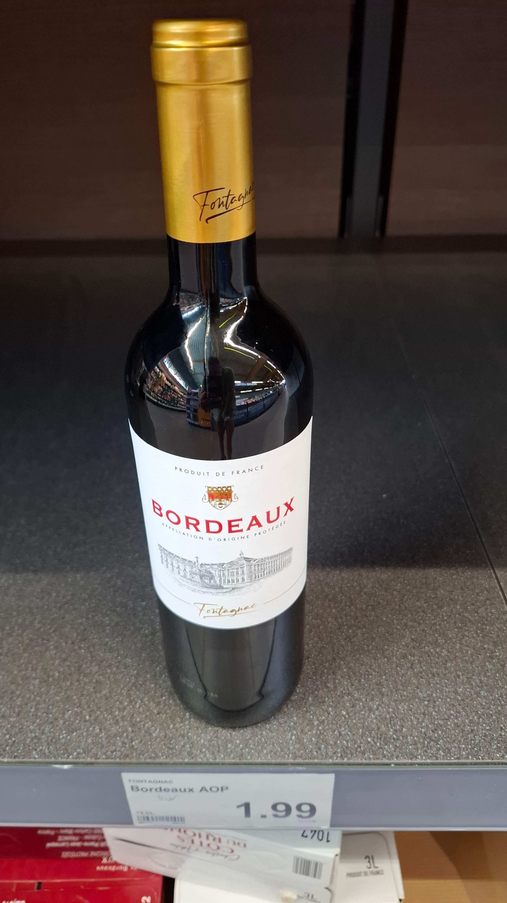
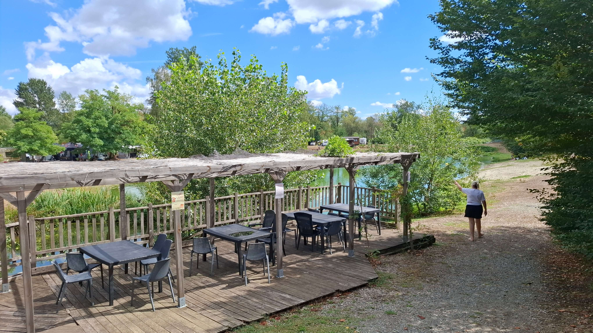
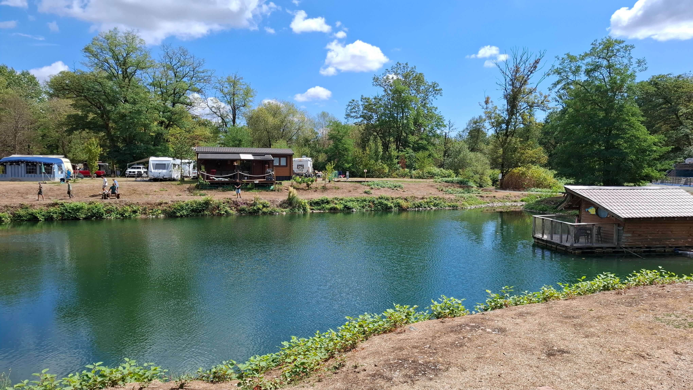

Arrived at the campsite around 2pm - it didn't open until 2:30, lovely place with a natural lake to swim and family friendly. 

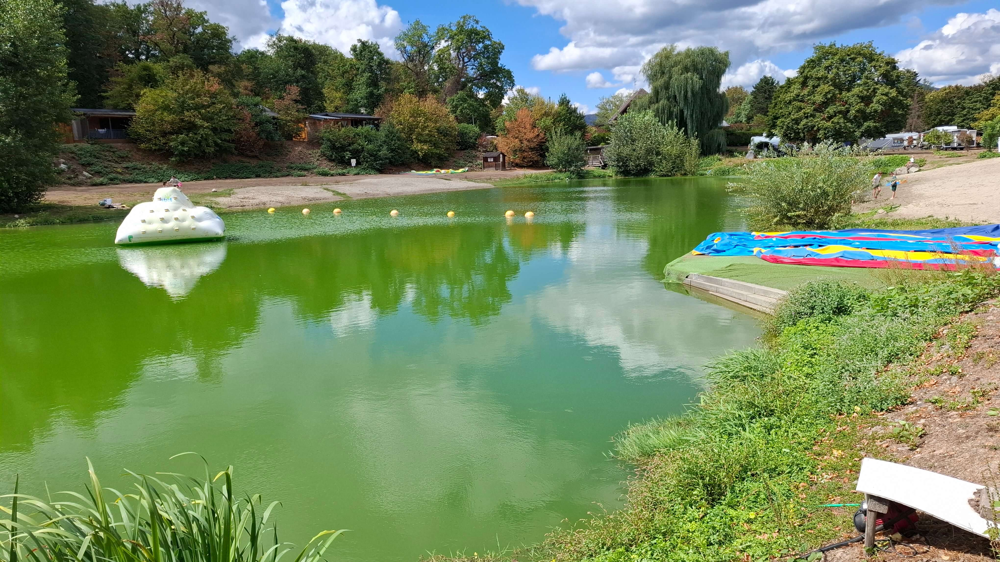
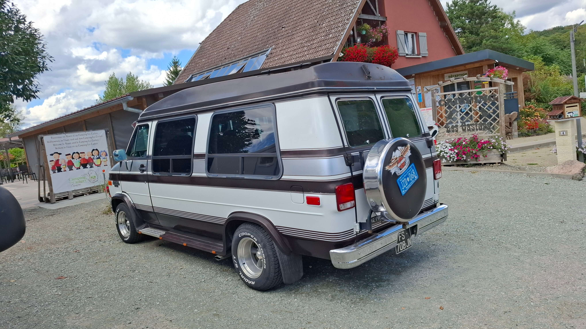

Got a great pitch lakeside, settled in with some beers and Aperols and proper chilled. 

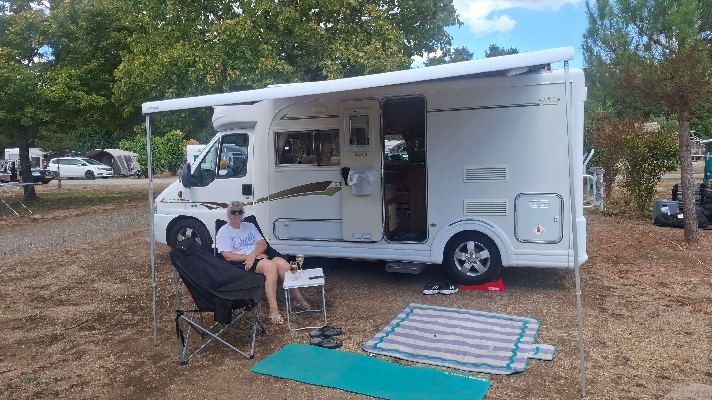
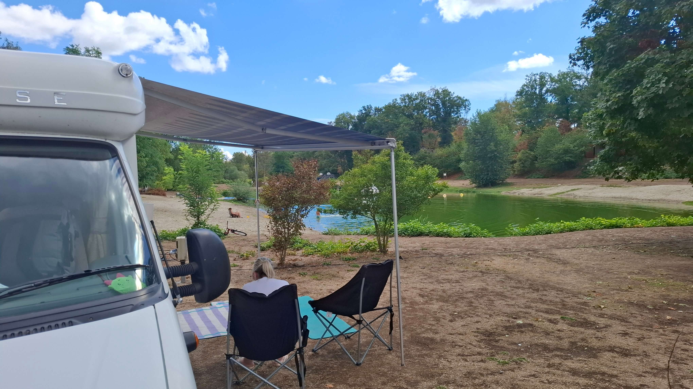
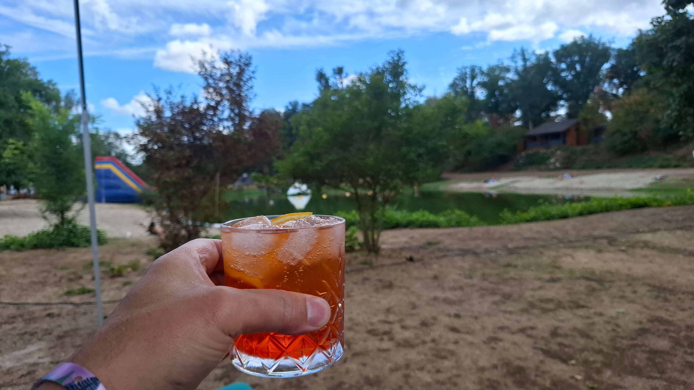
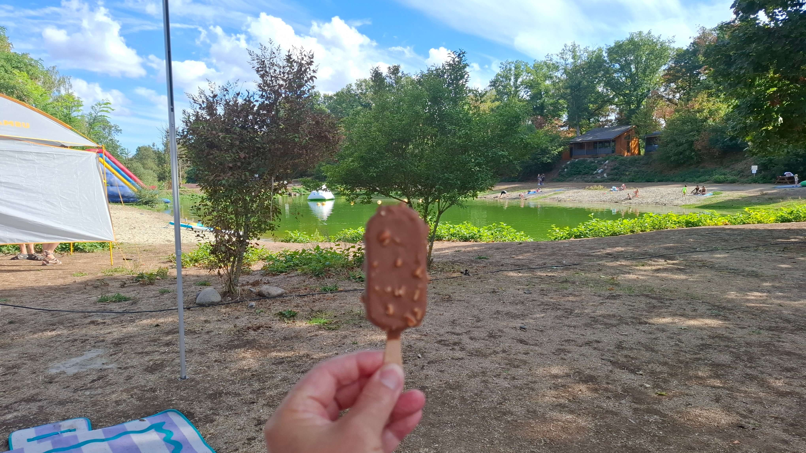

Mel had a migraine so had a kip and I chilled with some tunes. She re-appeared and knocked up a fabulous green Thai curry, it was divine! 

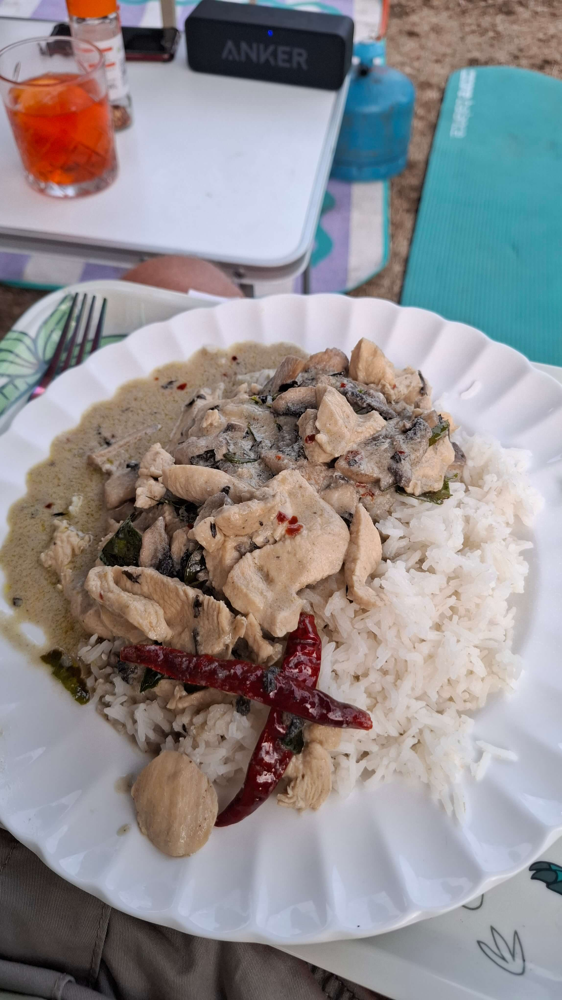
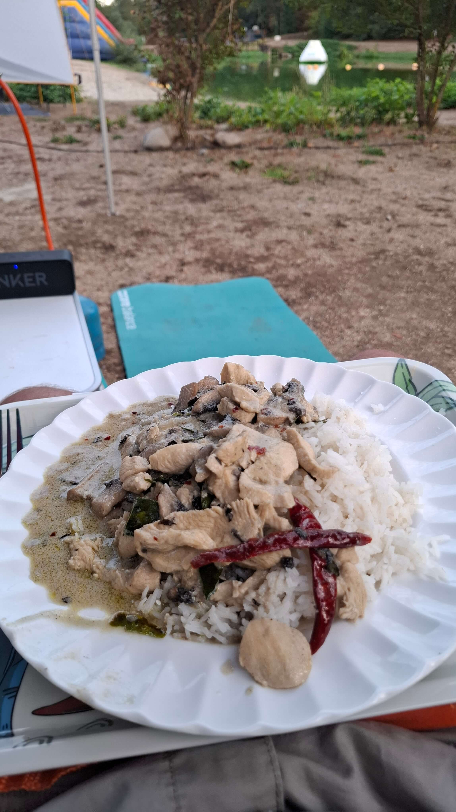

We must have been in our tomb snoring about 9:30. Campsite cost was £21 including electric.
